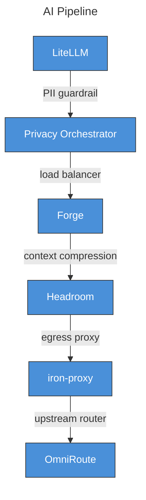
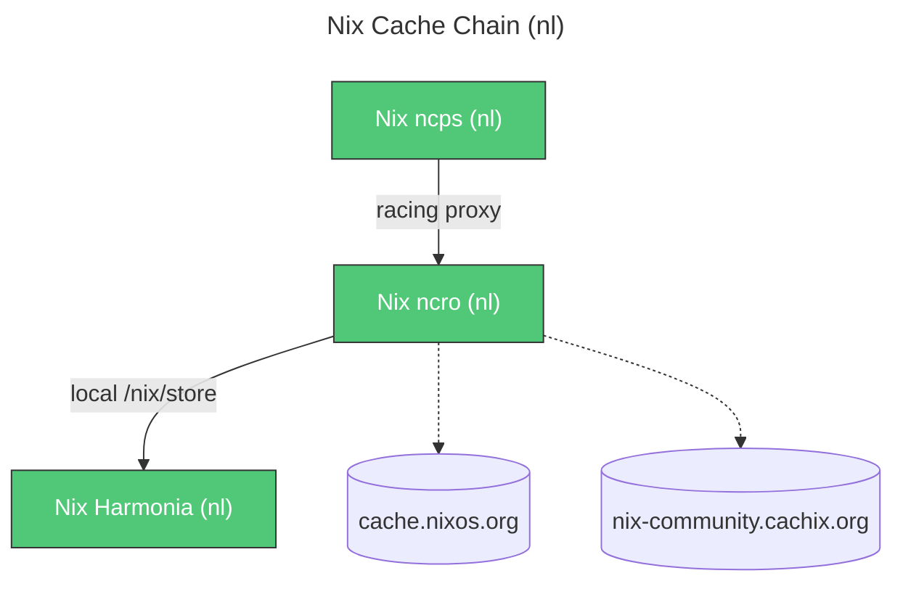
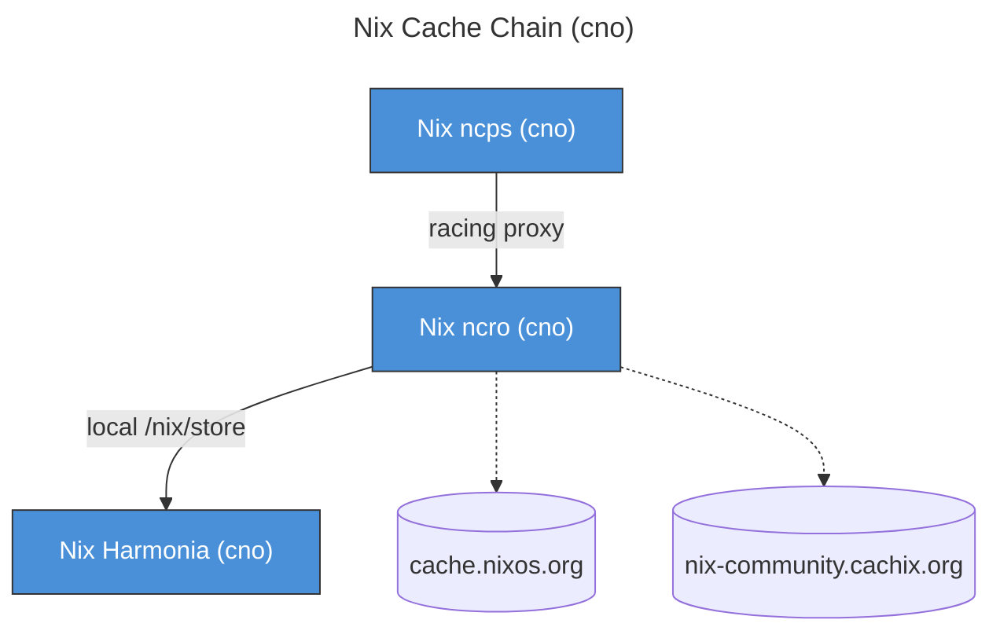

# Infrahub Service Catalog (Shared Defaults)

> **Auto-generated** from `infrastructure/*.yml` (shared defaults only) — last updated: 2026-09-13 18:42
> Regenerate with: `just generate-service-catalog-shared`
> Source: `shared/active/02-config/ansible/infrastructure/services.yml`
> Note: This catalog shows **default ports and suggested hostnames** only. Client-specific deployment details (custom domains, deployed machines, client port overrides) are not included. See `levonk/SERVICES.md` for the deployed client catalog.

**104 services** (shared defaults — no deployment info)

## Table of Contents

- [Service Chains](#service-chains)
  - [AI Pipeline](#ai-pipeline)
  - [Nix Cache Chain (nl)](#nix-cache-chain-nl)
  - [Nix Cache Chain (cno)](#nix-cache-chain-cno)
  - [Media Pipeline](#media-pipeline)
- [All Services (Alphabetical)](#all-services-alphabetical)
- [Services by Category](#services-by-category)
  - [🌐 UI (Web Apps)](#ui-web-apps)
  - [🔌 API (HTTP Services)](#api-http-services)
  - [🖥️ Console / Dashboard](#console-dashboard)
  - [🗄️ Passive (Databases / Caches / Queues)](#passive-databases-caches-queues)
  - [🔗 Proxy Chain (Internal)](#proxy-chain-internal)
  - [🔒 VPN / Mesh Networking](#vpn-mesh-networking)
  - [📡 DNS](#dns)
  - [🛡️ Security / SSO](#security-sso)
  - [⚙️ Infrastructure](#infrastructure)

## Service Chains

### AI Pipeline

*Request flow for AI inference — gateway → proxy chain → upstream providers*



### Nix Cache Chain (nl)

*Nix binary cache proxy chain (nl region) — client → cache → racer → upstreams*



### Nix Cache Chain (cno)

*Nix binary cache proxy chain (cno region) — client → cache → racer → upstreams*



### Media Pipeline

*Content lifecycle — request → search → download → organize → subtitle → stream*

```mermaid
---
title: Media Pipeline
---
flowchart TD
    Jellyseerr["Jellyseerr"]
    Radarr["Radarr"]
    Jellyseerr -->|movie manager| Radarr
    Sonarr["Sonarr"]
    Jellyseerr -->|TV manager| Sonarr
    Lidarr["Lidarr"]
    Jellyseerr -->|music manager| Lidarr
    Prowlarr["Prowlarr"]
    Jellyseerr -->|indexer manager + proxy| Prowlarr
    Flaresolverr["Flaresolverr"]
    Prowlarr -->|Cloudflare bypass| Flaresolverr
    qBittorrent["qBittorrent"]
    Prowlarr -->|torrent download (VPN-routed)| qBittorrent
    SABnzbd["SABnzbd"]
    qBittorrent -->|Usenet download (VPN-routed)| SABnzbd
    Unpackarr["Unpackarr"]
    SABnzbd -->|auto-unpack downloads| Unpackarr
    Bazarr["Bazarr"]
    Unpackarr -->|subtitle fetcher| Bazarr
    Jellyfin["Jellyfin"]
    Bazarr -->|media server (stream)| Jellyfin
    Audiobookshelf["Audiobookshelf"]
    Jellyfin -->|audiobook/podcast server| Audiobookshelf
    RomM["RomM"]
    Audiobookshelf -->|game/ROM library| RomM
    Kavita["Kavita"]
    RomM -->|ebook/manga reader| Kavita
    Calibre_Web["Calibre-Web"]
    Kavita -->|Calibre library frontend| Calibre_Web
    Komga["Komga"]
    Calibre_Web -->|comic/manga reader| Komga

    %% Machine color coding
    classDef machine_dtop_Media_Pipeline fill:#50C878,color:#fff,stroke:#333,stroke-width:1px
    class Prowlarr,RomM,SABnzbd,Jellyseerr,Bazarr,Calibre_Web,Lidarr,qBittorrent,Jellyfin,Audiobookshelf,Kavita,Unpackarr,Komga,Flaresolverr,Sonarr,Radarr machine_dtop_Media_Pipeline
```

## All Services (Alphabetical)

| Service | Container | Suggested Hostname | Port(s) (default) | Network | Storage | Monitoring | Category | Source |
|---------|-----------|--------------------|-------------------|---------|---------|------------|----------|--------|
| agentmemory | `agentmemory` | `infra_domain_ai_agentmemory` (suggested) | `3111`→`3111` (REST/MCP) | — | `/opt/localnet/data/agentmemory`<br>`/opt/localnet/services/agentmemory/config` | — | UI (Web Apps) | [rohitg00/agentmemory](https://github.com/rohitg00/agentmemory) |
| AI Dashboard | `ai-dashboard` | `infra_domain_ai_dashboard_web` (suggested) | `3000`→`3000` (Web) | — | — | — | UI (Web Apps) | [levonk/ai-dashboard](https://github.com/levonk/ai-dashboard) |
| Alertmanager | `localnet-monitoring-alertmanager` | `infra_domain_monitoring_alertmanager` (suggested) | `9093`→`9093` (Web UI) | traefik-network | — | — | Console / Dashboard | [prometheus/alertmanager](https://github.com/prometheus/alertmanager) |
| Audiobookshelf | `localnet-media-audiobookshelf` | `infra_domain_media_audiobookshelf` (suggested) | `13378`→`80` (Web) | traefik-windows-network | — | health: `/ping`<br>pipeline: `media`<br>labels: `pipeline=media, service=audiobookshelf, stage=streaming` | UI (Web Apps) | [advplyr/audiobookshelf](https://github.com/advplyr/audiobookshelf) |
| Authelia | `authelia` | `infra_domain_sso_authelia` (suggested) | `9091`→`9091` (Web) | — | — | metrics: `/metrics`<br>health: `/api/health`<br>labels: `pipeline=infra, service=authelia, stage=auth` | Security / SSO | [authelia/authelia](https://github.com/authelia/authelia) |
| Authelia Postgres | `authelia-postgres` | — | `5432`→`5432` (PostgreSQL) | authelia-network | — | — | Passive (Databases / Caches / Queues) | [docker-library/postgres](https://github.com/docker-library/postgres) |
| Bazarr | `localnet-media-bazarr` | `infra_domain_media_bazarr` (suggested) | `6767`→`6767` (Web) | traefik-windows-network | — | pipeline: `media`<br>labels: `pipeline=media, service=bazarr, stage=subtitles` | UI (Web Apps) | [morpheus65535/bazarr](https://github.com/morpheus65535/bazarr) |
| Buzz Agent Runtime | `buzz-agent-*` | — | — | buzz-network | — | — | ai | [block/buzz](https://github.com/block/buzz) |
| Calibre-Web | `localnet-media-calibre-web` | `infra_domain_media_calibre_web` (suggested) | `8087`→`8083` (Web) | traefik-windows-network | — | pipeline: `media`<br>labels: `pipeline=media, service=calibre-web, stage=library` | UI (Web Apps) | [janeczku/calibre-web](https://github.com/janeczku/calibre-web) |
| ComfyUI | `comfyui` | `infra_domain_ai_comfyui` (suggested) | `8188`→`8188` (Web UI) | — | — | health: `/`<br>labels: `pipeline=none, service=comfyui, stage=standalone` | ai | [comfyanonymous/ComfyUI](https://github.com/comfyanonymous/ComfyUI) |
| Control Center | `localnet-dashboard-control-center` | `infra_domain_dashboard_control_center` (suggested)<br>`infra_domain_dashboard_control_center_nl` (suggested) | `4537`→`3000` (Web) | traefik-windows-network | `localnet-control-center-data-volume` (volume) | health: `/api/health`<br>labels: `pipeline=none, service=control-center, stage=none` | UI (Web Apps) | [lrepo52/control-center](https://github.com/lrepo52/control-center) |
| copyparty | `{{ infra_hostname_copyparty | default('copyparty') }}` | `infra_domain_storage_copyparty` (suggested) | `3923`→`3923` (Web) | — | `localnet-copyparty-data-volume` (volume)<br>`localnet-copyparty-config-volume` (volume) | health: `/`<br>labels: `pipeline=none, service=copyparty, stage=storage` | UI (Web Apps) | [9001/copyparty](https://github.com/9001/copyparty) |
| CoreDNS | `coredns` | — | `15354`→`15353` (DNS)<br>`9153`→`9153` (Metrics) | localnet-network | — | — | DNS | [coredns/coredns](https://github.com/coredns/coredns) |
| coturn (Watch Party) | `localnet-media-coturn` | — | `3487`→`3478` (STUN/TURN (TCP+UDP))<br>`49000`→`49000` (TURN relay range (UDP)) | — | — | labels: `pipeline=none, service=coturn, stage=standalone` | Proxy Chain (Internal) | [coturn/coturn](https://github.com/coturn/coturn) |
| CrowdSec | `crowdsec` | — | `8080`→`8080` (LAPI) | crowdsec-network | — | metrics: `/metrics`<br>labels: `pipeline=infra, service=crowdsec, stage=security` | Security / SSO | [crowdsecurity/crowdsec](https://github.com/crowdsecurity/crowdsec) |
| Directory Empire | `localnet-dashboard-directory-empire` | `infra_domain_dashboard_directory_empire_nl` (suggested) | `4530`→`3000` (Web) | traefik-windows-network | `localnet-directory-empire-config-volume` (volume) | — | UI (Web Apps) | [lrepo52/directory-empire](https://github.com/lrepo52/directory-empire) |
| dnsdist | `dnsdist` | — | `5501`→`5501` (DNS)<br>`8083`→`8083` (Metrics) | localnet-network | — | — | DNS | [PowerDNS/dnsdist](https://github.com/PowerDNS/dnsdist) |
| Flaresolverr | `localnet-media-flaresolverr` | — | `8191`→`8191` (API) | traefik-windows-network | — | pipeline: `media`<br>labels: `pipeline=media, service=flaresolverr, stage=indexer` | Passive (Databases / Caches / Queues) | [FlareSolverr/FlareSolverr](https://github.com/FlareSolverr/FlareSolverr) |
| Forge | `forge` | — | `8083`→`8081` (API) | forge-network | — | — | Proxy Chain (Internal) | [antoinezambelli/forge](https://github.com/antoinezambelli/forge) |
| FreeLLMAPI | `localnet-ai-freellmapi` | `infra_domain_ai_freellmapi` (suggested) | `3003`→`3001` (Web/API) | traefik-network | — | health: `/api/ping`<br>pipeline: `ai`/`gateway`<br>labels: `pipeline=ai, service=freellmapi, stage=gateway` | ai | [tashfeenahmed/freellmapi](https://github.com/tashfeenahmed/freellmapi) |
| fwknop SPA | `N/A (host-level apt service)` | — | `62271`→`62271` (SPA (UDP)) | — | — | — | Security / SSO | [mrash/fwknop](https://github.com/mrash/fwknop) |
| Gost Egress | `localnet-proxy-gost` | — | `11080`→`1080` (SOCKS5) | localnet-network | — | — | Proxy Chain (Internal) | [go-gost/gost](https://github.com/go-gost/gost) |
| Grafana | `localnet-monitoring-grafana` | `infra_domain_monitoring_grafana` (suggested) | `3000`→`3000` (Web UI) | traefik-network | — | — | Console / Dashboard | [grafana/grafana](https://github.com/grafana/grafana) |
| Headroom | `headroom` | `infra_domain_ai_aishrink` (suggested) | `8787`→`8787` (API) | — | — | — | Proxy Chain (Internal) | [chopratejas/headroom](https://github.com/chopratejas/headroom) |
| Hister | `localnet-hister` | `infra_domain_search_hister` (suggested) | `4433`→`4433` (Web) | traefik-windows-network | `localnet-hister-data-volume` (volume) | — | search | [asciimoo/hister](https://github.com/asciimoo/hister) |
| Homepage | `homepage` | `infra_domain_dashboard_homepage` (suggested) | `8084`→`3000` (Web) | — | — | — | Infrastructure | [gethomepage/homepage](https://github.com/gethomepage/homepage) |
| Host Exit Node (cno) | `—` | — | — | — | — | — | VPN / Mesh Networking | [tailscale/tailscale](https://github.com/tailscale/tailscale) |
| Host Exit Node (nl) | `—` | — | — | — | — | — | VPN / Mesh Networking | [tailscale/tailscale](https://github.com/tailscale/tailscale) |
| iron-proxy | `iron-proxy` | — | `8080` (HTTP)<br>`8443` (HTTPS) | proxy-chain-network | — | — | Proxy Chain (Internal) | [ironsh/iron-proxy](https://github.com/ironsh/iron-proxy) |
| Isolation VM | `isolation-vm` | — | — | — | — | — | Infrastructure | [www.qemu.org](https://www.qemu.org/) |
| Jellyfin | `localnet-media-jellyfin` | `infra_domain_media_jellyfin` (suggested) | `8096`→`8096` (Web)<br>`7359`→`7359` (Discovery (UDP)) | traefik-windows-network | — | health: `/health`<br>pipeline: `media`<br>labels: `pipeline=media, service=jellyfin, stage=streaming` | UI (Web Apps) | [jellyfin/jellyfin](https://github.com/jellyfin/jellyfin) |
| Jellyseerr | `localnet-media-jellyseerr` | `infra_domain_media_jellyseerr` (suggested) | `5055`→`5055` (Web) | traefik-windows-network | — | health: `/api/v1/status`<br>pipeline: `media`<br>labels: `pipeline=media, service=jellyseerr, stage=request` | UI (Web Apps) | [fallenbagel/jellyseerr](https://github.com/fallenbagel/jellyseerr) |
| JobOps | `localnet-jobops` | `infra_domain_career_jobops` (suggested) | `3005`→`3001` (Web) | — | `localnet-jobops-data-volume` (volume) | — | UI (Web Apps) | [DaKheera47/job-ops](https://github.com/DaKheera47/job-ops) |
| Kapowarr | `localnet-media-kapowarr` | `infra_domain_media_kapowarr` (suggested) | `5656`→`5656` (Web) | traefik-windows-network | — | pipeline: `media`<br>labels: `pipeline=media, service=kapowarr, stage=manager` | UI (Web Apps) | [Casvt/Kapowarr](https://github.com/Casvt/Kapowarr) |
| Kavita | `localnet-media-kavita` | `infra_domain_media_kavita` (suggested) | `5060`→`5000` (Web) | traefik-windows-network | — | pipeline: `media`<br>labels: `pipeline=media, service=kavita, stage=library` | UI (Web Apps) | [Kareadita/Kavita](https://github.com/Kareadita/Kavita) |
| kckinai Host | `kckinai` | `infra_domain_inference_host` (suggested) | — | — | — | — | Infrastructure | [tailscale.com](https://tailscale.com/) |
| Komga | `localnet-media-komga` | `infra_domain_media_komga` (suggested) | `25600`→`25600` (Web) | traefik-windows-network | — | pipeline: `media`<br>labels: `pipeline=media, service=komga, stage=library` | UI (Web Apps) | [gotson/komga](https://github.com/gotson/komga) |
| Langfuse ClickHouse | `langfuse-clickhouse` | — | `8123` (HTTP)<br>`9000` (TCP) | langfuse-network | — | — | Passive (Databases / Caches / Queues) | [ClickHouse/ClickHouse](https://github.com/ClickHouse/ClickHouse) |
| Langfuse MinIO | `langfuse-minio` | — | `9190`→`9000` (S3 API)<br>`9001` (Console) | langfuse-network | — | — | Passive (Databases / Caches / Queues) | [minio/minio](https://github.com/minio/minio) |
| Langfuse Postgres | `langfuse-postgres` | — | `5434`→`5432` (PostgreSQL) | langfuse-network | — | — | Passive (Databases / Caches / Queues) | [docker-library/postgres](https://github.com/docker-library/postgres) |
| Langfuse Redis | `langfuse-redis` | — | `6379` (Redis) | langfuse-network | — | — | Passive (Databases / Caches / Queues) | [redis/redis](https://github.com/redis/redis) |
| Langfuse Web | `langfuse-web` | `infra_domain_ai_langfuse` (suggested) | `3001`→`3000` (Web) | — | — | — | UI (Web Apps) | [langfuse/langfuse](https://github.com/langfuse/langfuse) |
| Langfuse Worker | `langfuse-worker` | — | `3030` (Worker) | langfuse-network | — | — | Passive (Databases / Caches / Queues) | [langfuse/langfuse](https://github.com/langfuse/langfuse) |
| Lidarr | `localnet-media-lidarr` | `infra_domain_media_lidarr` (suggested) | `8686`→`8686` (Web) | traefik-windows-network | — | pipeline: `media`<br>labels: `pipeline=media, service=lidarr, stage=manager` | UI (Web Apps) | [Lidarr/Lidarr](https://github.com/Lidarr/Lidarr) |
| LiteLLM | `litellm` | `infra_domain_ai_litellm` (suggested)<br>`infra_domain_ai_litellm_api` (suggested) | `4000`→`4000` (Web/API) | — | `/opt/localnet/data/litellm`<br>`/opt/localnet/services/litellm/config` | metrics: `/metrics`<br>health: `/health`<br>pipeline: `ai`/`gateway`<br>labels: `pipeline=ai, service=litellm, stage=gateway` | UI (Web Apps) | [BerriAI/litellm](https://github.com/BerriAI/litellm) |
| LiteLLM Postgres | `litellm-postgres` | — | `5435`→`5432` (PostgreSQL) | proxy-chain-network | — | — | Passive (Databases / Caches / Queues) | [docker-library/postgres](https://github.com/docker-library/postgres) |
| LiteLLM Redis | `litellm-redis` | — | `6379` (Redis) | proxy-chain-network | — | — | Passive (Databases / Caches / Queues) | [redis/redis](https://github.com/redis/redis) |
| Local Registry | `registry` | — | `5000`→`5000` (Registry) | traefik-network | — | — | Infrastructure | [distribution/distribution](https://github.com/distribution/distribution) |
| Local Watch Party | `localnet-media-watch-party` | `infra_domain_media_watch_party` (suggested) | `3137`→`3001` (Web UI + Socket.IO) | traefik-network | — | health: `/api/health`<br>labels: `pipeline=none, service=watch-party, stage=standalone` | UI (Web Apps) | [smSamani/Local-Watch-Party](https://github.com/smSamani/Local-Watch-Party) |
| Loki | `localnet-monitoring-loki` | — | `3135`→`3100` (API) | traefik-network | — | — | Passive (Databases / Caches / Queues) | [grafana/loki](https://github.com/grafana/loki) |
| MITM Proxy | `mitmproxy` | — | `3128`→`3128` (HTTP Proxy) | localnet-network | — | — | Proxy Chain (Internal) | [mitmproxy/mitmproxy](https://github.com/mitmproxy/mitmproxy) |
| n8n | `localnet-n8n` | `infra_domain_ai_n8n` (suggested) | `3106`→`5678` (Web UI) | n8n-network | `localnet-n8n-data-volume` (volume) | — | UI (Web Apps) | [n8n-io/n8n](https://github.com/n8n-io/n8n) |
| n8n Grafana | `localnet-n8n-grafana` | `infra_domain_ai_n8n_grafana` (suggested) | `3108`→`3000` (Web UI) | n8n-network | `localnet-n8n-grafana-data-volume` (volume) | — | Console / Dashboard | [n8n-io/n8n-observability](https://github.com/n8n-io/n8n-observability) |
| n8n Postgres | `localnet-n8n-postgres` | — | `5438`→`5432` (PostgreSQL) | n8n-network | `localnet-n8n-postgres-data-volume` (volume) | — | Passive (Databases / Caches / Queues) | [postgres/postgres](https://github.com/postgres/postgres) |
| n8n Prometheus | `localnet-n8n-prometheus` | — | `3107`→`9090` (Web UI) | n8n-network | `localnet-n8n-prometheus-data-volume` (volume) | — | Passive (Databases / Caches / Queues) | [prometheus/prometheus](https://github.com/prometheus/prometheus) |
| Nix Harmonia (cno) | `localnet-nix-harmonia-cno` | — | `4523`→`5000` (HTTP (local only)) | traefik-network | — | — | Infrastructure | [nix-community/harmonia](https://github.com/nix-community/harmonia) |
| Nix Harmonia (nl) | `localnet-nix-harmonia` | — | `4523`→`5000` (HTTP (local only)) | traefik-windows-network | — | — | Infrastructure | [nix-community/harmonia](https://github.com/nix-community/harmonia) |
| Nix ncps (cno) | `localnet-nix-ncps-cno` | `infra_domain_nix_cache_cno` (suggested) | `4524`→`8080` (HTTP (via Traefik)) | traefik-network | — | — | Infrastructure | [kalbasit/ncps](https://github.com/kalbasit/ncps) |
| Nix ncps (nl) | `localnet-nix-ncps` | `infra_domain_nix_cache_nl` (suggested) | `4524`→`8080` (HTTP (via Traefik)) | traefik-windows-network | — | — | Infrastructure | [kalbasit/ncps](https://github.com/kalbasit/ncps) |
| Nix ncro (cno) | `localnet-nix-ncro-cno` | — | `4525`→`8081` (HTTP (internal, behind ncps)) | traefik-network | — | — | Proxy Chain (Internal) | [manic-systems/ncro](https://github.com/manic-systems/ncro) |
| Nix ncro (nl) | `localnet-nix-ncro` | — | `4525`→`8081` (HTTP (internal, behind ncps)) | traefik-windows-network | — | — | Proxy Chain (Internal) | [manic-systems/ncro](https://github.com/manic-systems/ncro) |
| no-mistakes Gate | `localnet-no-mistakes` | `infra_domain_devops_no_mistakes` (suggested) | `2222`→`2222` (SSH Git) | traefik-windows-network | — | — | Infrastructure | [kunchenguid/no-mistakes](https://github.com/kunchenguid/no-mistakes) |
| node_exporter | `localnet-monitoring-node-exporter` | — | `9100`→`9100` (Metrics) | traefik-network | — | — | Passive (Databases / Caches / Queues) | [prometheus/node_exporter](https://github.com/prometheus/node_exporter) |
| NordVPN | `nordvpn` | — | `51820`→`51820` (WireGuard)<br>`1080`→`1080` (SOCKS)<br>`8888`→`8888` (HTTP Proxy) | vpn-network | — | — | VPN / Mesh Networking | [qdm12/gluetun](https://github.com/qdm12/gluetun) |
| NordVPN Exit Node (nl) | `nordvpn` | — | `1081`→`1080` (SOCKS)<br>`8889`→`8888` (HTTP Proxy)<br>`8444`→`8443` (HTTPS Proxy) | vpn-network | — | — | VPN / Mesh Networking | [qdm12/gluetun](https://github.com/qdm12/gluetun) |
| Omnigent | `omnigent` | `infra_domain_ai_omnigent` (suggested) | `8000`→`8000` (Web/API) | — | — | — | UI (Web Apps), API (HTTP Services) | [omnigent-ai/omnigent](https://github.com/omnigent-ai/omnigent) |
| Omnigent Postgres | `omnigent-postgres` | — | `5433`→`5432` (PostgreSQL) | proxy-chain-network | — | — | Passive (Databases / Caches / Queues) | [docker-library/postgres](https://github.com/docker-library/postgres) |
| OmniRoute | `omniroute` | `infra_domain_ai_omniroute` (suggested) | `20128`→`20128` (API) | — | — | — | API (HTTP Services) | [diegosouzapw/OmniRoute](https://github.com/diegosouzapw/OmniRoute) |
| Pi | `pi` | — | `8090`→`8090` (RPC) | proxy-chain-network | — | — | API (HTTP Services) | [earendil-works/pi](https://github.com/earendil-works/pi) |
| Privacy Orchestrator | `privacy-orchestrator` | — | `8082`→`8082` (API) | proxy-chain-network | — | — | Proxy Chain (Internal) | [levonk/ai-dashboard](https://github.com/levonk/ai-dashboard) |
| Privoxy | `privoxy` | — | `8118`→`8118` (HTTP Proxy) | localnet-network | — | — | Proxy Chain (Internal) | [www.privoxy.org](https://www.privoxy.org/) |
| Prometheus | `localnet-monitoring-prometheus` | — | `9090`→`9090` (Web UI) | traefik-network | — | — | Console / Dashboard | [prometheus/prometheus](https://github.com/prometheus/prometheus) |
| Prowlarr | `localnet-media-prowlarr` | `infra_domain_media_prowlarr` (suggested) | `9696`→`9696` (Web) | traefik-windows-network | — | pipeline: `media`<br>labels: `pipeline=media, service=prowlarr, stage=indexer` | UI (Web Apps) | [Prowlarr/Prowlarr](https://github.com/Prowlarr/Prowlarr) |
| qBittorrent | `localnet-media-qbittorrent` | `infra_domain_media_qbittorrent` (suggested) | `8080` (Web UI (via nordvpn)) | container:nordvpn | — | pipeline: `media`<br>labels: `pipeline=media, service=qbittorrent, stage=download` | UI (Web Apps) | [qbittorrent/qBittorrent](https://github.com/qbittorrent/qBittorrent) |
| QM Core | `qm-levonk-core` | — | `3104`→`8080` (Core API) | — | — | — | API (HTTP Services) | [yc-software/qm](https://github.com/yc-software/qm) |
| QM Postgres | `qm-levonk-pg` | — | `5437`→`5432` (PostgreSQL) | qm-levonk | `localnet-qm-postgres-data-volume` (volume) | — | Passive (Databases / Caches / Queues) | [docker-library/postgres](https://github.com/docker-library/postgres) |
| QM Web UI | `qm-levonk-web-ui` | `infra_domain_ai_qm` (suggested) | `3105`→`8082` (Web UI) | — | — | — | UI (Web Apps) | [yc-software/qm](https://github.com/yc-software/qm) |
| Radarr | `localnet-media-radarr` | `infra_domain_media_radarr` (suggested) | `7878`→`7878` (Web) | traefik-windows-network | — | pipeline: `media`<br>labels: `pipeline=media, service=radarr, stage=manager` | UI (Web Apps) | [Radarr/Radarr](https://github.com/Radarr/Radarr) |
| Recyclarr | `localnet-media-recyclarr` | — | — | traefik-windows-network | — | pipeline: `media`<br>labels: `pipeline=media, service=recyclarr, stage=support` | Passive (Databases / Caches / Queues) | [recyclarr/recyclarr](https://github.com/recyclarr/recyclarr) |
| RomM | `localnet-media-romm` | `infra_domain_media_romm` (suggested) | `8091`→`8080` (Web) | traefik-windows-network | — | pipeline: `media`<br>labels: `pipeline=media, service=romm, stage=library` | UI (Web Apps) | [rommapp/romm](https://github.com/rommapp/romm) |
| RustDesk hbbr (Relay Server) | `localnet-rustdesk-server-hbbr` | — | `21117`→`21117` (Relay (TCP)) | cloud-server | — | labels: `pipeline=none, service=rustdesk-hbbr, stage=remote-desktop` | Infrastructure | [rustdesk/rustdesk-server](https://github.com/rustdesk/rustdesk-server) |
| RustDesk hbbs (ID Server) | `localnet-rustdesk-server-hbbs` | — | `21115`→`21115` (NAT Test (TCP))<br>`21116`→`21116` (ID Registration (TCP/UDP)) | cloud-server | — | labels: `pipeline=none, service=rustdesk-hbbs, stage=remote-desktop` | Infrastructure | [rustdesk/rustdesk-server](https://github.com/rustdesk/rustdesk-server) |
| RustFS | `localnet-rustfs` | `infra_domain_storage_rustfs` (suggested)<br>`infra_domain_storage_rustfs_console` (suggested) | `9000`→`9000` (S3 API)<br>`9001`→`9001` (Console) | — | `localnet-rustfs-data-volume` (volume) | — | Passive (Databases / Caches / Queues) | [rustfs/rustfs](https://github.com/rustfs/rustfs) |
| SABnzbd | `localnet-media-sabnzbd` | `infra_domain_media_sabnzbd` (suggested) | `8081` (Web UI (via nordvpn)) | container:nordvpn | — | pipeline: `media`<br>labels: `pipeline=media, service=sabnzbd, stage=download` | UI (Web Apps) | [sabnzbd/sabnzbd](https://github.com/sabnzbd/sabnzbd) |
| SearXNG | `searxng` | `infra_domain_proxy_search` (suggested) | `8080`→`8080` (Web) | — | — | — | UI (Web Apps) | [searxng/searxng](https://github.com/searxng/searxng) |
| Sonarr | `localnet-media-sonarr` | `infra_domain_media_sonarr` (suggested) | `8989`→`8989` (Web) | traefik-windows-network | — | pipeline: `media`<br>labels: `pipeline=media, service=sonarr, stage=manager` | UI (Web Apps) | [Sonarr/Sonarr](https://github.com/Sonarr/Sonarr) |
| Stirling-PDF | `localnet-tools-stirling-pdf` | `infra_domain_tools_stirling_pdf` (suggested) | `4531`→`8080` (Web) | traefik-windows-network | — | health: `/api/v1/info/status`<br>labels: `pipeline=none, service=stirling-pdf, stage=tools` | tools | [Stirling-Tools/Stirling-PDF](https://github.com/Stirling-Tools/Stirling-PDF) |
| Tailscale | `tailscale` | — | `41641`→`41641` (WireGuard) | — | — | — | VPN / Mesh Networking | [tailscale/tailscale](https://github.com/tailscale/tailscale) |
| Tor Exit Node (cno) | `tor` | — | `9001`→`9001` (ORPort)<br>`9030`→`9030` (DirPort)<br>`9050`→`9050` (SOCKS) | tor-network | — | — | VPN / Mesh Networking | [torproject/tor](https://github.com/torproject/tor) |
| Tor Exit Node (nl) | `tor-exit` | — | `9011`→`9001` (ORPort)<br>`9031`→`9030` (DirPort)<br>`9051`→`9050` (SOCKS) | tor-network | — | — | VPN / Mesh Networking | [torproject/tor](https://github.com/torproject/tor) |
| Tor Tailscale Exit (cno) | `{{ infra_hostname_vpn_tailscale_tor }}` | — | — | tor-network | — | — | VPN / Mesh Networking | [torproject/tor](https://github.com/torproject/tor) |
| Tor Tailscale Exit (nl) | `{{ infra_hostname_vpn_tailscale_tor }}` | — | — | tor-network | — | — | VPN / Mesh Networking | [torproject/tor](https://github.com/torproject/tor) |
| Traefik | `traefik` | `infra_domain_traefik_dashboard` (suggested) | `80`→`80` (HTTP)<br>`443`→`443` (HTTPS) | traefik-network | — | metrics: `/metrics`<br>health: `/api/rawdata`<br>labels: `pipeline=infra, service=traefik, stage=ingress` | Console / Dashboard | [traefik/traefik](https://github.com/traefik/traefik) |
| TraLa | `trala` | `infra_domain_dashboard_trala` (suggested) | `8085`→`8080` (Web) | — | — | — | Infrastructure | [dannybouwers/trala](https://github.com/dannybouwers/trala) |
| treg Tool Registry (cno) | `localnet-ai-treg` | `infra_domain_ai_treg` (suggested) | `18790`→`18790` (Web/API) | traefik-network | — | health: `/meta`<br>labels: `pipeline=none, service=treg, stage=standalone` | ai | [superdesigndev/treg](https://github.com/superdesigndev/treg) |
| Unpackarr | `localnet-media-unpackarr` | — | — | traefik-windows-network | — | pipeline: `media`<br>labels: `pipeline=media, service=unpackarr, stage=support` | Passive (Databases / Caches / Queues) | [davidnewhall/unpackarr](https://github.com/davidnewhall/unpackarr) |
| Uptime Kuma | `localnet-monitoring-uptime-kuma` | `infra_domain_monitoring_uptime_kuma` (suggested) | `3136`→`3001` (Web UI) | traefik-network | — | — | Console / Dashboard | [louislam/uptime-kuma](https://github.com/louislam/uptime-kuma) |
| Varnish Cache | `varnish` | — | `6081`→`6081` (HTTP) | localnet-network | — | — | Proxy Chain (Internal) | [varnishcache/varnish-cache](https://github.com/varnishcache/varnish-cache) |
| Verdaccio NPM Registry (cno) | `localnet-artifact-verdaccio` | `infra_domain_artifact_verdaccio_cno` (suggested) | `4873`→`4873` (Web/API) | traefik-network | — | — | Infrastructure | [verdaccio/verdaccio](https://github.com/verdaccio/verdaccio) |
| Verdaccio NPM Registry (nl) | `localnet-artifact-verdaccio-nl` | `infra_domain_artifact_verdaccio_nl` (suggested) | `4873`→`4873` (Web/API) | — | — | — | Infrastructure | [verdaccio/verdaccio](https://github.com/verdaccio/verdaccio) |
| VPN Tailscale Exit (cno) | `{{ infra_hostname_vpn_tailscale_nordvpn }}` | — | — | vpn-network | — | — | VPN / Mesh Networking | [tailscale/tailscale](https://github.com/tailscale/tailscale) |
| VPN Tailscale Exit (nl) | `{{ infra_hostname_vpn_tailscale_nordvpn }}` | — | — | vpn-network | — | — | VPN / Mesh Networking | [tailscale/tailscale](https://github.com/tailscale/tailscale) |
| WorldMonitor | `worldmonitor-app` | — | `3000`→`8080` (Web) | worldmonitor-net | — | — | UI (Web Apps) | [koala73/worldmonitor](https://github.com/koala73/worldmonitor) |
| WorldMonitor Redis | `worldmonitor-redis` | — | `8079`→`80` (Redis REST) | worldmonitor-net | `worldmonitor-redis-data` (volume) | — | Passive (Databases / Caches / Queues) | [redis/redis](https://github.com/redis/redis) |

## Services by Category

### 🌐 UI (Web Apps)

| Service | Container | Suggested Hostname | Port(s) (default) | Network | Storage | Monitoring | Source |
|---------|-----------|--------------------|-------------------|---------|---------|------------|--------|
| agentmemory | `agentmemory` | `infra_domain_ai_agentmemory` (suggested) | `3111`→`3111` (REST/MCP) | — | `/opt/localnet/data/agentmemory`<br>`/opt/localnet/services/agentmemory/config` | — | [rohitg00/agentmemory](https://github.com/rohitg00/agentmemory) |
| AI Dashboard | `ai-dashboard` | `infra_domain_ai_dashboard_web` (suggested) | `3000`→`3000` (Web) | — | — | — | [levonk/ai-dashboard](https://github.com/levonk/ai-dashboard) |
| Audiobookshelf | `localnet-media-audiobookshelf` | `infra_domain_media_audiobookshelf` (suggested) | `13378`→`80` (Web) | traefik-windows-network | — | health: `/ping`<br>pipeline: `media`<br>labels: `pipeline=media, service=audiobookshelf, stage=streaming` | [advplyr/audiobookshelf](https://github.com/advplyr/audiobookshelf) |
| Bazarr | `localnet-media-bazarr` | `infra_domain_media_bazarr` (suggested) | `6767`→`6767` (Web) | traefik-windows-network | — | pipeline: `media`<br>labels: `pipeline=media, service=bazarr, stage=subtitles` | [morpheus65535/bazarr](https://github.com/morpheus65535/bazarr) |
| Calibre-Web | `localnet-media-calibre-web` | `infra_domain_media_calibre_web` (suggested) | `8087`→`8083` (Web) | traefik-windows-network | — | pipeline: `media`<br>labels: `pipeline=media, service=calibre-web, stage=library` | [janeczku/calibre-web](https://github.com/janeczku/calibre-web) |
| Control Center | `localnet-dashboard-control-center` | `infra_domain_dashboard_control_center` (suggested)<br>`infra_domain_dashboard_control_center_nl` (suggested) | `4537`→`3000` (Web) | traefik-windows-network | `localnet-control-center-data-volume` (volume) | health: `/api/health`<br>labels: `pipeline=none, service=control-center, stage=none` | [lrepo52/control-center](https://github.com/lrepo52/control-center) |
| copyparty | `{{ infra_hostname_copyparty | default('copyparty') }}` | `infra_domain_storage_copyparty` (suggested) | `3923`→`3923` (Web) | — | `localnet-copyparty-data-volume` (volume)<br>`localnet-copyparty-config-volume` (volume) | health: `/`<br>labels: `pipeline=none, service=copyparty, stage=storage` | [9001/copyparty](https://github.com/9001/copyparty) |
| Directory Empire | `localnet-dashboard-directory-empire` | `infra_domain_dashboard_directory_empire_nl` (suggested) | `4530`→`3000` (Web) | traefik-windows-network | `localnet-directory-empire-config-volume` (volume) | — | [lrepo52/directory-empire](https://github.com/lrepo52/directory-empire) |
| Jellyfin | `localnet-media-jellyfin` | `infra_domain_media_jellyfin` (suggested) | `8096`→`8096` (Web)<br>`7359`→`7359` (Discovery (UDP)) | traefik-windows-network | — | health: `/health`<br>pipeline: `media`<br>labels: `pipeline=media, service=jellyfin, stage=streaming` | [jellyfin/jellyfin](https://github.com/jellyfin/jellyfin) |
| Jellyseerr | `localnet-media-jellyseerr` | `infra_domain_media_jellyseerr` (suggested) | `5055`→`5055` (Web) | traefik-windows-network | — | health: `/api/v1/status`<br>pipeline: `media`<br>labels: `pipeline=media, service=jellyseerr, stage=request` | [fallenbagel/jellyseerr](https://github.com/fallenbagel/jellyseerr) |
| JobOps | `localnet-jobops` | `infra_domain_career_jobops` (suggested) | `3005`→`3001` (Web) | — | `localnet-jobops-data-volume` (volume) | — | [DaKheera47/job-ops](https://github.com/DaKheera47/job-ops) |
| Kapowarr | `localnet-media-kapowarr` | `infra_domain_media_kapowarr` (suggested) | `5656`→`5656` (Web) | traefik-windows-network | — | pipeline: `media`<br>labels: `pipeline=media, service=kapowarr, stage=manager` | [Casvt/Kapowarr](https://github.com/Casvt/Kapowarr) |
| Kavita | `localnet-media-kavita` | `infra_domain_media_kavita` (suggested) | `5060`→`5000` (Web) | traefik-windows-network | — | pipeline: `media`<br>labels: `pipeline=media, service=kavita, stage=library` | [Kareadita/Kavita](https://github.com/Kareadita/Kavita) |
| Komga | `localnet-media-komga` | `infra_domain_media_komga` (suggested) | `25600`→`25600` (Web) | traefik-windows-network | — | pipeline: `media`<br>labels: `pipeline=media, service=komga, stage=library` | [gotson/komga](https://github.com/gotson/komga) |
| Langfuse Web | `langfuse-web` | `infra_domain_ai_langfuse` (suggested) | `3001`→`3000` (Web) | — | — | — | [langfuse/langfuse](https://github.com/langfuse/langfuse) |
| Lidarr | `localnet-media-lidarr` | `infra_domain_media_lidarr` (suggested) | `8686`→`8686` (Web) | traefik-windows-network | — | pipeline: `media`<br>labels: `pipeline=media, service=lidarr, stage=manager` | [Lidarr/Lidarr](https://github.com/Lidarr/Lidarr) |
| LiteLLM | `litellm` | `infra_domain_ai_litellm` (suggested)<br>`infra_domain_ai_litellm_api` (suggested) | `4000`→`4000` (Web/API) | — | `/opt/localnet/data/litellm`<br>`/opt/localnet/services/litellm/config` | metrics: `/metrics`<br>health: `/health`<br>pipeline: `ai`/`gateway`<br>labels: `pipeline=ai, service=litellm, stage=gateway` | [BerriAI/litellm](https://github.com/BerriAI/litellm) |
| Local Watch Party | `localnet-media-watch-party` | `infra_domain_media_watch_party` (suggested) | `3137`→`3001` (Web UI + Socket.IO) | traefik-network | — | health: `/api/health`<br>labels: `pipeline=none, service=watch-party, stage=standalone` | [smSamani/Local-Watch-Party](https://github.com/smSamani/Local-Watch-Party) |
| n8n | `localnet-n8n` | `infra_domain_ai_n8n` (suggested) | `3106`→`5678` (Web UI) | n8n-network | `localnet-n8n-data-volume` (volume) | — | [n8n-io/n8n](https://github.com/n8n-io/n8n) |
| Omnigent | `omnigent` | `infra_domain_ai_omnigent` (suggested) | `8000`→`8000` (Web/API) | — | — | — | [omnigent-ai/omnigent](https://github.com/omnigent-ai/omnigent) |
| Prowlarr | `localnet-media-prowlarr` | `infra_domain_media_prowlarr` (suggested) | `9696`→`9696` (Web) | traefik-windows-network | — | pipeline: `media`<br>labels: `pipeline=media, service=prowlarr, stage=indexer` | [Prowlarr/Prowlarr](https://github.com/Prowlarr/Prowlarr) |
| qBittorrent | `localnet-media-qbittorrent` | `infra_domain_media_qbittorrent` (suggested) | `8080` (Web UI (via nordvpn)) | container:nordvpn | — | pipeline: `media`<br>labels: `pipeline=media, service=qbittorrent, stage=download` | [qbittorrent/qBittorrent](https://github.com/qbittorrent/qBittorrent) |
| QM Web UI | `qm-levonk-web-ui` | `infra_domain_ai_qm` (suggested) | `3105`→`8082` (Web UI) | — | — | — | [yc-software/qm](https://github.com/yc-software/qm) |
| Radarr | `localnet-media-radarr` | `infra_domain_media_radarr` (suggested) | `7878`→`7878` (Web) | traefik-windows-network | — | pipeline: `media`<br>labels: `pipeline=media, service=radarr, stage=manager` | [Radarr/Radarr](https://github.com/Radarr/Radarr) |
| RomM | `localnet-media-romm` | `infra_domain_media_romm` (suggested) | `8091`→`8080` (Web) | traefik-windows-network | — | pipeline: `media`<br>labels: `pipeline=media, service=romm, stage=library` | [rommapp/romm](https://github.com/rommapp/romm) |
| SABnzbd | `localnet-media-sabnzbd` | `infra_domain_media_sabnzbd` (suggested) | `8081` (Web UI (via nordvpn)) | container:nordvpn | — | pipeline: `media`<br>labels: `pipeline=media, service=sabnzbd, stage=download` | [sabnzbd/sabnzbd](https://github.com/sabnzbd/sabnzbd) |
| SearXNG | `searxng` | `infra_domain_proxy_search` (suggested) | `8080`→`8080` (Web) | — | — | — | [searxng/searxng](https://github.com/searxng/searxng) |
| Sonarr | `localnet-media-sonarr` | `infra_domain_media_sonarr` (suggested) | `8989`→`8989` (Web) | traefik-windows-network | — | pipeline: `media`<br>labels: `pipeline=media, service=sonarr, stage=manager` | [Sonarr/Sonarr](https://github.com/Sonarr/Sonarr) |
| WorldMonitor | `worldmonitor-app` | — | `3000`→`8080` (Web) | worldmonitor-net | — | — | [koala73/worldmonitor](https://github.com/koala73/worldmonitor) |

### 🔌 API (HTTP Services)

| Service | Container | Suggested Hostname | Port(s) (default) | Network | Storage | Monitoring | Source |
|---------|-----------|--------------------|-------------------|---------|---------|------------|--------|
| Omnigent | `omnigent` | `infra_domain_ai_omnigent` (suggested) | `8000`→`8000` (Web/API) | — | — | — | [omnigent-ai/omnigent](https://github.com/omnigent-ai/omnigent) |
| OmniRoute | `omniroute` | `infra_domain_ai_omniroute` (suggested) | `20128`→`20128` (API) | — | — | — | [diegosouzapw/OmniRoute](https://github.com/diegosouzapw/OmniRoute) |
| Pi | `pi` | — | `8090`→`8090` (RPC) | proxy-chain-network | — | — | [earendil-works/pi](https://github.com/earendil-works/pi) |
| QM Core | `qm-levonk-core` | — | `3104`→`8080` (Core API) | — | — | — | [yc-software/qm](https://github.com/yc-software/qm) |

### 🖥️ Console / Dashboard

| Service | Container | Suggested Hostname | Port(s) (default) | Network | Storage | Monitoring | Source |
|---------|-----------|--------------------|-------------------|---------|---------|------------|--------|
| Alertmanager | `localnet-monitoring-alertmanager` | `infra_domain_monitoring_alertmanager` (suggested) | `9093`→`9093` (Web UI) | traefik-network | — | — | [prometheus/alertmanager](https://github.com/prometheus/alertmanager) |
| Grafana | `localnet-monitoring-grafana` | `infra_domain_monitoring_grafana` (suggested) | `3000`→`3000` (Web UI) | traefik-network | — | — | [grafana/grafana](https://github.com/grafana/grafana) |
| n8n Grafana | `localnet-n8n-grafana` | `infra_domain_ai_n8n_grafana` (suggested) | `3108`→`3000` (Web UI) | n8n-network | `localnet-n8n-grafana-data-volume` (volume) | — | [n8n-io/n8n-observability](https://github.com/n8n-io/n8n-observability) |
| Prometheus | `localnet-monitoring-prometheus` | — | `9090`→`9090` (Web UI) | traefik-network | — | — | [prometheus/prometheus](https://github.com/prometheus/prometheus) |
| Traefik | `traefik` | `infra_domain_traefik_dashboard` (suggested) | `80`→`80` (HTTP)<br>`443`→`443` (HTTPS) | traefik-network | — | metrics: `/metrics`<br>health: `/api/rawdata`<br>labels: `pipeline=infra, service=traefik, stage=ingress` | [traefik/traefik](https://github.com/traefik/traefik) |
| Uptime Kuma | `localnet-monitoring-uptime-kuma` | `infra_domain_monitoring_uptime_kuma` (suggested) | `3136`→`3001` (Web UI) | traefik-network | — | — | [louislam/uptime-kuma](https://github.com/louislam/uptime-kuma) |

### 🗄️ Passive (Databases / Caches / Queues)

| Service | Container | Suggested Hostname | Port(s) (default) | Network | Storage | Monitoring | Source |
|---------|-----------|--------------------|-------------------|---------|---------|------------|--------|
| Authelia Postgres | `authelia-postgres` | — | `5432`→`5432` (PostgreSQL) | authelia-network | — | — | [docker-library/postgres](https://github.com/docker-library/postgres) |
| Flaresolverr | `localnet-media-flaresolverr` | — | `8191`→`8191` (API) | traefik-windows-network | — | pipeline: `media`<br>labels: `pipeline=media, service=flaresolverr, stage=indexer` | [FlareSolverr/FlareSolverr](https://github.com/FlareSolverr/FlareSolverr) |
| Langfuse ClickHouse | `langfuse-clickhouse` | — | `8123` (HTTP)<br>`9000` (TCP) | langfuse-network | — | — | [ClickHouse/ClickHouse](https://github.com/ClickHouse/ClickHouse) |
| Langfuse MinIO | `langfuse-minio` | — | `9190`→`9000` (S3 API)<br>`9001` (Console) | langfuse-network | — | — | [minio/minio](https://github.com/minio/minio) |
| Langfuse Postgres | `langfuse-postgres` | — | `5434`→`5432` (PostgreSQL) | langfuse-network | — | — | [docker-library/postgres](https://github.com/docker-library/postgres) |
| Langfuse Redis | `langfuse-redis` | — | `6379` (Redis) | langfuse-network | — | — | [redis/redis](https://github.com/redis/redis) |
| Langfuse Worker | `langfuse-worker` | — | `3030` (Worker) | langfuse-network | — | — | [langfuse/langfuse](https://github.com/langfuse/langfuse) |
| LiteLLM Postgres | `litellm-postgres` | — | `5435`→`5432` (PostgreSQL) | proxy-chain-network | — | — | [docker-library/postgres](https://github.com/docker-library/postgres) |
| LiteLLM Redis | `litellm-redis` | — | `6379` (Redis) | proxy-chain-network | — | — | [redis/redis](https://github.com/redis/redis) |
| Loki | `localnet-monitoring-loki` | — | `3135`→`3100` (API) | traefik-network | — | — | [grafana/loki](https://github.com/grafana/loki) |
| n8n Postgres | `localnet-n8n-postgres` | — | `5438`→`5432` (PostgreSQL) | n8n-network | `localnet-n8n-postgres-data-volume` (volume) | — | [postgres/postgres](https://github.com/postgres/postgres) |
| n8n Prometheus | `localnet-n8n-prometheus` | — | `3107`→`9090` (Web UI) | n8n-network | `localnet-n8n-prometheus-data-volume` (volume) | — | [prometheus/prometheus](https://github.com/prometheus/prometheus) |
| node_exporter | `localnet-monitoring-node-exporter` | — | `9100`→`9100` (Metrics) | traefik-network | — | — | [prometheus/node_exporter](https://github.com/prometheus/node_exporter) |
| Omnigent Postgres | `omnigent-postgres` | — | `5433`→`5432` (PostgreSQL) | proxy-chain-network | — | — | [docker-library/postgres](https://github.com/docker-library/postgres) |
| QM Postgres | `qm-levonk-pg` | — | `5437`→`5432` (PostgreSQL) | qm-levonk | `localnet-qm-postgres-data-volume` (volume) | — | [docker-library/postgres](https://github.com/docker-library/postgres) |
| Recyclarr | `localnet-media-recyclarr` | — | — | traefik-windows-network | — | pipeline: `media`<br>labels: `pipeline=media, service=recyclarr, stage=support` | [recyclarr/recyclarr](https://github.com/recyclarr/recyclarr) |
| RustFS | `localnet-rustfs` | `infra_domain_storage_rustfs` (suggested)<br>`infra_domain_storage_rustfs_console` (suggested) | `9000`→`9000` (S3 API)<br>`9001`→`9001` (Console) | — | `localnet-rustfs-data-volume` (volume) | — | [rustfs/rustfs](https://github.com/rustfs/rustfs) |
| Unpackarr | `localnet-media-unpackarr` | — | — | traefik-windows-network | — | pipeline: `media`<br>labels: `pipeline=media, service=unpackarr, stage=support` | [davidnewhall/unpackarr](https://github.com/davidnewhall/unpackarr) |
| WorldMonitor Redis | `worldmonitor-redis` | — | `8079`→`80` (Redis REST) | worldmonitor-net | `worldmonitor-redis-data` (volume) | — | [redis/redis](https://github.com/redis/redis) |

### 🔗 Proxy Chain (Internal)

| Service | Container | Suggested Hostname | Port(s) (default) | Network | Storage | Monitoring | Source |
|---------|-----------|--------------------|-------------------|---------|---------|------------|--------|
| coturn (Watch Party) | `localnet-media-coturn` | — | `3487`→`3478` (STUN/TURN (TCP+UDP))<br>`49000`→`49000` (TURN relay range (UDP)) | — | — | labels: `pipeline=none, service=coturn, stage=standalone` | [coturn/coturn](https://github.com/coturn/coturn) |
| Forge | `forge` | — | `8083`→`8081` (API) | forge-network | — | — | [antoinezambelli/forge](https://github.com/antoinezambelli/forge) |
| Gost Egress | `localnet-proxy-gost` | — | `11080`→`1080` (SOCKS5) | localnet-network | — | — | [go-gost/gost](https://github.com/go-gost/gost) |
| Headroom | `headroom` | `infra_domain_ai_aishrink` (suggested) | `8787`→`8787` (API) | — | — | — | [chopratejas/headroom](https://github.com/chopratejas/headroom) |
| iron-proxy | `iron-proxy` | — | `8080` (HTTP)<br>`8443` (HTTPS) | proxy-chain-network | — | — | [ironsh/iron-proxy](https://github.com/ironsh/iron-proxy) |
| MITM Proxy | `mitmproxy` | — | `3128`→`3128` (HTTP Proxy) | localnet-network | — | — | [mitmproxy/mitmproxy](https://github.com/mitmproxy/mitmproxy) |
| Nix ncro (cno) | `localnet-nix-ncro-cno` | — | `4525`→`8081` (HTTP (internal, behind ncps)) | traefik-network | — | — | [manic-systems/ncro](https://github.com/manic-systems/ncro) |
| Nix ncro (nl) | `localnet-nix-ncro` | — | `4525`→`8081` (HTTP (internal, behind ncps)) | traefik-windows-network | — | — | [manic-systems/ncro](https://github.com/manic-systems/ncro) |
| Privacy Orchestrator | `privacy-orchestrator` | — | `8082`→`8082` (API) | proxy-chain-network | — | — | [levonk/ai-dashboard](https://github.com/levonk/ai-dashboard) |
| Privoxy | `privoxy` | — | `8118`→`8118` (HTTP Proxy) | localnet-network | — | — | [www.privoxy.org](https://www.privoxy.org/) |
| Varnish Cache | `varnish` | — | `6081`→`6081` (HTTP) | localnet-network | — | — | [varnishcache/varnish-cache](https://github.com/varnishcache/varnish-cache) |

### 🔒 VPN / Mesh Networking

| Service | Container | Suggested Hostname | Port(s) (default) | Network | Storage | Monitoring | Source |
|---------|-----------|--------------------|-------------------|---------|---------|------------|--------|
| Host Exit Node (cno) | `—` | — | — | — | — | — | [tailscale/tailscale](https://github.com/tailscale/tailscale) |
| Host Exit Node (nl) | `—` | — | — | — | — | — | [tailscale/tailscale](https://github.com/tailscale/tailscale) |
| NordVPN | `nordvpn` | — | `51820`→`51820` (WireGuard)<br>`1080`→`1080` (SOCKS)<br>`8888`→`8888` (HTTP Proxy) | vpn-network | — | — | [qdm12/gluetun](https://github.com/qdm12/gluetun) |
| NordVPN Exit Node (nl) | `nordvpn` | — | `1081`→`1080` (SOCKS)<br>`8889`→`8888` (HTTP Proxy)<br>`8444`→`8443` (HTTPS Proxy) | vpn-network | — | — | [qdm12/gluetun](https://github.com/qdm12/gluetun) |
| Tailscale | `tailscale` | — | `41641`→`41641` (WireGuard) | — | — | — | [tailscale/tailscale](https://github.com/tailscale/tailscale) |
| Tor Exit Node (cno) | `tor` | — | `9001`→`9001` (ORPort)<br>`9030`→`9030` (DirPort)<br>`9050`→`9050` (SOCKS) | tor-network | — | — | [torproject/tor](https://github.com/torproject/tor) |
| Tor Exit Node (nl) | `tor-exit` | — | `9011`→`9001` (ORPort)<br>`9031`→`9030` (DirPort)<br>`9051`→`9050` (SOCKS) | tor-network | — | — | [torproject/tor](https://github.com/torproject/tor) |
| Tor Tailscale Exit (cno) | `{{ infra_hostname_vpn_tailscale_tor }}` | — | — | tor-network | — | — | [torproject/tor](https://github.com/torproject/tor) |
| Tor Tailscale Exit (nl) | `{{ infra_hostname_vpn_tailscale_tor }}` | — | — | tor-network | — | — | [torproject/tor](https://github.com/torproject/tor) |
| VPN Tailscale Exit (cno) | `{{ infra_hostname_vpn_tailscale_nordvpn }}` | — | — | vpn-network | — | — | [tailscale/tailscale](https://github.com/tailscale/tailscale) |
| VPN Tailscale Exit (nl) | `{{ infra_hostname_vpn_tailscale_nordvpn }}` | — | — | vpn-network | — | — | [tailscale/tailscale](https://github.com/tailscale/tailscale) |

### 📡 DNS

| Service | Container | Suggested Hostname | Port(s) (default) | Network | Storage | Monitoring | Source |
|---------|-----------|--------------------|-------------------|---------|---------|------------|--------|
| CoreDNS | `coredns` | — | `15354`→`15353` (DNS)<br>`9153`→`9153` (Metrics) | localnet-network | — | — | [coredns/coredns](https://github.com/coredns/coredns) |
| dnsdist | `dnsdist` | — | `5501`→`5501` (DNS)<br>`8083`→`8083` (Metrics) | localnet-network | — | — | [PowerDNS/dnsdist](https://github.com/PowerDNS/dnsdist) |

### 🛡️ Security / SSO

| Service | Container | Suggested Hostname | Port(s) (default) | Network | Storage | Monitoring | Source |
|---------|-----------|--------------------|-------------------|---------|---------|------------|--------|
| Authelia | `authelia` | `infra_domain_sso_authelia` (suggested) | `9091`→`9091` (Web) | — | — | metrics: `/metrics`<br>health: `/api/health`<br>labels: `pipeline=infra, service=authelia, stage=auth` | [authelia/authelia](https://github.com/authelia/authelia) |
| CrowdSec | `crowdsec` | — | `8080`→`8080` (LAPI) | crowdsec-network | — | metrics: `/metrics`<br>labels: `pipeline=infra, service=crowdsec, stage=security` | [crowdsecurity/crowdsec](https://github.com/crowdsecurity/crowdsec) |
| fwknop SPA | `N/A (host-level apt service)` | — | `62271`→`62271` (SPA (UDP)) | — | — | — | [mrash/fwknop](https://github.com/mrash/fwknop) |

### ⚙️ Infrastructure

| Service | Container | Suggested Hostname | Port(s) (default) | Network | Storage | Monitoring | Source |
|---------|-----------|--------------------|-------------------|---------|---------|------------|--------|
| Homepage | `homepage` | `infra_domain_dashboard_homepage` (suggested) | `8084`→`3000` (Web) | — | — | — | [gethomepage/homepage](https://github.com/gethomepage/homepage) |
| Isolation VM | `isolation-vm` | — | — | — | — | — | [www.qemu.org](https://www.qemu.org/) |
| kckinai Host | `kckinai` | `infra_domain_inference_host` (suggested) | — | — | — | — | [tailscale.com](https://tailscale.com/) |
| Local Registry | `registry` | — | `5000`→`5000` (Registry) | traefik-network | — | — | [distribution/distribution](https://github.com/distribution/distribution) |
| Nix Harmonia (cno) | `localnet-nix-harmonia-cno` | — | `4523`→`5000` (HTTP (local only)) | traefik-network | — | — | [nix-community/harmonia](https://github.com/nix-community/harmonia) |
| Nix Harmonia (nl) | `localnet-nix-harmonia` | — | `4523`→`5000` (HTTP (local only)) | traefik-windows-network | — | — | [nix-community/harmonia](https://github.com/nix-community/harmonia) |
| Nix ncps (cno) | `localnet-nix-ncps-cno` | `infra_domain_nix_cache_cno` (suggested) | `4524`→`8080` (HTTP (via Traefik)) | traefik-network | — | — | [kalbasit/ncps](https://github.com/kalbasit/ncps) |
| Nix ncps (nl) | `localnet-nix-ncps` | `infra_domain_nix_cache_nl` (suggested) | `4524`→`8080` (HTTP (via Traefik)) | traefik-windows-network | — | — | [kalbasit/ncps](https://github.com/kalbasit/ncps) |
| no-mistakes Gate | `localnet-no-mistakes` | `infra_domain_devops_no_mistakes` (suggested) | `2222`→`2222` (SSH Git) | traefik-windows-network | — | — | [kunchenguid/no-mistakes](https://github.com/kunchenguid/no-mistakes) |
| RustDesk hbbr (Relay Server) | `localnet-rustdesk-server-hbbr` | — | `21117`→`21117` (Relay (TCP)) | cloud-server | — | labels: `pipeline=none, service=rustdesk-hbbr, stage=remote-desktop` | [rustdesk/rustdesk-server](https://github.com/rustdesk/rustdesk-server) |
| RustDesk hbbs (ID Server) | `localnet-rustdesk-server-hbbs` | — | `21115`→`21115` (NAT Test (TCP))<br>`21116`→`21116` (ID Registration (TCP/UDP)) | cloud-server | — | labels: `pipeline=none, service=rustdesk-hbbs, stage=remote-desktop` | [rustdesk/rustdesk-server](https://github.com/rustdesk/rustdesk-server) |
| TraLa | `trala` | `infra_domain_dashboard_trala` (suggested) | `8085`→`8080` (Web) | — | — | — | [dannybouwers/trala](https://github.com/dannybouwers/trala) |
| Verdaccio NPM Registry (cno) | `localnet-artifact-verdaccio` | `infra_domain_artifact_verdaccio_cno` (suggested) | `4873`→`4873` (Web/API) | traefik-network | — | — | [verdaccio/verdaccio](https://github.com/verdaccio/verdaccio) |
| Verdaccio NPM Registry (nl) | `localnet-artifact-verdaccio-nl` | `infra_domain_artifact_verdaccio_nl` (suggested) | `4873`→`4873` (Web/API) | — | — | — | [verdaccio/verdaccio](https://github.com/verdaccio/verdaccio) |

---

*This file is generated by `generate_service_catalog.py`. Do not edit manually.*
*To add a service: add its ports/domains/storage to the shared infrastructure YAML files, add an entry to `services.yml` (including `source_repo`), then run `just generate-service-catalog-shared` (repo root) and `just generate-service-catalog` (client).*
