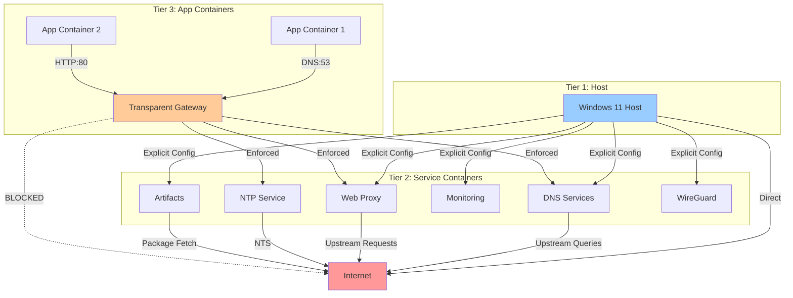

# Three-Tier Access Model

## Overview

The homelab implements a **three-tier access control model** with different levels of network access and interception:

```
┌─────────────────────────────────────────────────────────────────┐
│                         Tier 1: Host                             │
│                    (Windows 11 / WSL2)                           │
│                                                                  │
│  Access Mode: EXPLICIT CONFIGURATION ONLY                       │
│  - Configure proxy: localhost:3128                              │
│  - Configure DNS: localhost:5353                                │
│  - Access dashboards: localhost:3000, :9090, etc.              │
│  - VPN: localhost:51820                                         │
│                                                                  │
│  Can Access: All exposed ports (direct mode)                    │
│  Cannot Access: Container-to-container traffic                  │
└────────────────────────┬────────────────────────────────────────┘
                         │
                         ▼
┌─────────────────────────────────────────────────────────────────┐
│                  Tier 2: Service Containers                      │
│         (DNS, Proxy, NTP, Monitoring, Artifacts, VPN)           │
│                                                                  │
│  Access Mode: DIRECT (from host) or GATEWAY (from containers)   │
│  - dnsdist, CoreDNS, dnscrypt-proxy                            │
│  - Envoy, Squid, Privoxy, Tor                                  │
│  - chronyd                                                      │
│  - Nexus, Verdaccio                                            │
│  - Grafana, Prometheus, Jaeger                                 │
│  - WireGuard                                                    │
│                                                                  │
│  Can Access: Internet (for upstream queries)                    │
│  Provides: Services to Tier 1 (host) and Tier 3 (containers)   │
└────────────────────────┬────────────────────────────────────────┘
                         │
                         ▼
┌─────────────────────────────────────────────────────────────────┐
│              Tier 3: Application Containers                      │
│                  (Under Observation)                             │
│                                                                  │
│  Access Mode: TRANSPARENT (automatic interception)              │
│  - Uses transparent-gateway as DNS server                       │
│  - All DNS/NTP/HTTP/HTTPS automatically intercepted            │
│                                                                  │
│  Can Access: ONLY through Tier 2 services (enforced)           │
│  Cannot Access: Internet directly                               │
│  Cannot Access: Host network                                    │
└─────────────────────────────────────────────────────────────────┘
```

## Detailed Traffic Flows

### Flow 1: Host → Service Containers (Explicit)

```
Windows Host
    ↓ (explicit configuration)
    ├─→ localhost:5353 → dnsdist (DNS queries)
    ├─→ localhost:3128 → Squid (web proxy)
    ├─→ localhost:3000 → Grafana (monitoring)
    ├─→ localhost:8081 → Nexus (artifacts)
    ├─→ localhost:4873 → Verdaccio (npm)
    └─→ localhost:51820 → WireGuard (VPN)
```

**Characteristics:**
- ✅ Host has **full control** over what it accesses
- ✅ Host can **bypass** services if desired
- ✅ Host can access **internet directly**
- ⚠️ Host must **explicitly configure** each service

### Flow 2: Service Containers → Internet (Upstream)

```
Service Containers
    ↓ (upstream queries)
    ├─→ dnscrypt-proxy → ODoH → Internet -> Cloudflare 1.1.1.1
    ├─→ chronyd → NTS → Internet -> time.google.com
    ├─→ Tor → Tor Network → Internet
    ├─→ Nexus → Internet -> Maven Central, Docker Hub
    └─→ Verdaccio → Internet -> npmjs.org
```

**Characteristics:**
- ✅ Services can reach **internet directly**
- ✅ Services fetch **upstream data** (DNS, time, packages)
- ✅ Services provide **caching** and **filtering**
- ✅ Services enforce **privacy** (ODoH, NTS, Tor)

### Flow 3: App Containers → Services (Transparent)

```
Application Container (e.g., Node.js app)
    ↓ (automatic interception)
    ├─→ DNS:53 → transparent-gateway → AdGuard → dnsdist:5353
    ├─→ NTP:123 → transparent-gateway → chronyd:123
    ├─→ HTTP:80 → transparent-gateway → Squid:3128
    └─→ HTTPS:443 → transparent-gateway → Squid:3128
    ↓ (service processing)
    ├─→ DNS filtering (blocklists)
    ├─→ Web caching
    ├─→ Privacy protection (Tor)
    └─→ Internet (if allowed)
```

**Characteristics:**
- ✅ Apps **cannot bypass** homelab services
- ✅ Apps **cannot access internet directly**
- ✅ Apps are **under observation** (all traffic logged)
- ✅ Apps get **automatic benefits** (ad blocking, caching, privacy)
- ⚠️ Apps **must use transparent-gateway** as DNS

In the DNS path, AdGuard is the first policy and content-filtering layer in front of dnsdist and CoreDNS, ensuring that intercepted DNS queries receive host-level filtering before they enter the internal DNS chain.

### Flow 4a: VPN Clients → Services (Direct Mode)

```
VPN Client (mobile/laptop)
    ↓ (WireGuard tunnel - wg0)
    └─→ WireGuard Server (Port 51820)
        ↓ (direct routing)
        ├─→ Internet (direct access)
        ├─→ dnsdist:5353 (DNS - optional)
        ├─→ Squid:3128 (web proxy - optional)
        ├─→ Tor:9050 (SOCKS5 proxy - optional)
        ├─→ Grafana:3000 (monitoring)
        └─→ Nexus/Verdaccio (artifacts)
```

**Characteristics:**
- ✅ VPN clients have **direct internet access** (like Tier 1 Host)
- ✅ VPN clients can **choose** to use homelab services
- ✅ VPN clients can **optionally** use Tor for anonymization
- ✅ VPN clients **cannot access host**
- ✅ VPN clients **cannot access Docker daemon**
- ✅ VPN clients use **split-tunnel** (internet goes direct)
- ⚠️ VPN clients are **NOT under observation**

### Flow 4b: VPN Clients → Services (Transparent Mode)

```
VPN Client (mobile/laptop)
    ↓ (WireGuard tunnel - wg1)
    └─→ WireGuard Server (Port 51821)
        ↓ (transparent gateway routing)
        └─→ Transparent Gateway
            ↓ (enforced interception)
            ├─→ dnsdist:5353 (DNS - enforced)
            ├─→ Squid:3128 (web proxy - enforced)
            └─→ Internet (through homelab services only)
```

**Characteristics:**
- ✅ VPN clients are **under observation** (like Tier 3 Apps)
- ✅ VPN clients **MUST** use homelab services
- ✅ VPN clients **CANNOT** bypass filtering/monitoring
- ✅ VPN clients **CANNOT** access internet directly
- ✅ All traffic **logged and filtered**
- ⚠️ VPN clients have **restricted access** (for managed devices)

## Access Control Matrix

| Source | Target | Method | Enforced By | Can Bypass? |
|--------|--------|--------|-------------|-------------|
| **Host** | Service Containers | Explicit Config | User Choice | ✅ Yes |
| **Host** | Internet | Direct | None | ✅ Yes |
| **Service Containers** | Internet | Direct | None | ✅ Yes |
| **Service Containers** | Other Services | Docker Network | Docker DNS | ❌ No |
| **App Containers** | Services | Transparent Gateway | iptables in gateway | ❌ No |
| **App Containers** | Internet | **BLOCKED** | iptables in gateway | ❌ No |
| **VPN Clients (wg0 - Direct)** | Services | WireGuard Routing | WireGuard config | ✅ Yes (optional) |
| **VPN Clients (wg0 - Direct)** | Internet | Direct | WireGuard config | ✅ Yes |
| **VPN Clients (wg0 - Direct)** | Host | **BLOCKED** | Docker network isolation | ❌ No |
| **VPN Clients (wg1 - Transparent)** | Services | Transparent Gateway | iptables in gateway | ❌ No |
| **VPN Clients (wg1 - Transparent)** | Internet | **BLOCKED** | iptables in gateway | ❌ No |
| **VPN Clients (wg1 - Transparent)** | Host | **BLOCKED** | Docker network isolation | ❌ No |

## Security Boundaries

### Boundary 1: Host ↔ Containers

```
Host (Windows/WSL2)
    ║ (Docker port mapping)
    ║ Security: Host firewall, Docker isolation
    ╚═══════════════════════════════════════
Container Network (172.20.0.0/16)
```

**Protection:**
- Host cannot access container internal IPs (unless explicitly exposed)
- Containers cannot access host services (unless explicitly allowed)
- Docker provides network namespace isolation

### Boundary 2: Service Containers ↔ App Containers

```
Service Containers (Tier 2)
    ║ (transparent-gateway enforcement)
    ║ Security: iptables DNAT, no direct routes
    ╚═══════════════════════════════════════
App Containers (Tier 3)
```

**Protection:**
- App containers **must** go through transparent-gateway
- App containers **cannot** access internet directly
- App containers **cannot** bypass filtering/monitoring
- All traffic is **logged and observable**

### Boundary 3a: VPN Network (Direct) ↔ Homelab Network

```
VPN Network wg0 (172.21.0.0/24)
    ║ (WireGuard routing rules)
    ║ Security: Split-tunnel, optional service access
    ╚═══════════════════════════════════════
Homelab Network (172.20.0.0/16)
```

**Protection:**
- VPN clients can access **internet directly**
- VPN clients can **optionally** use homelab services
- VPN clients **cannot** access Docker daemon
- VPN clients **cannot** access host SSH
- VPN clients use **split-tunnel** (internet direct)

### Boundary 3b: VPN Network (Transparent) ↔ Homelab Network

```
VPN Network wg1 (172.21.1.0/24)
    ║ (Transparent Gateway enforcement)
    ║ Security: All traffic intercepted, no bypass
    ╚═══════════════════════════════════════
Transparent Gateway (172.20.0.254)
    ║
    ╚═══════════════════════════════════════
Homelab Network (172.20.0.0/16)
```

**Protection:**
- VPN clients **MUST** go through transparent gateway
- VPN clients **CANNOT** access internet directly
- VPN clients **CANNOT** bypass filtering/monitoring
- VPN clients **CANNOT** access Docker daemon
- VPN clients **CANNOT** access host SSH
- All traffic **logged and observable**

## Example Configurations

### Example 1: Host Accessing Services

**Windows PowerShell:**
```powershell
# Configure browser proxy (explicit)
$proxy = "http://localhost:3128"
$env:HTTP_PROXY = $proxy
$env:HTTPS_PROXY = $proxy

# Configure DNS (explicit)
nslookup example.com 127.0.0.1 -port=5353

# Access monitoring
Start-Process "http://localhost:3000"  # Grafana

# Use Tor for anonymization (optional)
$env:HTTP_PROXY = "socks5://localhost:9050"
$env:HTTPS_PROXY = "socks5://localhost:9050"
```

### Example 2: App Container Under Observation

**docker-compose.yml:**
```yaml
services:
  my-app:
    image: node:18
    networks:
      - localnet
    dns:
      - transparent-gateway  # Enforces transparent interception
    environment:
      - NODE_ENV=production
```

**Result:**
- ✅ All DNS queries → dnsdist (logged, filtered)
- ✅ All HTTP/HTTPS → Squid (cached, logged)
- ✅ All NTP → chronyd (synchronized)
- ❌ Cannot access internet directly
- ❌ Cannot bypass homelab services

### Example 3: VPN Direct Mode Client Configuration

**VPN clients on Direct Mode (wg0) can optionally use homelab services:**

```bash
# On VPN client (after connecting to wg0)

# Option 1: Direct internet (default)
curl http://example.com

# Option 2: Use homelab DNS
echo "nameserver 172.20.0.2" > /etc/resolv.conf

# Option 3: Use homelab web proxy
export HTTP_PROXY=http://172.20.0.3:3128
export HTTPS_PROXY=http://172.20.0.3:3128
curl http://example.com

# Option 4: Use Tor for anonymization
export HTTP_PROXY=socks5://172.20.0.5:9050
export HTTPS_PROXY=socks5://172.20.0.5:9050
curl http://example.com  # Goes through Tor

# Option 5: Configure browser to use Tor
# SOCKS5 Proxy: 172.20.0.5:9050
```

### Example 4: Service Container Upstream Access

**Service containers have direct internet access for upstream queries:**

```yaml
services:
  dnscrypt-proxy:
    # This service CAN access internet directly
    # to query ODoH relays and DNS servers
    image: klutchell/dnscrypt-proxy
    networks:
      - localnet
    # No dns: [transparent-gateway] - uses default Docker DNS
```

## Why This Design?

### For Host (Tier 1):
- **Flexibility**: Host can choose to use services or bypass them
- **Performance**: No overhead when not using services
- **Compatibility**: Works with all Windows applications

### For Service Containers (Tier 2):
- **Upstream Access**: Can fetch data from internet (DNS, packages, time)
- **Caching**: Can cache responses for app containers
- **Privacy**: Can use encrypted protocols (ODoH, NTS, Tor)

### For App Containers (Tier 3):
- **Enforcement**: Cannot bypass monitoring or filtering
- **Observability**: All traffic is logged and visible
- **Security**: Cannot access internet directly (air-gapped)
- **Benefits**: Automatic ad blocking, caching, privacy protection

## Traffic Flow Diagram



## Summary

| Tier | Access Mode | Internet Access | Can Bypass Services | Enforcement |
|------|-------------|-----------------|---------------------|-------------|
| **Tier 1: Host** | Explicit | ✅ Yes | ✅ Yes | User choice |
| **Tier 2: Services** | Direct | ✅ Yes (upstream) | N/A | None |
| **Tier 3: Apps** | Transparent | ❌ No | ❌ No | iptables in gateway |
| **VPN (wg0 - Direct)** | Direct | ✅ Yes | ✅ Yes | WireGuard routing |
| **VPN (wg1 - Transparent)** | Transparent | ❌ No | ❌ No | iptables in gateway |

This three-tier model provides:
- ✅ **Flexibility** for host
- ✅ **Functionality** for services
- ✅ **Enforcement** for apps under observation
