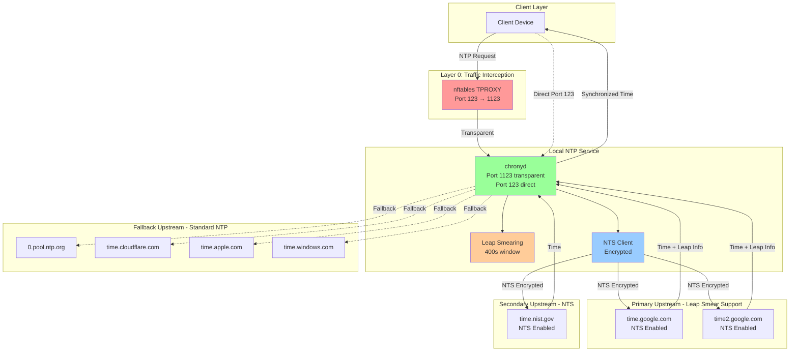
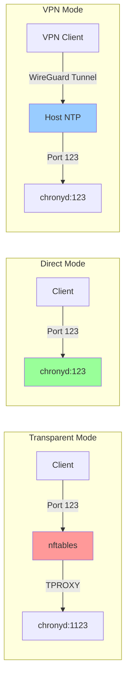
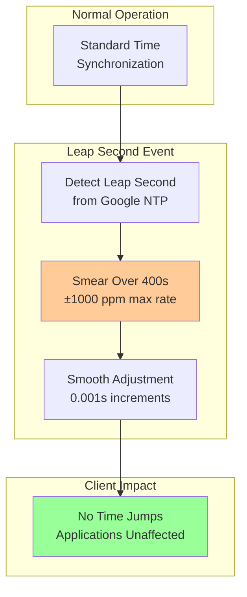
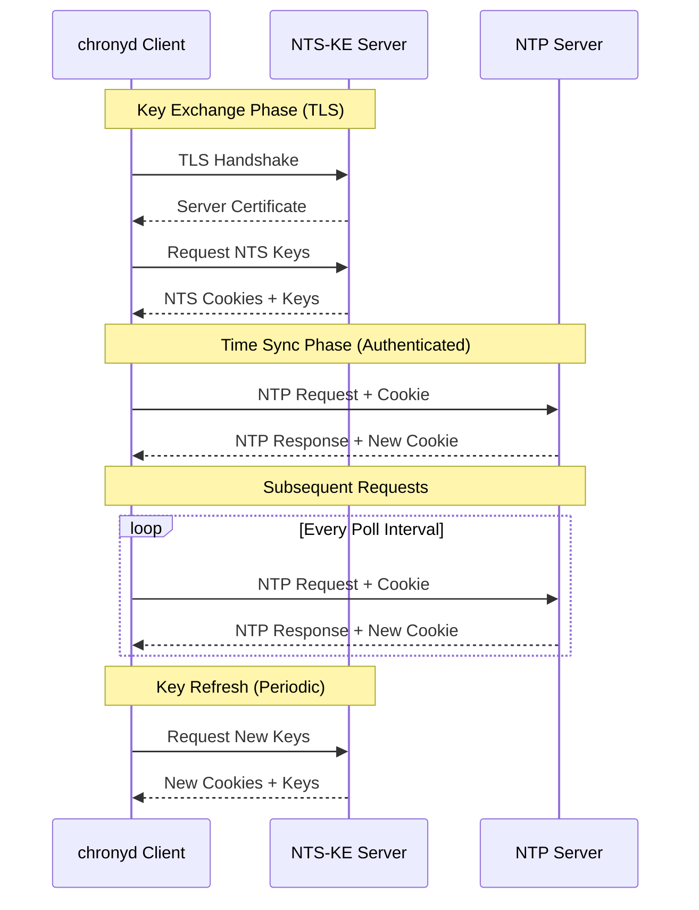
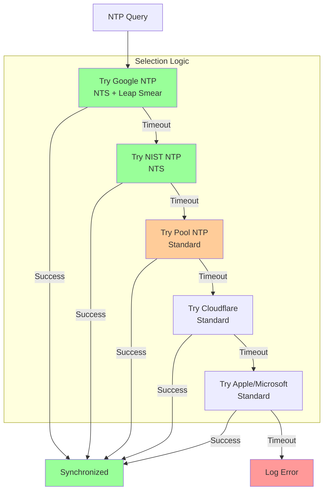

# NTP Time Synchronization Flow

## NTP Service Chain

```mermaid
graph TB
    subgraph "Client Layer"
        Client[Client Device]
    end
    
    subgraph "Layer 0: Traffic Interception"
        nftables[nftables TPROXY<br/>Port 123 → 1123]
    end
    
    subgraph "Local NTP Service"
        chronyd[chronyd<br/>Port 1123 transparent<br/>Port 123 direct]
        LeapSmear[Leap Smearing<br/>400s window]
        NTSClient[NTS Client<br/>Encrypted]
    end
    
    subgraph "Primary Upstream - Leap Smear Support"
        Google1[time.google.com<br/>NTS Enabled]
        Google2[time2.google.com<br/>NTS Enabled]
    end
    
    subgraph "Secondary Upstream - NTS"
        NIST[time.nist.gov<br/>NTS Enabled]
    end
    
    subgraph "Fallback Upstream - Standard NTP"
        Pool[0.pool.ntp.org]
        Cloudflare[time.cloudflare.com]
        Apple[time.apple.com]
        Microsoft[time.windows.com]
    end
    
    Client -->|NTP Request| nftables
    nftables -->|Transparent| chronyd
    Client -.->|Direct Port 123| chronyd
    
    chronyd --> LeapSmear
    chronyd --> NTSClient
    
    NTSClient -->|NTS Encrypted| Google1
    NTSClient -->|NTS Encrypted| Google2
    NTSClient -->|NTS Encrypted| NIST
    
    chronyd -.->|Fallback| Pool
    chronyd -.->|Fallback| Cloudflare
    chronyd -.->|Fallback| Apple
    chronyd -.->|Fallback| Microsoft
    
    Google1 -->|Time + Leap Info| chronyd
    Google2 -->|Time + Leap Info| chronyd
    NIST -->|Time| chronyd
    
    chronyd -->|Synchronized Time| Client
    
    style nftables fill:#ff9999
    style chronyd fill:#99ff99
    style NTSClient fill:#99ccff
    style LeapSmear fill:#ffcc99
```

## NTP Access Modes

```mermaid
graph LR
    subgraph "Transparent Mode"
        T1[Client] -->|Port 123| T2[nftables]
        T2 -->|TPROXY| T3[chronyd:1123]
    end
    
    subgraph "Direct Mode"
        D1[Client] -->|Port 123| D2[chronyd:123]
    end
    
    subgraph "VPN Mode"
        V1[VPN Client] -->|WireGuard Tunnel| V2[Host NTP]
        V2 -->|Port 123| V3[chronyd:123]
    end
    
    style T2 fill:#ff9999
    style D2 fill:#99ff99
    style V2 fill:#99ccff
```

## Leap Second Handling

```mermaid
graph TB
    subgraph "Normal Operation"
        Normal[Standard Time<br/>Synchronization]
    end
    
    subgraph "Leap Second Event"
        Detect[Detect Leap Second<br/>from Google NTP]
        Smear[Smear Over 400s<br/>±1000 ppm max rate]
        Smooth[Smooth Adjustment<br/>0.001s increments]
    end
    
    subgraph "Client Impact"
        NoJump[No Time Jumps<br/>Applications Unaffected]
    end
    
    Normal --> Detect
    Detect --> Smear
    Smear --> Smooth
    Smooth --> NoJump
    
    style Smear fill:#ffcc99
    style NoJump fill:#99ff99
```

## NTS (Network Time Security)

```mermaid
sequenceDiagram
    participant Client as chronyd Client
    participant NTS as NTS-KE Server
    participant NTP as NTP Server
    
    Note over Client,NTS: Key Exchange Phase (TLS)
    Client->>NTS: TLS Handshake
    NTS-->>Client: Server Certificate
    Client->>NTS: Request NTS Keys
    NTS-->>Client: NTS Cookies + Keys
    
    Note over Client,NTP: Time Sync Phase (Authenticated)
    Client->>NTP: NTP Request + Cookie
    NTP-->>Client: NTP Response + New Cookie
    
    Note over Client,NTP: Subsequent Requests
    loop Every Poll Interval
        Client->>NTP: NTP Request + Cookie
        NTP-->>Client: NTP Response + New Cookie
    end
    
    Note over Client,NTS: Key Refresh (Periodic)
    Client->>NTS: Request New Keys
    NTS-->>Client: New Cookies + Keys
```

## Upstream Selection Strategy

```mermaid
graph TB
    Start[NTP Query]
    
    subgraph "Selection Logic"
        Try1[Try Google NTP<br/>NTS + Leap Smear]
        Try2[Try NIST NTP<br/>NTS]
        Try3[Try Pool NTP<br/>Standard]
        Try4[Try Cloudflare<br/>Standard]
        Try5[Try Apple/Microsoft<br/>Standard]
    end
    
    Success[Synchronized]
    Fail[Log Error]
    
    Start --> Try1
    Try1 -->|Success| Success
    Try1 -->|Timeout| Try2
    Try2 -->|Success| Success
    Try2 -->|Timeout| Try3
    Try3 -->|Success| Success
    Try3 -->|Timeout| Try4
    Try4 -->|Success| Success
    Try4 -->|Timeout| Try5
    Try5 -->|Success| Success
    Try5 -->|Timeout| Fail
    
    style Try1 fill:#99ff99
    style Try2 fill:#99ff99
    style Try3 fill:#ffcc99
    style Success fill:#99ff99
    style Fail fill:#ff9999
```
