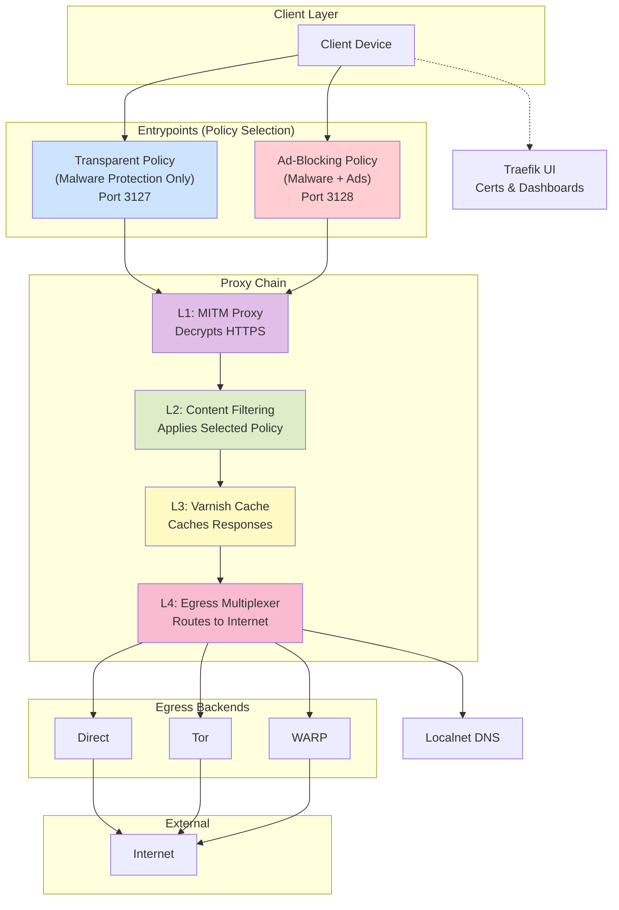
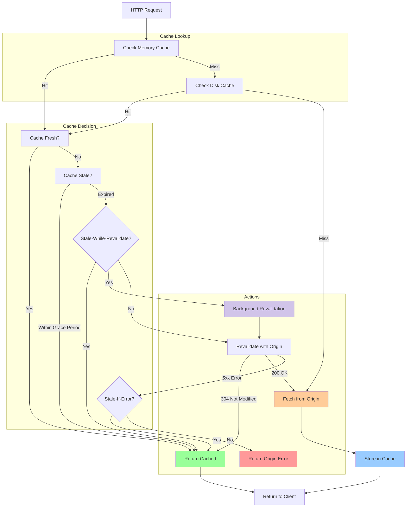

# Web Proxy Architecture (V2)

This document outlines the modular, layered architecture of the `localnet` web proxy system. The design provides flexibility, allowing clients to select their desired level of filtering and privacy by choosing different entry points into the proxy chain.

## High-Level Architecture

The following diagram illustrates the complete proxy chain, from client entry to internet egress.

## Core Concepts

### 1. Linear Proxy Chain

The proxy is a single, sequential chain of services. All traffic flows through the layers in a specific order. This ensures that essential steps like decryption happen before content-dependent steps like filtering.

1.  **L1: MITM Proxy**: All traffic first enters the MITM (Man-in-the-Middle) proxy to be decrypted from HTTPS into plaintext HTTP.
2.  **L2: Content Filtering**: The plaintext traffic is passed to the filtering layer. This layer inspects the request and applies the security policy chosen by the client at the entrypoint.
3.  **L3: Caching**: If the request is allowed, it moves to the caching layer (Varnish) to check for a stored response.
4.  **L4: Egress**: If the request is not cached, it is sent to the egress multiplexer (`Gost`), which forwards it to the internet via the selected backend.

### 2. Entrypoints as Policy Selectors

The two entrypoints do not represent different process flows; they are simply a way for the client to signal which **security policy** should be applied at the Content Filtering layer.

- **Transparent Policy (Port 3127):** This policy instructs the filtering layer to *only* scan for and block known malware and tracking domains.
- **Ad-Blocking Policy (Port 3128):** This is a stricter policy that instructs the filtering layer to block malware, trackers, *and* advertisements.

### 3. Egress Routing with Gost

The `Gost` proxy acts as a flexible egress router. It can be configured to forward traffic to one of several backends based on the credentials the client uses to connect to the proxy.

- **`user: direct`** -> Forwards directly to the internet (highest performance).
- **`user: tor`** -> Forwards through the Tor network (highest privacy).
- **`user: warp`** -> Forwards through Cloudflare WARP (balanced performance and security).

## Service Management with Traefik

Traefik serves as the central management plane for the proxy services.

- **Web Dashboards:** It exposes the web UIs for services like Varnish, Privoxy, etc., under a single, unified dashboard, secured with authentication.
- **Certificate Management:** The root CA certificate required for the MITM proxy to decrypt HTTPS traffic is available for download directly from the Traefik dashboard. This makes it easy to provision new client devices.

## DNS Integration

All services within the proxy chain are configured to use the `localnet` DNS services. This ensures that all DNS resolution is handled internally, benefiting from the same filtering, caching, and security policies defined in the DNS architecture.

## Advanced Caching Strategies

To enhance performance and resilience, the caching layer employs two advanced strategies:

1. **Stale-While-Revalidate**: For content that has just expired, the cache will serve the stale version to the client immediately for a fast response, while simultaneously sending a request to the origin server to fetch the fresh version in the background. This makes the user experience feel significantly faster.

2. **Stale-If-Error**: If the origin server is down or returns an error (e.g., a `5xx` status code), the cache is configured to serve a stale version of the content instead of returning an error to the client. This dramatically improves resilience and ensures that sites remain accessible even when their servers are temporarily unavailable.

The flow is illustrated below:

## Architectural Decision: Caching Layer

During the design phase, **Squid** was initially chosen as the caching layer. However, an investigation into its capabilities revealed a critical limitation: modern versions of Squid do not support the `stale-while-revalidate` Cache-Control directive. This feature is essential for providing a highly performant user experience by serving stale content immediately while refreshing it in the background.

While Squid does support a `stale-if-error` equivalent via its proprietary `max-stale` directive, the lack of `stale-while-revalidate` was considered a significant drawback for a modern caching service.

Therefore, a decision was made to pivot to **Varnish Cache**.

### Rationale for Choosing Varnish

1. **Full Support for Modern Caching**: Varnish provides first-class, native support for both `stale-while-revalidate` and `stale-if-error`, allowing the implementation of the ideal caching logic without compromise.
2. **Specialization**: Varnish is a purpose-built HTTP accelerator. It is designed specifically for high-performance reverse proxy caching, making it a specialist tool for this layer of the proxy chain.
3. **Configuration Flexibility**: The Varnish Configuration Language (VCL) offers unparalleled control over the caching logic, enabling fine-grained manipulation of requests and responses.

By choosing Varnish, the architecture prioritizes performance and modern standards compliance over the legacy features of Squid, which are better suited to traditional forward proxy deployments.
