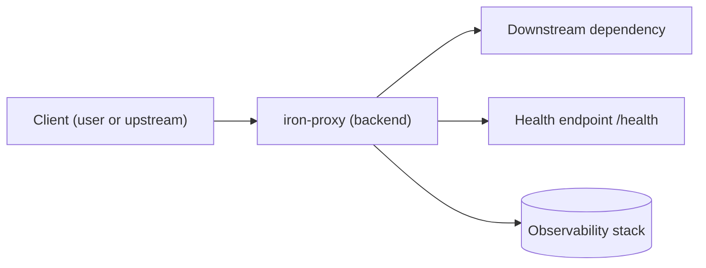
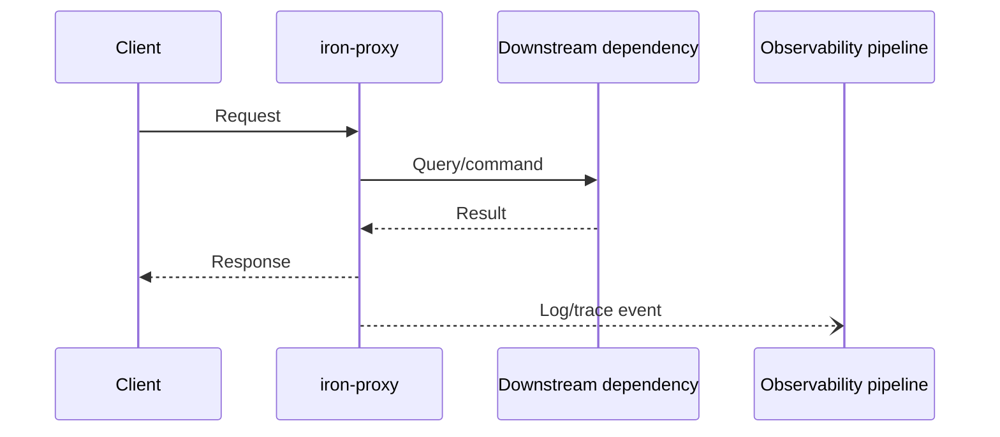

# Iron-Proxy Service Diagram Pack

⭐ **Purpose**

Illustrate the default control flow for the generated iron-proxy stack so the service owner can adapt it once custom dependencies or sidecars are added.

☑️ **Mermaid Flow**

☑️ **Mermaid Sequence**

✅ **Implementation Notes**

- Replace the `Downstream dependency` placeholder with real integrations such as databases, queues, or external APIs.
- Extend the diagrams when adding sidecars (migrations, workers, cron jobs) so the operational runbooks stay accurate.
- Ensure docker-compose overrides or k8s manifests remain in sync with this documentation when topologies change.
- Export finalized diagrams as SVG/PNG (`mmdc`) to embed in higher-level design docs or dashboards.
