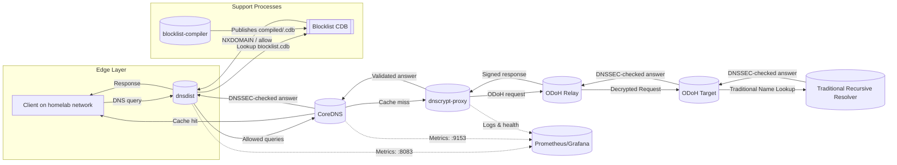
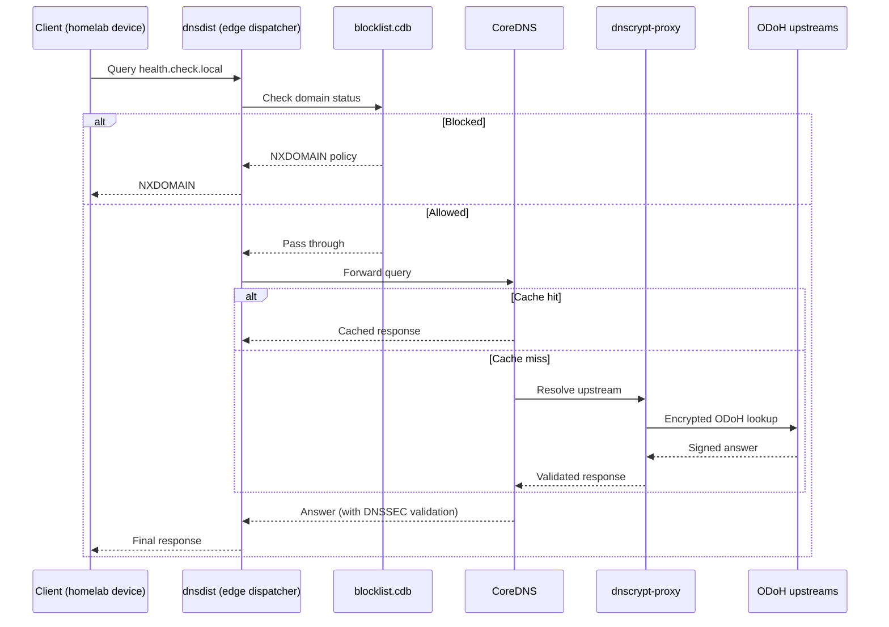

# DNS Service Chain for Localnet

⭐ **Purpose**

Document how queries travel through the hardened DNS stack that lives under `apps/active/devops/localnet/services/dns`. The focus is on the runtime flow across `dnsdist`, `coredns`, `dnscrypt-proxy`, and the supporting blocklist compiler.

☑️ **Mermaid Flow**

☑️ **Mermaid Sequence**

✅ **Stage Highlights**

- **dnsdist** (edge dispatcher) applies rate limiting, consults the compiled blocklist, and forwards permitted queries to CoreDNS while exposing Prometheus metrics on port `:8083` @apps/active/devops/localnet/services/dns/docker-compose.dns.yml#1-34.
- **CoreDNS** caches answers, serves internal zones, and forwards cache misses to `dnscrypt-proxy` @apps/active/devops/localnet/configs/dns/coredns/Corefile#4-22.
- **dnscrypt-proxy** performs encrypted Oblivious DoH (ODoH) lookups against curated upstream resolvers, validating DNSSEC and enforcing resolver policies defined in `dnscrypt-proxy.toml` @apps/active/devops/localnet/configs/dns/dnscrypt-proxy/dnscrypt-proxy.toml#16-156.
- **Blocklist compiler** converts curated source lists into the `blocklist.cdb` artifact that dnsdist queries synchronously during request evaluation @apps/active/devops/localnet/services/dns/docker-compose.dns.yml#78-99.

⚠️ **Operational Notes**

- All services run on the `homelab` Docker network with static IP assignments, enabling dnsdist to route to CoreDNS (`172.20.255.51:53`) or dnscrypt (`172.20.255.50:5053`) even during restarts @apps/active/devops/localnet/services/dns/docker-compose.dns.yml#35-76.
- Health checks cover edge resolution, upstream privacy resolution, and blocklist availability. Failing probes indicate which service needs attention (`dig` for dnsdist, `dnscrypt-proxy -resolve` for dnscrypt, file existence for blocklist) @apps/active/devops/localnet/services/dns/docker-compose.dns.yml#27-99.
- Metrics endpoints plug into Prometheus/Grafana dashboards for latency, cache-hit ratios, and blocklist effectiveness.

📚 **Related Resources**

- Service README with lifecycle commands and component matrix @apps/active/devops/localnet/services/dns/README.md#1-50.
- Makefile tasks for build, deploy, lint, and health verification @apps/active/devops/localnet/services/dns/Makefile#28-138.
- Configuration artifacts under `apps/active/devops/localnet/configs/dns/` for per-service tuning.
