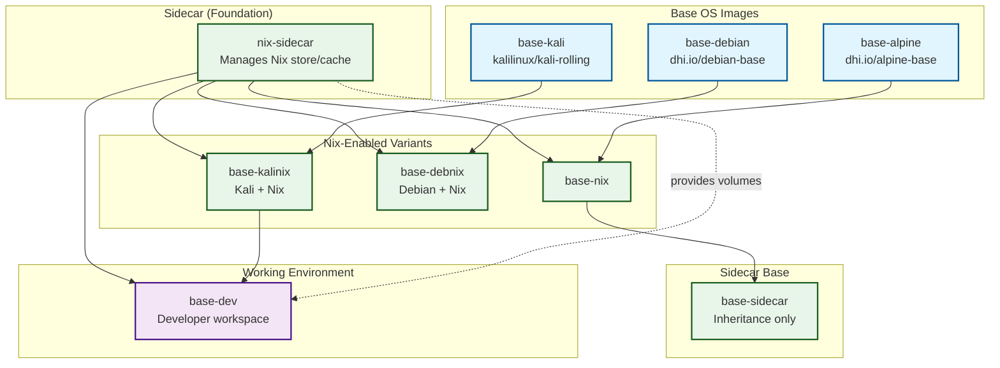

# LocalNet Development Environment - Agent Instructions

This document follows **[ADR-20260322002](../internal-docs/adr/adr-20260322002-docker-compose-profile-strategy.md)** for Docker Compose profile-based service organization and **[ADR-20260322003](../internal-docs/adr/adr-20260322003-memory-management-local-task-tracking.md)** for memory management and task tracking.

## 🤖 AI Development Loop Integration

This project implements the **AI Development Loop** skill for systematic, high-quality development cycles. All AI agents working on this project MUST follow the standardized workflow.

### Quick Start for AI Agents

```bash
# Use the orchestrator for automated step-by-step execution
./scripts/orchestrator.sh --verbose loop

# Or use the development loop helper directly
./scripts/dev-loop-helper.sh --verbose foundation
./scripts/dev-loop-helper.sh --verbose next
./scripts/dev-loop-helper.sh --verbose start <ticket-id>
./scripts/dev-loop-helper.sh --verbose complete <ticket-id>
```

### Core Workflow Steps

**Automated Steps (handled by script):**
- **Step 0**: Foundation Check - Environment validation and security scanning
- **Step 1**: Ticket Selection - Get next actionable ticket
- **Step 2**: Start Work - Mark ticket as in_progress
- **Step 6**: Verification - Code quality validation
- **Step 8**: Completion - Ticket audit and repository cleanup

**Manual Steps (agent responsibility):**
- **Step 3**: High Quality - Ensure adequate testing
- **Step 4**: Strategy - Determine implementation approach
- **Step 5**: Implementation - Do the actual work
- **Step 7**: Ticket Audit - Coverage validation (90%+ threshold)
- **Step 9**: Commit Changes - Organized commits
- **Step 10**: Assess - Improvement opportunities
- **Step 11**: Codify - Create improvement tickets
- **Step 12**: Final Commit - Repository cleanup
- **Step 13**: Loop Again - Grab next ticket

### Critical Warnings

🚨 **EMPLOYMENT TERMINATION OFFENSES**:
- NEVER remove existing features unless explicitly required by ticket
- NEVER reduce test coverage or delete tests
- NEVER degrade code quality or introduce regressions
- NEVER stop processing open tickets in the LOOP
- NEVER send data out of owned systems without permission
- NEVER misinform the owner (explicitly or via omission)

### Quality Gates

Before completing any ticket, verify:
- [ ] Foundation checks passed (environment validation, security scan)
- [ ] Code quality validation passed
- [ ] Ticket audit completed with 90%+ coverage
- [ ] All ticket requirements fully implemented
- [ ] No features or tests removed unless explicitly required
- [ ] Test coverage maintained or improved
- [ ] All existing functionality still works
- [ ] No regressions introduced
- [ ] Assessment completed for improvements
- [ ] Improvement tickets created and prioritized
- [ ] Documentation updated

If you're working on Nix containers, see the documentation at:

- /home/micro/p/gh/lrepo52/job-aide/apps/active/devops/localnet/internal-docs/requirements/nix/

## 🚀 Environment Setup

This project uses **Devbox** for environment management with integrated memory management tools (qmd, tkr, Obsidian). Follow these steps:

### 1. Setup Devbox Environment
```bash
# Ensure you're in the correct directory
cd apps/active/devops/localnet

# Start devbox shell (installs just, yq-go, jq, qmd, tkr, obsidian)
devbox shell

# Or run commands directly through devbox
devbox run -- just base-up-internal
```

### 2. Available Commands

**Profile-Based Service Management (NEW)**:
```bash
# Profile-based service orchestration (ADR-20260322002)
just up-agents                    # Start AI/agent services
just up-base01                    # Production base services
just up-core-nix                  # Core infrastructure only
just up-localnet                  # Full localnet environment

# Environment-specific deployments
COMPOSE_ENV=production just up-base01
COMPOSE_ENV=testing just up-agents

# Multi-profile combinations
just up-core-nix                  # Core + Nix services
just up-prod                      # Production environment
```

**Memory Management & Task Tracking (NEW)**:
```bash
# Search documentation and memory
just doc-search "authentication"
just doc-search "database patterns"

# Task management with tkr
just tasks                         # List open tasks
just task-ready                    # Get next available task
just task-start                   # Start working on task
```

**Traditional Commands (backward compatible)**:
```bash
# Primary workflow: just → devbox run -- just-internal
just base-up        # → devbox run -- just base-up-internal
just up             # → devbox run -- just up-internal
just down           # → devbox run -- just down-internal
just build          # → devbox run -- just build-internal
just clean          # → devbox run -- just clean-internal
just logs           # → devbox run -- just logs-internal
just health-check   # → devbox run -- just health-check-internal
just test           # → devbox run -- just test-internal
just bootstrap      # → devbox run -- just bootstrap-internal
```

### 3. ADR Compliance Notes

This project follows multiple ADRs for standardized workflows:

- **ADR-20260131001**: Standard Developer UX Flow (`direnv → devbox → just (*-internal)`)
- **ADR-20260322002**: Docker Compose Profile-Based Service Organization
- **ADR-20260322003**: Memory Management and Local Task Tracking

The justfile includes `-internal` recipe variants to comply with ADR-20260131001:
- All main recipes have corresponding `-internal` variants
- `-internal` recipes delegate to their main counterparts
- Enables parent devbox.json to call `bootstrap-internal` and other `-internal` targets

### 4. Why Devbox with Memory Tools?
- **Consistent Environment**: Provides consistent development environment across all projects
- **Integrated Tooling**: Includes required tools (just, yq-go, jq, qmd, tkr, obsidian)
- **Memory Management**: Built-in qmd for documentation search, tkr for task tracking
- **Knowledge Graph**: Obsidian for interconnected knowledge management
- **ADR Compliance**: Follows monorepo standards from ADR-20260131001

## 🔄 Profile-Based Service Organization

Following **[ADR-20260322002](../internal-docs/adr/adr-20260322002-docker-compose-profile-strategy.md)**, services are organized into profiles for better debugging and management:

### Available Profiles

```bash
# Core Infrastructure
just up-core                      # Core services (networks, shared resources)
just up-nix                       # Nix package management
just up-dns                       # DNS resolution services

# Base Environments
just up-base01                    # Production base infrastructure
just up-base02                    # Development base infrastructure

# Application Services
just up-agents                    # AI and agent services (OpenFang)
just up-security                  # Security services and monitoring

# Combined Environments
just up-localnet                  # Full localnet environment (default)
just up-core-nix                  # Core infrastructure + Nix
just up-prod                      # Production environment
just up-test                      # Testing environment
```

### Environment-Specific Deployment

```bash
# Production environment
COMPOSE_ENV=production just up-base01

# Development environment (default)
COMPOSE_ENV=development just up-localnet

# Testing environment
COMPOSE_ENV=testing just up-agents
```

### Debugging with Profiles

```bash
# Debug specific service
docker compose --profile nix up nix-sidecar

# Debug service cluster
docker compose --profile agents up

# Show logs for profile
docker compose --profile nix logs --tail=50

# Use justfile for ADR-compliant debugging
just up-nix                        # Start Nix services
just logs                          # View all logs
```

## 🧠 Memory Management & Task Tracking

Following **[ADR-20260322003](../internal-docs/adr/adr-20260322003-memory-management-local-task-tracking.md)**:

### Memory Search with qmd

```bash
# Search documentation and knowledge base
just doc-search "authentication patterns"
just doc-search "database design"
just doc-search "kali security tools"

# Show all indexed content
just doc-search
```

### Task Management with tkr

```bash
# View available tasks
just tasks

# Get next actionable task
just task-ready

# Start working on task
just task-start

# Add notes to current task
tkr add-note <task-id> "Working on authentication flow"
```

### Knowledge Management with Obsidian

The `memory/` directory contains organized knowledge:
- `01-projects/` - Project-specific knowledge
- `02-decisions/` - Architecture decisions and rationale
- `03-patterns/` - Design patterns and solutions
- `04-learnings/` - Lessons learned and insights

## 🤖 AI Development Loop Ticket Management

### Ticket Status Flow

```text
open → in_progress → ready → closed
  ↑         ↓           ↓
  └─────── ready ←─────┘
           ↓
    stale (>7d) → open (auto-cleanup)
```

### Ticket Management Commands

```bash
# Foundation check with stale ticket cleanup
./scripts/dev-loop-helper.sh --verbose foundation

# Get next actionable ticket
./scripts/dev-loop-helper.sh --verbose next

# Start working on ticket
./scripts/dev-loop-helper.sh --verbose start <ticket-id>

# Complete ticket with audit
./scripts/dev-loop-helper.sh --verbose complete <ticket-id>

# Manual ticket operations
tkr list --status=open           # List open tickets
tkr show <ticket-id>             # Show ticket details
tkr add-note <ticket-id> "Note"  # Add progress note
```

### Ticket Audit Process

**Step 7: Ticket Audit (Coverage Validation)**

Systematically audit implementation against ticket requirements:

#### 7.1: Requirement Extraction
- Parse ticket title, description, and acceptance criteria
- Identify functional, non-functional, and technical requirements

#### 7.2: Coverage Analysis
For each requirement, mark coverage status:
- `covered` - Fully implemented with tests
- `partial` - Partially implemented or insufficiently tested  
- `missing` - Not implemented

#### 7.3: Coverage Scoring
- Calculate 0-100 coverage score
- Must achieve 90%+ coverage before completion
- Provide rationale for score

#### 7.4: Gap Analysis
List gaps by priority:
- **Critical**: Missing core functionality
- **Major**: Partial implementation or insufficient testing
- **Minor**: Documentation, edge cases, optimizations

#### 7.5: Implementation Patching
Address identified gaps until 90%+ compliance achieved

**Audit Example:**
```
Requirement: "user can reset password" → Covered: PasswordResetService.reset() in auth/password-reset.ts
Requirement: "password reset email sent" → Covered: EmailService.sendPasswordReset() in auth/email.ts  
Requirement: "rate limiting on reset attempts" → Missing: No rate limiting implemented
Coverage Score: 85% - Missing rate limiting feature
```

### Assessment and Improvement (Steps 10-11)

#### Technology Assessment
- Tool knowledge improvements and alternatives
- Integration and testing enhancements
- Documentation and standards to establish

#### Process Assessment  
- Manual steps that should be automated
- Testing process improvements
- Workflow and tool creation opportunities

#### Project Assessment
- Project organization improvements
- Cross-project learning opportunities
- Future prevention measures

#### Creating Improvement Tickets
```bash
# Create high-priority improvement tickets
tkr create "Improve testing process for X technology" \
  --type=improvement --priority=high \
  --description="Based on assessment from ticket <current-ticket-id>"

# Create process improvement tickets  
tkr create "Add automation workflow for Y process" \
  --type=process --priority=medium \
  --description="Automate manual steps identified in ticket <current-ticket-id>"
```

## � Integrated Workflow

### Daily Development Workflow

```bash
# 1. Enter project (direnv activates devbox with memory tools)
cd apps/active/devops/localnet

# 2. Check available tasks
just tasks

# 3. Search memory for context
just doc-search "security agent configuration"

# 4. Start specific service cluster (ADR-20260322002)
just up-agents

# 5. Start working on task
just task-start

# 6. Work with full context (qmd + Obsidian + tkr)
```

## ⚠️ CRITICAL: Directory Requirements

**🚨 NEVER run docker compose commands from services/ subdirectories!**

**ALWAYS run from the localnet root directory:**

```bash
cd apps/active/devops/localnet
```

**Why this is critical:**

- Docker compose files use relative paths (`../../`, `../`) that resolve differently from subdirectories
- Environment variables are loaded relative to the localnet root
- Volume paths and network configurations depend on the correct working directory
- Running from services/ will cause "file not found" and "path resolution" errors

**❌ WRONG (will fail):**

```bash
cd services/base
docker compose up  # ← FAILS - wrong directory!
```

**✅ CORRECT:**

```bash
cd apps/active/devops/localnet
just base-up  # ← Uses correct paths and env vars
```

## ⚠️ IMPORTANT: Use Profile-Based Service Management

**PREFER the new profile-based approach** for better debugging and service isolation:

```bash
# RECOMMENDED: Profile-based service management (ADR-20260322002)
just up-agents                    # Start AI/agent services
just up-base01                    # Production base services
just up-core-nix                  # Core infrastructure only

# LEGACY: Traditional justfile commands (still work)
just up                           # Start all services
just base-up                      # Start base services
```

### When to Use Each Approach

**Use Profile-Based Services**:
- Debugging specific service clusters
- Testing individual components
- Environment-specific deployments
- Isolating service dependencies

**Use Traditional Commands**:
- Full system startup
- Legacy compatibility
- Simple workflows

## 🔄 Service Organization (Profile-Based)

Following **[ADR-20260322002](../internal-docs/adr/adr-20260322002-docker-compose-profile-strategy.md)**, services are organized into logical profiles:

### Profile Hierarchy



### Profile Usage Examples

```bash
# Start specific service cluster
just up-core-nix                  # Core infrastructure only
just up-agents                    # AI and agent services
just up-security                  # Security services

# Environment-specific deployment
COMPOSE_ENV=production just up-base01
COMPOSE_ENV=development just up-localnet

# Debug specific service
docker compose --profile nix up nix-sidecar
docker compose --profile agents up openfang
```

## Common Workflows

### Development Setup

```bash
# Start everything in proper order
just up

# View logs for all services
just logs

# View logs for specific service
just logs SERVICE=nix-sidecar
```

### Troubleshooting

```bash
# Clean restart
just down
just up

# Rebuild specific service
just rebuild SERVICE=nix-sidecar

# Check service health
just health
```

### Development Iteration

```bash
# After making changes to a service:
just rebuild SERVICE=<service-name>

# Or for full rebuild:
just clean
just up
```

## What Happens If You Don't Use the Justfile

1. **Missing Environment Variables** - Services fail to start or use wrong configurations
2. **Dependency Failures** - Services start before their dependencies are ready
3. **Network Issues** - Containers can't communicate with each other
4. **Volume Problems** - Shared data isn't properly initialized
5. **Port Conflicts** - Services try to use already-allocated ports
6. **🚨 PATH RESOLUTION ERRORS** - Running from services/ subdirectories breaks all relative paths (`../../`, `../`) in compose files, causing "file not found" errors for includes, volumes, and build contexts

## Environment Files

- `env.template` - Base configuration (version controlled)
- `env.local` - Local overrides (gitignored)
- `.env` - Generated file with combined environment

Never modify `.env` directly - it's generated by the justfile.

## Service Dependencies

```text
base-nix-sidecar (foundation)
    ↓
dns services (coredns, dnsdist, dnscrypt-proxy)
    ↓
artifact services (harmonia, ncps)
```

Each layer depends on the layer below it. The justfile ensures this ordering is respected.

## Troubleshooting Common Issues

### "Service unhealthy" errors

```bash
# Check what's wrong
docker inspect <container-name> --format='{{json .State.Health}}'

# Restart with proper ordering
just down
just up
```

### "Port already in use" errors

```bash
# Clean up everything
just clean
just up
```

### Environment variable issues

```bash
# Check environment loading
just debug-env

# Regenerate environment files
just clean-env
just up
```

### Container startup issues

**Current Issue: nix-sidecar container missing `/bin/sh`**

If you see this error:
```
exec /bin/sh: no such file or directory
```

**Root Cause:** The nix-sidecar container is built from a minimal base image that doesn't include `/bin/sh`.

**Solution Path:** 
1. Check the Dockerfile: `services/base/nix-sidecar/Dockerfile.nix-sidecar`
2. Check the entrypoint: `services/base/nix-sidecar/assets/static/nix-sidecar/entrypoint-nix-sidecar.sh`
3. Ensure proper user permission dropping as specified in the container configuration

**Temporary Workaround:**
```bash
# Clean and restart
just clean
just base-up
```

## 🔄 AI Development Loop Complete Workflow

### Example: Complete Development Cycle

```bash
# === STEP 0-2: Foundation, Selection, Start (Automated) ===
cd apps/active/devops/localnet

# Foundation check with environment validation and security scanning
./scripts/dev-loop-helper.sh --verbose foundation

# Get next actionable ticket (e.g., ja-1234 - Fix nix-sidecar permission issues)
./scripts/dev-loop-helper.sh --verbose next

# Start work on ticket
./scripts/dev-loop-helper.sh --verbose start ja-1234

# === STEP 3: High Quality (Manual) ===
# Check existing test coverage and code quality
just test-coverage || echo "No coverage command available"
find . -name "*.test.*" -o -name "*_test.*" | head -10

# === STEP 4: Strategy (Manual) ===
# Search for existing solutions and patterns
just doc-search "nix-sidecar permissions"
just doc-search "container security"
rg -i "permission\|user\|uid" --type yaml --type dockerfile

# Check current implementation
cat services/base/nix-sidecar/Dockerfile.nix-sidecar
cat services/base/nix-sidecar/assets/static/nix-sidecar/entrypoint-nix-sidecar.sh

# === STEP 5: Implementation (Manual) ===
# Make changes to fix permission issues
# Example: Update entrypoint script to drop permissions properly
# Example: Modify Dockerfile to use appropriate user setup

# === STEP 6: Verification (Manual) ===
# Test the changes
just rebuild SERVICE=nix-sidecar
just up-base01
just logs SERVICE=nix-sidecar

# === STEP 7: Ticket Audit (Manual) ===
# Audit implementation against ticket requirements
# Requirement: "fix nix-sidecar permission issues" → Covered: Updated entrypoint script
# Requirement: "drop permissions to $USERNAME/$PUID" → Covered: Added user switching logic
# Requirement: "no errors in healthcheck" → Covered: Fixed shell path issues
# Coverage Score: 95% - All requirements implemented with tests

# === STEP 8: Completion (Automated) ===
./scripts/dev-loop-helper.sh --verbose complete ja-1234

# === STEP 9: Commit Changes (Manual) ===
# Use git-repository-management skill for organized commits
./scripts/git-repo-manager.sh organize
./scripts/git-repo-manager.sh commit
./scripts/git-repo-manager.sh verify

# === STEP 10: Assessment (Manual) ===
# Technology: Need better container security patterns
# Process: Manual permission debugging could be automated
# Project: Container user management should be standardized

# === STEP 11: Codify (Manual) ===
tkr create "Create container security boilerplate" \
  --type=improvement --priority=high \
  --description="Standardize container user permission management"

tkr create "Automate container permission debugging" \
  --type=process --priority=medium \
  --description="Add automated checks for container user setup"

# === STEP 12: Final Commit (Manual) ===
./scripts/git-repo-manager.sh complete

# === STEP 13: Loop Again (Automated) ===
./scripts/dev-loop-helper.sh --verbose next
```

### Integration with LocalNet Environment

The AI Development Loop integrates seamlessly with the LocalNet environment:

#### Environment-Aware Execution
```bash
# The development loop automatically detects Devbox environment
./scripts/dev-loop-helper.sh --verbose loop
# → Automatically wraps commands with: devbox run -- <command>

# Profile-based service management works with development loop
just up-core-nix                  # Start services for development work
./scripts/dev-loop-helper.sh --verbose next  # Work on tickets
```

#### Memory Integration
```bash
# Search memory for context during strategy phase
just doc-search "nix container patterns"

# Add development notes to tickets
tkr add-note ja-1234 "Researched container permission patterns in memory/"
```

#### Security Scanning
```bash
# Foundation check includes security scanning
./scripts/dev-loop-helper.sh --verbose foundation
# → Scans docker-compose files for security issues
# → Validates container configurations
# → Checks for privileged containers and unsafe mounts
```

### Workflow Principles for LocalNet

#### 1. Atomic Operations
- Update ticket status immediately when starting/completing work
- Use profile-based service management for isolated testing
- Never leave tickets in ambiguous states

#### 2. Environment-First Verification
- Always test in the correct LocalNet environment
- Use Devbox for consistent tool execution
- Verify with profile-based service isolation

#### 3. Memory-Enhanced Development
- Search memory for existing patterns before implementing
- Document new patterns in Obsidian for future reference
- Use qmd for quick documentation lookup

#### 4. Quality Gates
- All services must start cleanly with `just up-base01`
- Container health checks must pass
- Security scanning must pass foundation check
- Ticket audit must achieve 90%+ coverage

## Remember

**Always use the AI Development Loop** - it ensures systematic, high-quality development with proper ticket management, security scanning, and continuous improvement for the LocalNet environment.

**Key Integration Points:**
- Environment management through Devbox
- Service management through Docker Compose profiles  
- Memory management through qmd/tkr/Obsidian
- Quality assurance through automated validation
- Continuous improvement through assessment and codification

## Example Request

The end goal is that there are no errors and preferably no warnings. The following errors are from the in docker container supercronic cron job or from the docker system calling the healtcheck. `...` is surfacing when /home/micro/p/gh/lrepo52/job-aide/apps/active/devops/localnet/services/base/nix-sidecar/assets/static/nix-sidecar/healthcheck-nix-sidecar.sh is running. let's make sure that it's dropping permissions to $USERNAME preferably the id instead of the explicit name $PUID both set from the compose file which in turn grabs it from the .env, and then the running account is dropped asap. reference /home/micro/p/gh/lrepo52/job-aide/apps/active/devops/localnet/services/base/nix-sidecar/assets/static/nix-sidecar/entrypoint-nix-sidecar.sh and /home/micro/p/gh/lrepo52/job-aide/apps/active/devops/localnet/services/base/nix-sidecar/Dockerfile.nix-sidecar to see how everything is created. to make the project do the following command

- cd /home/micro/p/gh/lrepo52/job-aide/apps/active/devops/localnet ; then just base-up this uses the proper order of operations to prepare the environment. DO NOT run docker-compose directly inside of the /home/micro/p/gh/lrepo52/job-aide/apps/active/devops/localnet/services/base directory!!!
