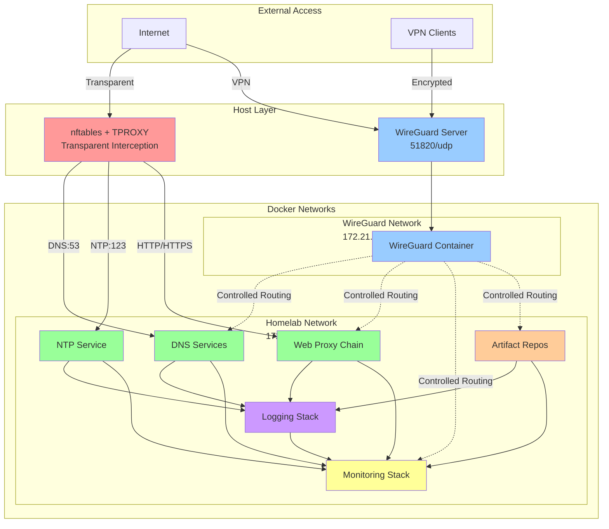
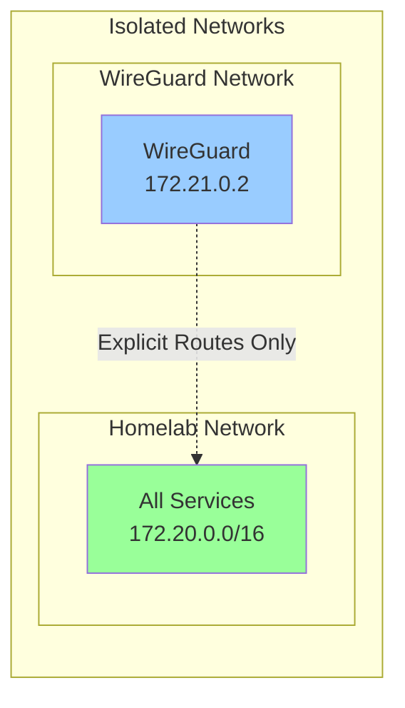
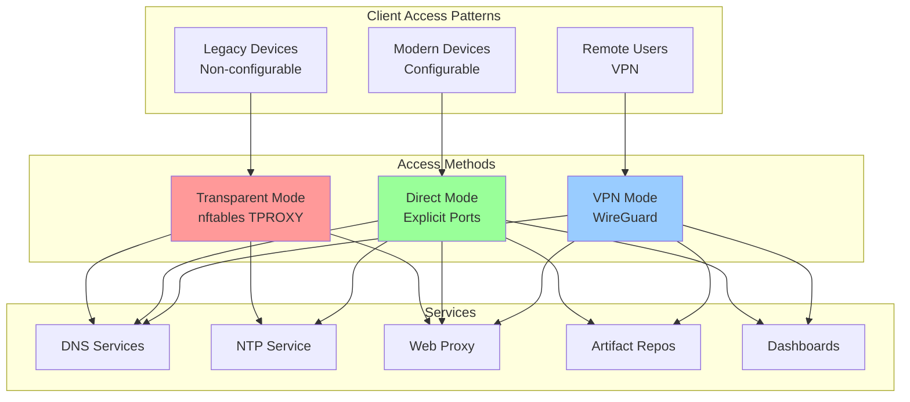

# Overall Architecture

## System Overview

```mermaid
graph TB
    subgraph "External Access"
        Internet[Internet]
        VPNClients[VPN Clients]
    end
    
    subgraph "Host Layer"
        nftables[nftables + TPROXY<br/>Transparent Interception]
        WGServer[WireGuard Server<br/>51820/udp]
    end
    
    subgraph "Docker Networks"
        subgraph "WireGuard Network<br/>172.21.0.0/16"
            WGContainer[WireGuard Container]
        end
        
        subgraph "Homelab Network<br/>172.20.0.0/16"
            DNS[DNS Services]
            NTP[NTP Service]
            WebProxy[Web Proxy Chain]
            Artifacts[Artifact Repos]
            Logging[Logging Stack]
            Monitoring[Monitoring Stack]
        end
    end
    
    Internet -->|Transparent| nftables
    Internet -->|VPN| WGServer
    VPNClients -->|Encrypted| WGServer
    WGServer --> WGContainer
    WGContainer -.->|Controlled Routing| DNS
    WGContainer -.->|Controlled Routing| WebProxy
    WGContainer -.->|Controlled Routing| Monitoring
    WGContainer -.->|Controlled Routing| Artifacts
    
    nftables -->|DNS:53| DNS
    nftables -->|NTP:123| NTP
    nftables -->|HTTP/HTTPS| WebProxy
    
    DNS --> Logging
    NTP --> Logging
    WebProxy --> Logging
    Artifacts --> Logging
    
    DNS --> Monitoring
    NTP --> Monitoring
    WebProxy --> Monitoring
    Artifacts --> Monitoring
    Logging --> Monitoring
    
    style nftables fill:#ff9999
    style WGServer fill:#99ccff
    style WGContainer fill:#99ccff
    style DNS fill:#99ff99
    style NTP fill:#99ff99
    style WebProxy fill:#99ff99
    style Artifacts fill:#ffcc99
    style Logging fill:#cc99ff
    style Monitoring fill:#ffff99
```

## Network Isolation Model

```mermaid
graph LR
    subgraph "Isolated Networks"
        subgraph "WireGuard Network"
            WG[WireGuard<br/>172.21.0.2]
        end
        
        subgraph "Homelab Network"
            Services[All Services<br/>172.20.0.0/16]
        end
    end
    
    WG -.->|Explicit Routes Only| Services
    
    style WG fill:#99ccff
    style Services fill:#99ff99
```

## Access Modes

```mermaid
graph TB
    subgraph "Client Access Patterns"
        Legacy[Legacy Devices<br/>Non-configurable]
        Modern[Modern Devices<br/>Configurable]
        Remote[Remote Users<br/>VPN]
    end
    
    subgraph "Access Methods"
        Transparent[Transparent Mode<br/>nftables TPROXY]
        Direct[Direct Mode<br/>Explicit Ports]
        VPN[VPN Mode<br/>WireGuard]
    end
    
    subgraph "Services"
        DNS[DNS Services]
        NTP[NTP Service]
        Web[Web Proxy]
        Repos[Artifact Repos]
        Dash[Dashboards]
    end
    
    Legacy --> Transparent
    Modern --> Direct
    Remote --> VPN
    
    Transparent --> DNS
    Transparent --> NTP
    Transparent --> Web
    
    Direct --> DNS
    Direct --> NTP
    Direct --> Web
    Direct --> Repos
    Direct --> Dash
    
    VPN --> DNS
    VPN --> Web
    VPN --> Repos
    VPN --> Dash
    
    style Transparent fill:#ff9999
    style Direct fill:#99ff99
    style VPN fill:#99ccff
```
