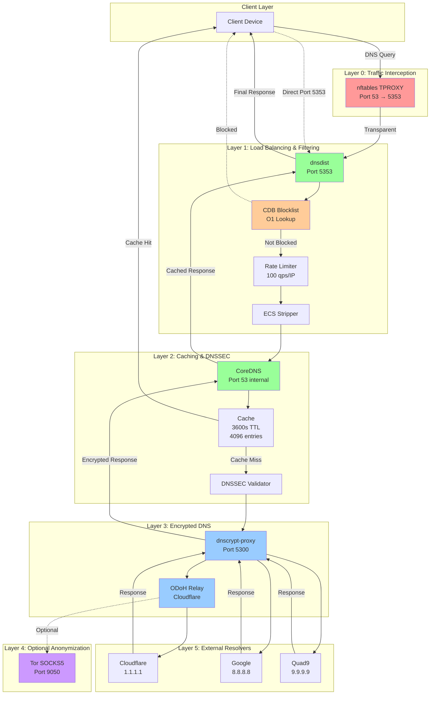
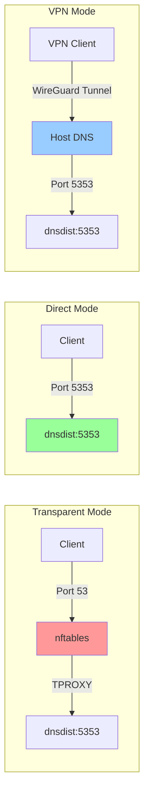
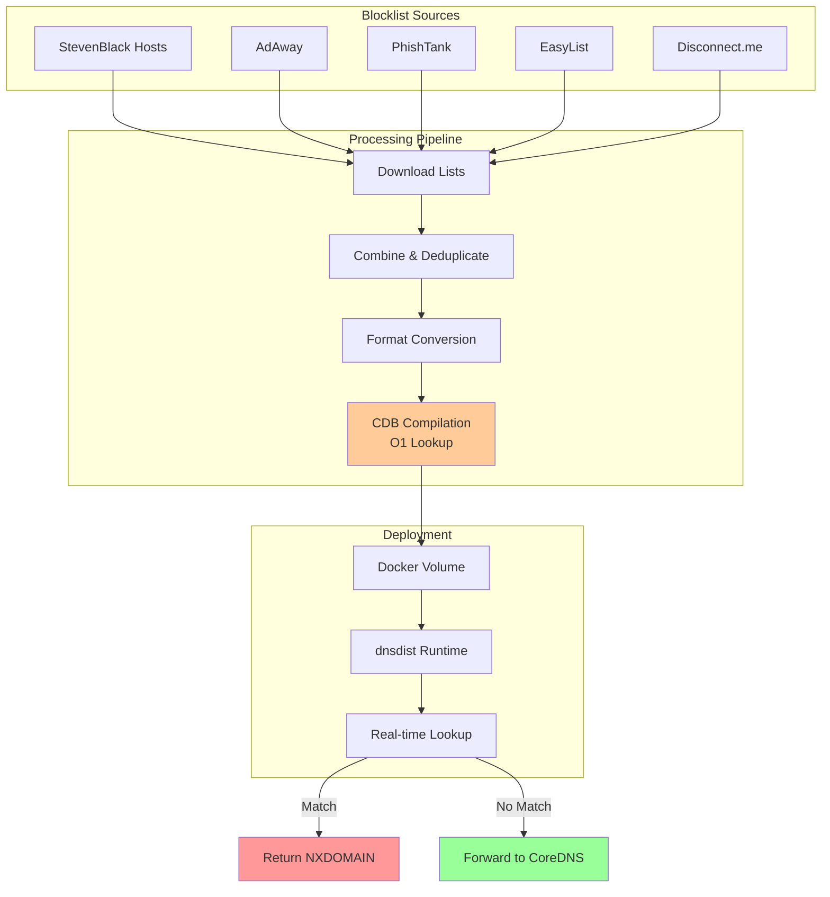
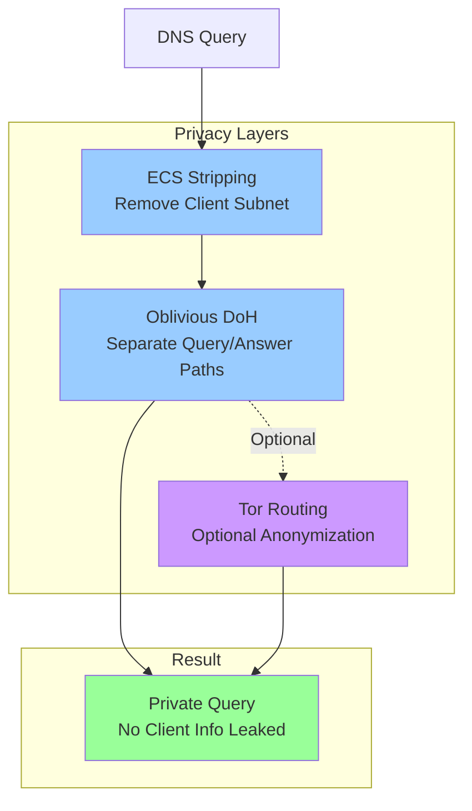

# DNS Resolution Flow

## Complete DNS Chain

```mermaid
graph TB
    subgraph "Client Layer"
        Client[Client Device]
    end
    
    subgraph "Layer 0: Traffic Interception"
        nftables[nftables TPROXY<br/>Port 53 → 5353]
    end
    
    subgraph "Layer 1: Load Balancing & Filtering"
        dnsdist[dnsdist<br/>Port 5353]
        Blocklist[CDB Blocklist<br/>O1 Lookup]
        RateLimit[Rate Limiter<br/>100 qps/IP]
        ECSStrip[ECS Stripper]
    end
    
    subgraph "Layer 2: Caching & DNSSEC"
        CoreDNS[CoreDNS<br/>Port 53 internal]
        Cache[Cache<br/>3600s TTL<br/>4096 entries]
        DNSSEC[DNSSEC Validator]
    end
    
    subgraph "Layer 3: Encrypted DNS"
        dnscrypt[dnscrypt-proxy<br/>Port 5300]
        ODoH[ODoH Relay<br/>Cloudflare]
    end
    
    subgraph "Layer 4: Optional Anonymization"
        Tor[Tor SOCKS5<br/>Port 9050]
    end
    
    subgraph "Layer 5: External Resolvers"
        Cloudflare[Cloudflare<br/>1.1.1.1]
        Google[Google<br/>8.8.8.8]
        Quad9[Quad9<br/>9.9.9.9]
    end
    
    Client -->|DNS Query| nftables
    nftables -->|Transparent| dnsdist
    Client -.->|Direct Port 5353| dnsdist
    
    dnsdist --> Blocklist
    Blocklist -->|Not Blocked| RateLimit
    RateLimit --> ECSStrip
    ECSStrip --> CoreDNS
    
    CoreDNS --> Cache
    Cache -->|Cache Miss| DNSSEC
    Cache -->|Cache Hit| Client
    DNSSEC --> dnscrypt
    
    dnscrypt --> ODoH
    ODoH -.->|Optional| Tor
    ODoH --> Cloudflare
    dnscrypt --> Google
    dnscrypt --> Quad9
    
    Cloudflare -->|Response| dnscrypt
    Google -->|Response| dnscrypt
    Quad9 -->|Response| dnscrypt
    
    dnscrypt -->|Encrypted Response| CoreDNS
    CoreDNS -->|Cached Response| dnsdist
    dnsdist -->|Final Response| Client
    
    Blocklist -.->|Blocked| Client
    
    style nftables fill:#ff9999
    style dnsdist fill:#99ff99
    style CoreDNS fill:#99ff99
    style dnscrypt fill:#99ccff
    style ODoH fill:#99ccff
    style Tor fill:#cc99ff
    style Blocklist fill:#ffcc99
```

## DNS Access Modes

```mermaid
graph LR
    subgraph "Transparent Mode"
        T1[Client] -->|Port 53| T2[nftables]
        T2 -->|TPROXY| T3[dnsdist:5353]
    end
    
    subgraph "Direct Mode"
        D1[Client] -->|Port 5353| D2[dnsdist:5353]
    end
    
    subgraph "VPN Mode"
        V1[VPN Client] -->|WireGuard Tunnel| V2[Host DNS]
        V2 -->|Port 5353| V3[dnsdist:5353]
    end
    
    style T2 fill:#ff9999
    style D2 fill:#99ff99
    style V2 fill:#99ccff
```

## Blocklist Processing

```mermaid
graph TB
    subgraph "Blocklist Sources"
        SB[StevenBlack Hosts]
        AA[AdAway]
        PT[PhishTank]
        EL[EasyList]
        DM[Disconnect.me]
    end
    
    subgraph "Processing Pipeline"
        Download[Download Lists]
        Combine[Combine & Deduplicate]
        Format[Format Conversion]
        CDB[CDB Compilation<br/>O1 Lookup]
    end
    
    subgraph "Deployment"
        Volume[Docker Volume]
        dnsdist[dnsdist Runtime]
        Lookup[Real-time Lookup]
    end
    
    SB --> Download
    AA --> Download
    PT --> Download
    EL --> Download
    DM --> Download
    
    Download --> Combine
    Combine --> Format
    Format --> CDB
    
    CDB --> Volume
    Volume --> dnsdist
    dnsdist --> Lookup
    
    Lookup -->|Match| Block[Return NXDOMAIN]
    Lookup -->|No Match| Allow[Forward to CoreDNS]
    
    style CDB fill:#ffcc99
    style Block fill:#ff9999
    style Allow fill:#99ff99
```

## Privacy Protection

```mermaid
graph TB
    Query[DNS Query]
    
    subgraph "Privacy Layers"
        ECS[ECS Stripping<br/>Remove Client Subnet]
        ODoH[Oblivious DoH<br/>Separate Query/Answer Paths]
        Tor[Tor Routing<br/>Optional Anonymization]
    end
    
    subgraph "Result"
        Private[Private Query<br/>No Client Info Leaked]
    end
    
    Query --> ECS
    ECS --> ODoH
    ODoH -.->|Optional| Tor
    ODoH --> Private
    Tor --> Private
    
    style ECS fill:#99ccff
    style ODoH fill:#99ccff
    style Tor fill:#cc99ff
    style Private fill:#99ff99
```
