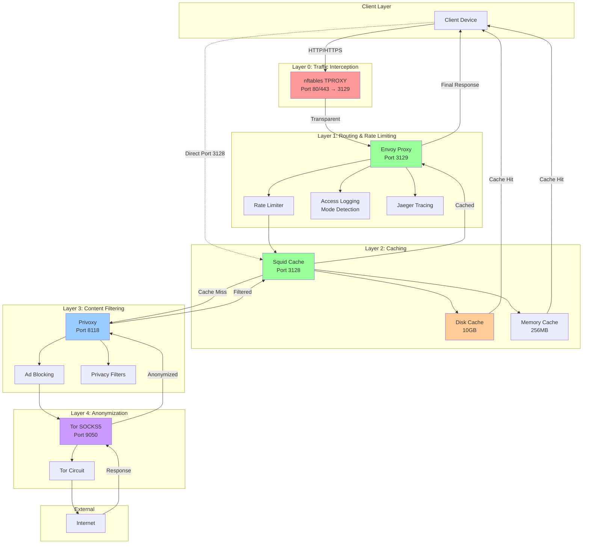
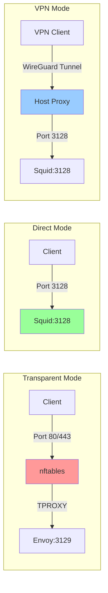
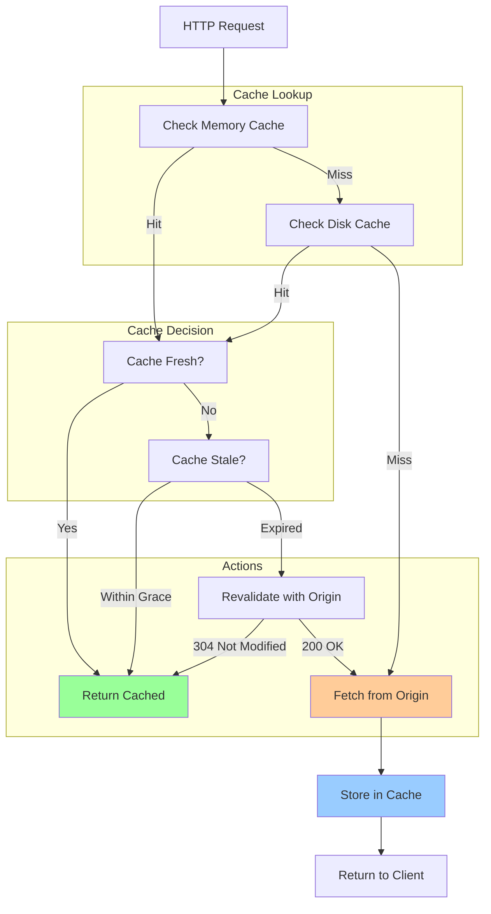
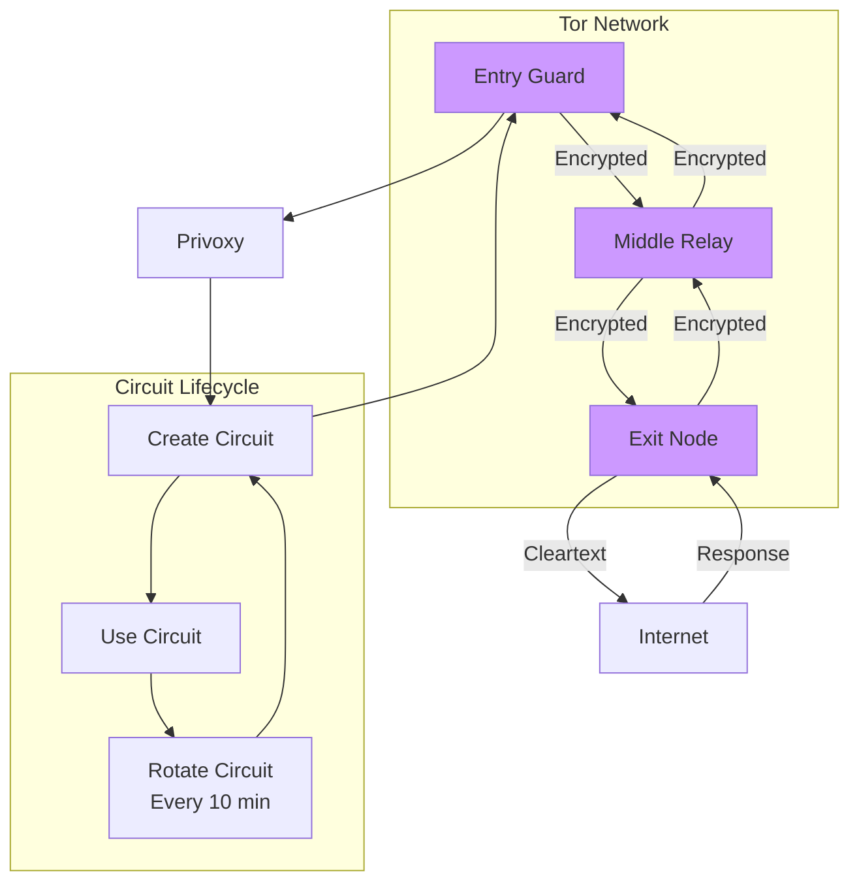
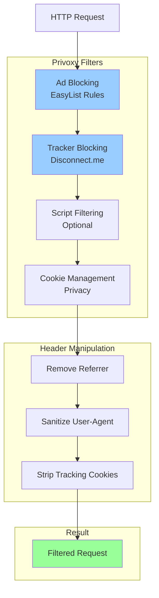
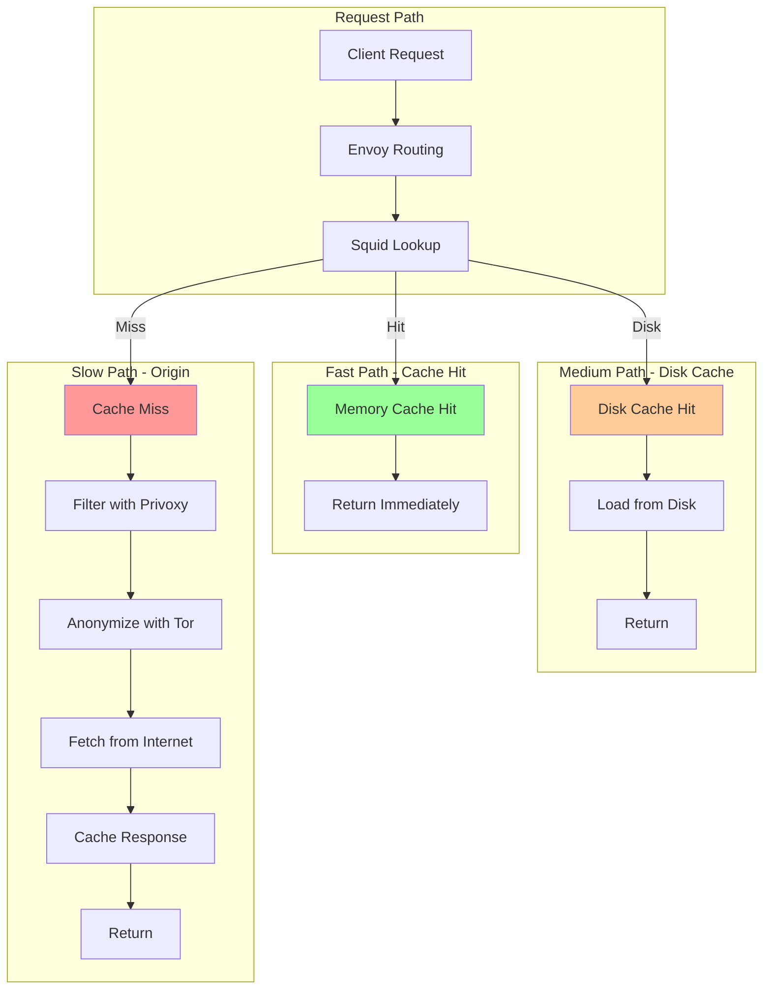

# Web Proxy Chain Flow

## Complete Web Proxy Chain

```mermaid
graph TB
    subgraph "Client Layer"
        Client[Client Device]
    end
    
    subgraph "Layer 0: Traffic Interception"
        nftables[nftables TPROXY<br/>Port 80/443 → 3129]
    end
    
    subgraph "Layer 1: Routing & Rate Limiting"
        Envoy[Envoy Proxy<br/>Port 3129]
        RateLimit[Rate Limiter]
        AccessLog[Access Logging<br/>Mode Detection]
        Tracing[Jaeger Tracing]
    end
    
    subgraph "Layer 2: Caching"
        Squid[Squid Cache<br/>Port 3128]
        DiskCache[Disk Cache<br/>10GB]
        MemCache[Memory Cache<br/>256MB]
    end
    
    subgraph "Layer 3: Content Filtering"
        Privoxy[Privoxy<br/>Port 8118]
        AdBlock[Ad Blocking]
        Privacy[Privacy Filters]
    end
    
    subgraph "Layer 4: Anonymization"
        Tor[Tor SOCKS5<br/>Port 9050]
        Circuit[Tor Circuit]
    end
    
    subgraph "External"
        Internet[Internet]
    end
    
    Client -->|HTTP/HTTPS| nftables
    nftables -->|Transparent| Envoy
    Client -.->|Direct Port 3128| Squid
    
    Envoy --> RateLimit
    Envoy --> AccessLog
    Envoy --> Tracing
    RateLimit --> Squid
    
    Squid --> DiskCache
    Squid --> MemCache
    DiskCache -->|Cache Hit| Client
    MemCache -->|Cache Hit| Client
    
    Squid -->|Cache Miss| Privoxy
    
    Privoxy --> AdBlock
    Privoxy --> Privacy
    AdBlock --> Tor
    
    Tor --> Circuit
    Circuit --> Internet
    
    Internet -->|Response| Tor
    Tor -->|Anonymized| Privoxy
    Privoxy -->|Filtered| Squid
    Squid -->|Cached| Envoy
    Envoy -->|Final Response| Client
    
    style nftables fill:#ff9999
    style Envoy fill:#99ff99
    style Squid fill:#99ff99
    style Privoxy fill:#99ccff
    style Tor fill:#cc99ff
    style DiskCache fill:#ffcc99
```

## Web Proxy Access Modes

```mermaid
graph LR
    subgraph "Transparent Mode"
        T1[Client] -->|Port 80/443| T2[nftables]
        T2 -->|TPROXY| T3[Envoy:3129]
    end
    
    subgraph "Direct Mode"
        D1[Client] -->|Port 3128| D2[Squid:3128]
    end
    
    subgraph "VPN Mode"
        V1[VPN Client] -->|WireGuard Tunnel| V2[Host Proxy]
        V2 -->|Port 3128| V3[Squid:3128]
    end
    
    style T2 fill:#ff9999
    style D2 fill:#99ff99
    style V2 fill:#99ccff
```

## Cache Decision Flow

```mermaid
graph TB
    Request[HTTP Request]
    
    subgraph "Cache Lookup"
        MemCheck[Check Memory Cache]
        DiskCheck[Check Disk Cache]
    end
    
    subgraph "Cache Decision"
        Fresh[Cache Fresh?]
        Stale[Cache Stale?]
    end
    
    subgraph "Actions"
        Hit[Return Cached]
        Revalidate[Revalidate with Origin]
        Miss[Fetch from Origin]
    end
    
    Request --> MemCheck
    MemCheck -->|Hit| Fresh
    MemCheck -->|Miss| DiskCheck
    DiskCheck -->|Hit| Fresh
    DiskCheck -->|Miss| Miss
    
    Fresh -->|Yes| Hit
    Fresh -->|No| Stale
    
    Stale -->|Within Grace| Hit
    Stale -->|Expired| Revalidate
    
    Revalidate -->|304 Not Modified| Hit
    Revalidate -->|200 OK| Miss
    
    Miss --> Store[Store in Cache]
    Store --> Return[Return to Client]
    
    style Hit fill:#99ff99
    style Miss fill:#ffcc99
    style Store fill:#99ccff
```

## Tor Circuit Management

```mermaid
graph TB
    subgraph "Tor Network"
        Entry[Entry Guard]
        Middle[Middle Relay]
        Exit[Exit Node]
    end
    
    subgraph "Circuit Lifecycle"
        Create[Create Circuit]
        Use[Use Circuit]
        Rotate[Rotate Circuit<br/>Every 10 min]
    end
    
    Client[Privoxy] --> Create
    Create --> Entry
    Entry -->|Encrypted| Middle
    Middle -->|Encrypted| Exit
    Exit -->|Cleartext| Internet[Internet]
    
    Create --> Use
    Use --> Rotate
    Rotate --> Create
    
    Internet -->|Response| Exit
    Exit -->|Encrypted| Middle
    Middle -->|Encrypted| Entry
    Entry --> Client
    
    style Entry fill:#cc99ff
    style Middle fill:#cc99ff
    style Exit fill:#cc99ff
```

## Content Filtering Pipeline

```mermaid
graph TB
    Request[HTTP Request]
    
    subgraph "Privoxy Filters"
        AdFilter[Ad Blocking<br/>EasyList Rules]
        TrackerFilter[Tracker Blocking<br/>Disconnect.me]
        ScriptFilter[Script Filtering<br/>Optional]
        CookieFilter[Cookie Management<br/>Privacy]
    end
    
    subgraph "Header Manipulation"
        RemoveRef[Remove Referrer]
        RemoveUA[Sanitize User-Agent]
        RemoveCookie[Strip Tracking Cookies]
    end
    
    subgraph "Result"
        Filtered[Filtered Request]
    end
    
    Request --> AdFilter
    AdFilter --> TrackerFilter
    TrackerFilter --> ScriptFilter
    ScriptFilter --> CookieFilter
    
    CookieFilter --> RemoveRef
    RemoveRef --> RemoveUA
    RemoveUA --> RemoveCookie
    
    RemoveCookie --> Filtered
    
    style AdFilter fill:#99ccff
    style TrackerFilter fill:#99ccff
    style Filtered fill:#99ff99
```

## Performance Optimization

```mermaid
graph TB
    subgraph "Request Path"
        R1[Client Request]
        R2[Envoy Routing]
        R3[Squid Lookup]
    end
    
    subgraph "Fast Path - Cache Hit"
        F1[Memory Cache Hit]
        F2[Return Immediately]
    end
    
    subgraph "Medium Path - Disk Cache"
        M1[Disk Cache Hit]
        M2[Load from Disk]
        M3[Return]
    end
    
    subgraph "Slow Path - Origin"
        S1[Cache Miss]
        S2[Filter with Privoxy]
        S3[Anonymize with Tor]
        S4[Fetch from Internet]
        S5[Cache Response]
        S6[Return]
    end
    
    R1 --> R2
    R2 --> R3
    
    R3 -->|Hit| F1
    F1 --> F2
    
    R3 -->|Disk| M1
    M1 --> M2
    M2 --> M3
    
    R3 -->|Miss| S1
    S1 --> S2
    S2 --> S3
    S3 --> S4
    S4 --> S5
    S5 --> S6
    
    style F1 fill:#99ff99
    style M1 fill:#ffcc99
    style S1 fill:#ff9999
```
