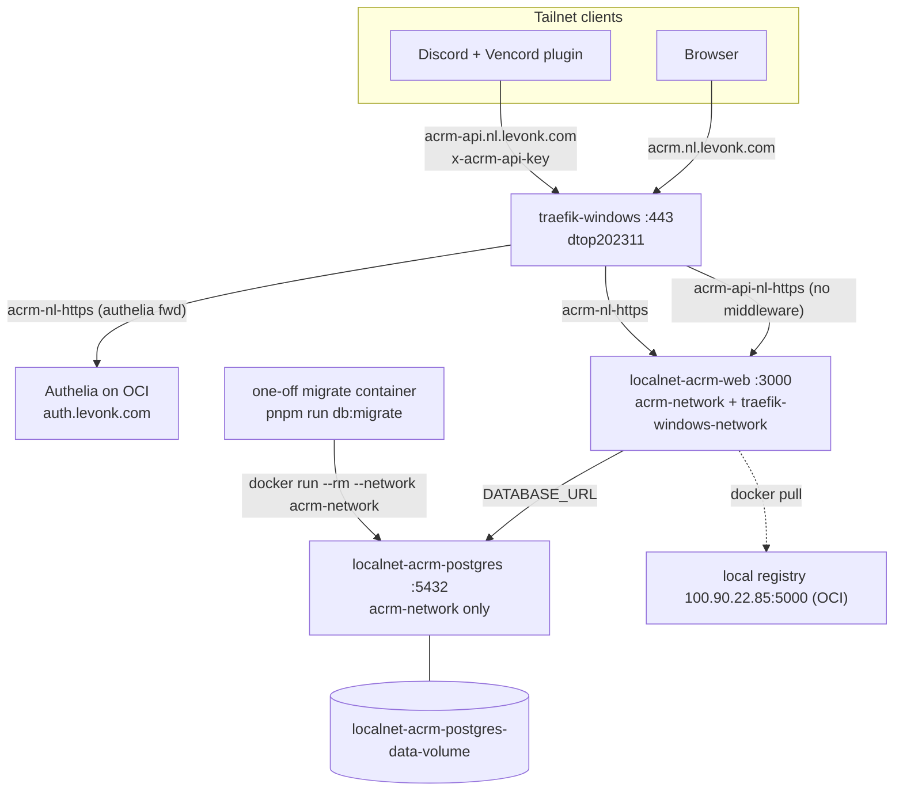
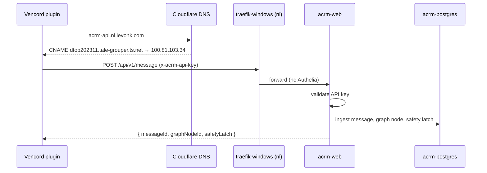

---
# Product Requirements Document (PRD)

feature_slug: acrm-deployment
created: 2026-09-19
completed:
last-activity: 2026-09-19
status: todo
tech_context:
  package_manager: pnpm          # in the acrm repo
  build_system: nx
  web_framework: nextjs          # Next.js 16
  orm: drizzle
  db: postgres                   # postgres:17-alpine
  deploy_tool: ansible           # ssh-tunneled Docker CLI (Windows target)
  target_region: nl              # dtop202311, Windows Docker Desktop, amd64
  never_use: [docker compose, community.docker on Windows, hardcoded IPs/ports]
---

# Product Requirements Document (PRD)

## Introduction / Overview

- **Feature name:** ACRM nl-region deployment into infrahub
- **Summary:** Deploy the ACRM web app (Next.js 16, private repo at
  `~/p/gh/levonk/acrm`) plus a dedicated Postgres onto `dtop202311` (Windows
  Docker Desktop, the `nl` region) using the established ssh-tunneled Docker
  CLI Ansible pattern, Windows Traefik routing, Cloudflare DNS records, and
  vault-managed secrets — the same discipline as stirling/hister/verdaccio-nl.
- **Context:**
  - ACRM's vertical slice (message ingestion → graph → safety latch →
    suggestion) is complete; the first real consumer is the Discord Vencord
    plugin, which needs a stable HTTPS API endpoint it can POST to with an
    API key.
  - This is the first **nl-region Postgres** and the first infrahub
    deployment of a private side-project repo — both precedents are captured
    in `internal-docs/research/service/acrm/`.
  - Planning output lives in infrahub; one story executes in the acrm repo
    (Dockerfile + build/push recipe).

## Goals

- `localnet-acrm-web` + `localnet-acrm-postgres` running on dtop202311 on a
  dedicated `acrm-network`, web also joined to `traefik-windows-network`.
- `acrm.nl.levonk.com` serves the dashboard behind Authelia SSO;
  `acrm-api.nl.levonk.com` serves the same container **without** Authelia,
  protected by `x-acrm-api-key` (Vencord plugin path).
- Drizzle migrations run as an explicit step in the deploy flow.
- All ports/domains/secrets come from `infra_*` / `vault_*` variables; no
  hardcoded IPs, ports, or secrets anywhere in `shared/`.
- Service catalog entries for both containers with `source_repo` and health
  metadata; both catalogs regenerated.
- The packaging/graduation question ("how do side projects enter infrahub
  deployment? is Verdaccio the bridge?") is answered and documented for
  reuse.

## User Stories

- **As the operator**, I run `just ansible-deploy-acrm` and get a working,
  TLS-terminated ACRM instance on the nl host with secrets coming from the
  vault.
- **As a Discord user** with the Vencord plugin installed, my messages POST
  to `https://acrm-api.nl.levonk.com/api/v1/message` with my API key and I
  get safety-latch results — no SSO redirect breaking the client.
- **As the operator**, I open `https://acrm.nl.levonk.com`, authenticate via
  Authelia, and reach the ACRM dashboard.
- **As a future side-project owner**, I can follow the documented graduation
  checklist instead of rediscovering the pattern.

## Functional Requirements

1. **Monorepo Dockerfile (acrm repo)** — root-context, multi-stage Dockerfile
   that resolves `workspace:*` deps (`@acrm/core`, `@acrm/engines-oss`,
   `@acrm/ui`), runs `next build` (output `distDir: 'dist'`), and produces a
   runnable image (`PORT=3000`, `next start`). Root `.dockerignore`. A `just`
   recipe builds+pushes `localnet-ai-acrm-web:latest` (linux/amd64) to
   `{{ infra_registry }}` = `100.90.22.85:5000`.
2. **Infrastructure variables** — `infra_port_ai_acrm_{host,container}`
   (4538/3000), `infra_port_ai_acrm_postgres_{host,container}` (5440/5432),
   `infra_domain_ai_acrm` + `infra_domain_ai_acrm_api`,
   `infra_hostname_acrm_{web,postgres}`, `infra_network_ai_acrm_network_name`
   (`acrm-network`), `infra_storage_acrm_postgres_data_volume`, plus
   `infra_value_acrm_*` fallbacks and levonk client overrides.
3. **Role `ai-acrm`** — `shared/active/02-config/ansible/roles/ai-acrm/`:
   validate vars → ensure `acrm-network` → ensure postgres volume → deploy
   postgres → wait healthy → run drizzle migrations (one-off container,
   gated) → deploy web → wait healthy → status report. All Docker ops via
   `DOCKER_HOST: ssh://…` + `delegate_to: localhost`; `no_log` on
   secret-bearing tasks.
4. **Traefik (Windows)** — `acrm-nl.yml.j2` with two HTTPS routers:
   `acrm.nl` (authelia middleware) and `acrm-api.nl` (no middleware), both →
   `http://localnet-acrm-web:3000`; register render/copy/network-connect
   tasks + `proxy_traefik_windows_acrm_*` vars in `proxy_traefik_windows`.
5. **DNS** — `acrm.nl.levonk.com` and `acrm-api.nl.levonk.com` CNAMEs →
   `dtop202311.tale-grouper.ts.net` in `configure-cloudflare-dns.yml`'s
   canonical `cloudflare_dns_records` list **and** a `dns`-tagged Phase-0
   play inside `deploy-acrm.yml` (n8n/paperclip pattern).
6. **Secrets** — `vault_acrm_api_key`, `vault_acrm_postgres_password` via
   user vault handoff.
7. **Playbook + recipes** — `playbooks/deploy-acrm.yml` (Phase 0 DNS →
   Phase 1 ai-acrm on `windows_docker_hosts` → Phase 2
   `proxy_traefik_windows`), `just ansible-deploy-acrm` (+ `-internal`),
   devbox.json script entry.

## Non-Functional Requirements

- **Security:** API domain has no SSO but requires `ACRM_API_KEY`
  (timing-safe compare in app). Postgres reachable only on `acrm-network`
  and host port 5440 (tailnet-facing). `no_log` on secret tasks.
- **Idempotency:** deploy tasks are `docker rm -f || true` + `docker run`
  (Windows pattern); re-runs replace containers without manual cleanup.
- **Reproducibility:** image is built from the acrm working tree and pushed
  to the local registry — deploy consumes only the registry image.
- **Portability:** every port/domain/IP/hostname resolves through
  `infra_*`/`infra_value_*` chains.

## Current State

- **acrm repo** (`~/p/gh/levonk/acrm`): `apps/active/web/Dockerfile` exists
  but is **broken for the monorepo** (assumes single-package context;
  `workspace:*` deps can't resolve). `apps/active/web/docker-compose.yml` is
  a dev reference only. API routes: `POST /api/v1/{message,suggest}`,
  `POST /api/v1/context/blend`, `POST /api/v1/graph/traverse`, plus
  `/api/auth/[...allauth]`. No `/api/health` — `/` is a static 200 landing
  page. Auth: `x-acrm-api-key` header vs `ACRM_API_KEY` (open when unset);
  `getCurrentUser()` is a stub (dashboard sign-in not real yet).
- **infrahub**: Windows deploy pattern proven (verdaccio, hister, stirling);
  Windows Traefik owns `*.nl.levonk.com`; `configure-cloudflare-dns.yml`
  holds the canonical record list; per-service postgres convention proven
  by n8n (on OCI). No nl postgres, no nl backups, no prior private-repo
  image builds.

## Technical Considerations

- **`infra_tailscale_ip_windows_docker` is currently `100.90.22.85`**
  (levonk domains.yml:126) — that's the **OCI** IP; dtop202311 is
  `100.81.103.34` (verified via `tailscale status`). The stirling-api A
  record is therefore likely broken. Plan uses CNAME→FQDN for both acrm
  domains and flags the variable for a fix-up.
- **Two-domain vs single-domain**: verdaccio-nl splits auth by path
  (`Path("/")` → Authelia, everything else bypasses). Stirling splits by
  domain (`stirling.nl` + `stirling-api.nl`). Requirement is the stirling
  split — cleaner token boundary for a programmatic API.
- **Migrations**: `drizzle-kit` is a production dep and migrations ship in
  the image (`src/db/migrations`), so a one-off `docker run --rm …
  pnpm run db:migrate` against `acrm-network` is sufficient; no init
  sidecar needed. The Dockerfile story must document the in-image web dir.
- **Registry image name**: `localnet-ai-acrm-web` (`ai-` role prefix +
  `-web` suffix keeps room for future acrm component images).

## Architecture Diagram

### Target Architecture



### Request Flow



## Verification Approach

| Purpose | Command / Check | Expected |
|---------|-----------------|----------|
| Syntax | `just ansible-syntax` (deploy-acrm.yml) | exit 0 |
| Lint | `just ansible-lint` | no new violations |
| Build | `docker buildx build` from acrm root (story 01) | image builds; pushed to registry |
| Containers | `docker inspect … State.Health.Status` via DOCKER_HOST ssh:// | both `healthy` |
| Dashboard | `curl -sI https://acrm.nl.levonk.com` | 302 → Authelia (or 200 post-auth) |
| API auth | `curl -X POST https://acrm-api.nl.levonk.com/api/v1/suggest` (no key) | 401 |
| API auth | same with `x-acrm-api-key` | non-401 JSON response |
| DNS | `dig +short acrm.nl.levonk.com` | CNAME → dtop202311.tale-grouper.ts.net |
| Catalog | `just generate-service-catalog-all` | `✓ All services have source_repo links` |
| Migrations | `docker exec localnet-acrm-postgres psql -c '\dt'` | acrm tables exist |

## Success Criteria (Machine-Checkable)

- [ ] Root-context Dockerfile in acrm repo builds and pushes
  `100.90.22.85:5000/localnet-ai-acrm-web:latest` (linux/amd64)
- [ ] `localnet-acrm-web` + `localnet-acrm-postgres` healthy on dtop202311
- [ ] `acrm.nl.levonk.com` → Authelia-gated 200; `acrm-api.nl.levonk.com` →
  401 without key, success with key
- [ ] Drizzle migrations applied on deploy (tables present)
- [ ] All config via `infra_*`/`vault_*` vars; no plaintext secrets in
  `shared/`; no hardcoded IPs/ports
- [ ] `services.yml` entries for both containers; both catalogs regenerated
- [ ] Research docs + this PRD + task files committed

## Implementation Deviations & Decisions

- **Windows Traefik (not OCI cross-machine)** — `*.nl` CNAMEs resolve to the
  Windows host; container-name upstreams on `traefik-windows-network` are
  the deployed nl precedent (stirling/hister/verdaccio).
- **CNAME for acrm-api** (not stirling's A record) — the
  `infra_tailscale_ip_windows_docker` var is currently wrong; CNAME→FQDN is
  consistent and works for all MagicDNS clients. Reversible.
- **No `localnet-volume-init` for postgres** — the official image's
  entrypoint fixes `/var/lib/postgresql/data` ownership itself.
- **Backup deferred** — first nl postgres; restoredrill is systemd/Linux
  only. Follow-up: scheduled pg_dump sidecar on `acrm-network`.

## Deferred Items

- Postgres backup sidecar (`localnet-acrm-postgres-backup`) + offsite copy.
- `/api/health` route in acrm (currently `/` serves as the health probe).
- Real better-auth session (`getCurrentUser` stub) — Authelia covers the
  dashboard until then; will need `vault_acrm_better_auth_secret` later.
- Optional: extend `scripts/build-and-push-images.sh` for external build
  contexts; optional verdaccio registry mirror for build-time npm caching.
- `validate-acrm.yml` playbook (three-layer validation convention).

## Out of Scope

- Deploying to `cno` or any other region — nl only.
- Publishing `@acrm/*` packages to Verdaccio (see packaging-analysis).
- The Vencord plugin's own packaging/distribution.
- Media-stack-style docker network for anything besides acrm.

## Risk Assessment

- **Priority:** P1
- **Effort:** M
- **Risk:** MED — the private-repo monorepo Dockerfile (story 01) is the
  riskiest piece (pnpm workspace + Nx + `distDir: dist` in a slim image);
  the Ansible side is a well-worn pattern. First nl postgres adds small
  surface-area risk (backups deferred).

## Success Metrics

- Vencord plugin ingests a real Discord message end-to-end against
  `acrm-api.nl.levonk.com`.
- Dashboard reachable via `acrm.nl.levonk.com` through Authelia.
- Deploy is fully repeatable from `just ansible-deploy-acrm` (+ the acrm
  build recipe) with no manual steps besides the one-time vault handoff.

## Open Questions

- Fix `infra_tailscale_ip_windows_docker` (currently `100.90.22.85` = OCI;
  should be `100.81.103.34`)? Recommend yes as part of 04-001 — it repairs
  the stirling-api record too. Needs owner confirmation since it changes a
  shared client value.
- Should the web container publish host port 4538 at all (Traefik reaches
  it via `traefik-windows-network`)? Published per hister/stirling
  convention for tailnet debugging — keep unless objected.
- Does `deploy-acrm.yml` need a third phase loading `ai-acrm` role defaults
  for the traefik role (stirling playbook did `include_vars` of role
  defaults in Phase 2)? Yes — mirror that.

## Dependencies

- `dtop202311` bootstrapped (Docker Desktop, Tailscale, `ansible` user,
  `docker-users` group) — already true (stirling/hister deployed).
- `traefik-windows` deployed — already true.
- Vault entries added by user before first deploy (handoff below).
- Image built+pushed from the acrm checkout before first deploy.
- `postgres:17-alpine` pullable by the Windows host (public image).

## Vault Handoff (user action required)

Add to `infrahub-levonk-all.vault.yml` (generate with `openssl rand -hex 32`
/ `openssl rand -base64 32`):

```yaml
vault_acrm_api_key: "<generated>"
vault_acrm_postgres_password: "<generated>"
```

Copyable edit command (from repo AGENTS.md):

```bash
docker run --rm -it \
  -v "$HOME/.ansible/vault_password:/vault_password:ro" \
  -v "$HOME/p/gh/levonk/infrahub/levonk/active/02-config/ansible/inventories/group_vars:/vault-dir" \
  -e EDITOR=vi \
  alpine/ansible:latest \
  ansible-vault edit /vault-dir/infrahub-levonk-all.vault.yml --vault-password-file /vault_password
```

## Timeline / Milestones

- **M1:** Story 01-001 — acrm Dockerfile + build recipe (external repo)
- **M2:** Story 02-001 — infra vars + services catalog entries
- **M3:** Story 03-001 — `ai-acrm` role (depends on M2; needs vault keys for
  a real deploy)
- **M4:** Story 04-001 — Traefik config + DNS records (depends on M2/M3)
- **M5:** Story 05-001 — playbook + just recipes + syntax check (depends on
  M3/M4)
- **M6:** Deploy: vault handoff → build/push image → `just
  ansible-deploy-acrm` → verify

## Maintenance Notes

- Bump `acrm` by rebuilding+pushing the image from acrm, then re-running
  the deploy playbook — no tag pinning initially (`latest`), consistent
  with other localnet services.
- Schema changes ride along automatically via the migrate step.
- If a second nl postgres appears, extract a shared `postgres-windows`
  pattern rather than copy-pasting the role internals.
- The `infra_tailscale_ip_windows_docker` fix should be its own commit —
  it also repairs stirling-api.

## STOP Conditions

- Port 4538 or 5440 found in use on dtop202311 → surface, don't silently
  reassign.
- Dockerfile build fails on workspace resolution → fix the Dockerfile in
  the acrm repo (story 01-001), never work around it infrahub-side.
- DNS record conflicts in `configure-cloudflare-dns.yml` (the playbook
  aborts on first failure) → run records via `--extra-vars` or fix order.
- Any request to put secrets in `shared/` or bypass the vault handoff → stop.
