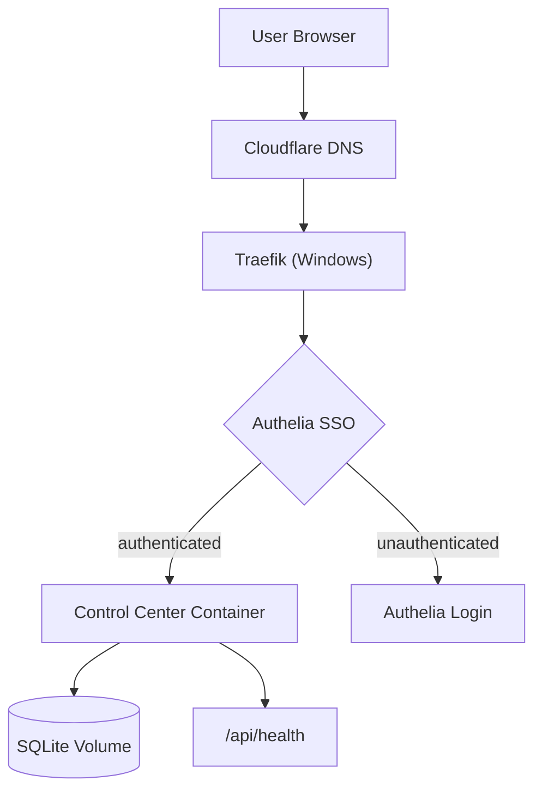

---
# Product Requirements Document (PRD)

## Introduction / Overview
- **Feature name:** Control Center Dashboard
- **Summary:** Deploy the mreflow/control-center business intelligence dashboard (via the lrepo52 fork with multi-tenancy) as an Infrahub service on dtop202311, exposed via Traefik on dashboard.levonk.com and dashboard.nl.levonk.com.
- **Context:**
  - The user wants a self-hosted business intelligence dashboard for industry updates, brand mentions, newsletter monitoring, audience tracking, reminders, and tasks.
  - The upstream (mreflow/control-center) is local-first and loopback-only. The fork (lrepo52/control-center) adds authentication, multi-tenancy, and session management.
  - Fork patches for Docker/reverse-proxy support have already been pushed (commit a9ba46c): proxy.ts host allowlist, standalone output, Dockerfile, .dockerignore.
  - Reference pattern: dashboard-directory-empire role (same target, same Windows Docker Desktop deployment pattern).

## Goals
- Control Center container running and healthy on dtop202311
- Reachable at both dashboard.levonk.com and dashboard.nl.levonk.com via Traefik
- Authelia SSO gate in front of the app's own auth
- Persistent SQLite data with backup strategy
- Image built locally and pushed to the local registry
- All ports/domains/networks/storage as infrastructure variables (no hardcodes)

## User Stories
- As a user, I can visit dashboard.levonk.com and after Authelia SSO, reach the Control Center login page.
- As a user, I can visit dashboard.nl.levonk.com and get the same experience.
- As a user, I can register the first tenant account via the app's /register page.
- As a user, my SQLite data persists across container restarts.
- As an operator, I can rebuild the image with `just build-control-center-image`.
- As an operator, I can deploy with `just ansible-deploy-control-center`.
- As an operator, I can validate with `just ansible-validate-control-center`.

## Functional Requirements
- FR-1: Build script clones lrepo52/control-center, builds multi-stage Docker image (linux/amd64), pushes to local registry
- FR-2: Ansible role deploys container to dtop202311 via DOCKER_HOST ssh:// delegate_to pattern
- FR-3: Container joins traefik-windows-network for Traefik routing
- FR-4: Traefik dynamic config routes both domains to the container with Authelia middleware
- FR-5: Container exposes /api/health endpoint for healthcheck
- FR-6: Persistent volume mounted at CONTROL_CENTER_DATA_DIR for SQLite + settings
- FR-7: CONTROL_CENTER_ALLOWED_HOSTS env var set to both domains
- FR-8: Service catalog entry in services.yml with monitoring metadata
- FR-9: Generated SERVICES.md catalogs (root + levonk/) via generate_service_catalog.py
- FR-10: Just recipes for build, deploy, and validate
- FR-11: Cloudflare DNS CNAME records for both domains

## Non-Functional Requirements
- NFR-1: All ports, domains, IPs, networks, storage paths defined as infrastructure variables
- NFR-2: No hardcoded magic numbers in Ansible tasks (project-lint compliant)
- NFR-3: Container restart_policy: unless-stopped
- NFR-4: Healthcheck uses curl -sf /api/health
- NFR-5: No vault secrets required (app bootstraps its own auth)
- NFR-6: Multi-stage Docker build (builder + runtime) per AGENTS.md Invariant #2
- NFR-7: Image built on Mac, pushed to registry, pulled on target (never build on target)

## Current State
- **Relevant files and their roles:**
  - `shared/active/02-config/ansible/roles/dashboard-directory-empire/` — reference role for dtop202311 deployment
  - `scripts/build-directory-empire-image.sh` — reference build script pattern
  - `shared/active/02-config/ansible/roles/proxy_traefik_windows/templates/dynamic/de-nl.yml.j2` — reference Traefik dynamic config
  - `shared/active/02-config/ansible/infrastructure/ports.yml` — port allocations
  - `shared/active/02-config/ansible/infrastructure/domains.yml` — shared domain defaults
  - `shared/active/02-config/ansible/infrastructure/storage.yml` — storage allocations
  - `shared/active/02-config/ansible/infrastructure/services.yml` — service catalog
  - `levonk/active/02-config/ansible/infrastructure/domains.yml` — client domain overrides
  - `internal-docs/research/service/control-center/README.md` — research document
- **Repository conventions:**
  - Windows Docker hosts use `delegate_to: localhost` + `DOCKER_HOST: ssh://` (community.docker modules fail on Windows)
  - All infrastructure values use `infra_{category}_{service}_{context}_{attribute}` naming
  - Traefik dynamic configs are Jinja2 templates under `proxy_traefik_windows/templates/dynamic/`
  - Generated catalogs (SERVICES.md) are NOT edited manually
  - project-lint enforces no magic numbers — use `# project-lint: disable=...` only for genuine non-operational constants

## Technical Considerations
- **Image**: node:24.20-alpine base, Next.js standalone output, linux/amd64 only
- **Data**: SQLite via node:sqlite (Node 24+ built-in), stored in CONTROL_CENTER_DATA_DIR volume
- **Auth**: Fork has its own auth (scrypt + session cookies). Authelia provides outer SSO gate.
- **Health**: GET /api/health returns {service, status, version}, 503 if DB unhealthy
- **Port**: Container listens on 3000 (Next.js default). Host port allocated in ports.yml.

## Architecture Diagram

### Target Architecture

## Verification Approach
| Purpose | Command | Expected Result |
|---------|---------|-----------------|
| Ansible syntax | `just ansible-syntax` | exit 0 |
| Ansible lint | `just ansible-lint` | exit 0 |
| Image build | `just build-control-center-image` | image pushed to registry |
| Deploy | `just ansible-deploy-control-center` | container running |
| Validate | `just ansible-validate-control-center` | all checks pass |
| Health | `curl -sf https://dashboard.levonk.com/api/health` | JSON with status: ready |
| Health (nl) | `curl -sf https://dashboard.nl.levonk.com/api/health` | JSON with status: ready |

## Success Criteria (Machine-Checkable)
- [ ] `just ansible-syntax` passes
- [ ] `just ansible-lint` passes with no new violations
- [ ] `just build-control-center-image` pushes image to registry
- [ ] `just ansible-deploy-control-center` deploys without errors
- [ ] Container is running and healthy on dtop202311
- [ ] curl to /api/health on both domains returns status: ready
- [ ] project-lint passes on all new/modified files
- [ ] SERVICES.md regenerated and committed

## Out of Scope
- App-level feature development (the fork already has auth, multi-tenancy, entities, tags)
- AI provider key configuration (optional, user can add via Settings UI later)
- Backup automation deployment (documented in role README, deploy separately)
- Monitoring dashboards (Grafana) — no Prometheus metrics endpoint exists
- Molecule tests (blocked per AGENTS.md)

## Risk Assessment
- **Priority:** P2
- **Effort:** M
- **Risk:** LOW — follows established directory-empire pattern, fork patches already pushed

## Success Metrics
- Container uptime > 99% after deployment
- Health check responds < 500ms
- No restart loops

## Open Questions
- None remaining (all resolved in research phase)

## Dependencies
- Fork patches (DONE — commit a9ba46c on lrepo52/control-center)
- Traefik Windows proxy already deployed on dtop202311
- Authelia already deployed and configured
- Local registry (100.90.22.85:5000) accessible

## Maintenance Notes
- Image rebuild: run `just build-control-center-image` after fork updates
- Data backup: rsync the SQLite volume to backup location (documented in role README)
- First user registration: visit /register after Authelia auth to create the first tenant

## STOP Conditions
Stop and report back if:
- Port conflict found in ports.yml (do not silently pick another port)
- Traefik Windows proxy is not deployed on dtop202311
- Authelia is not configured for the Windows Traefik
- Local registry is unreachable
- Fork Dockerfile build fails
- project-lint violations cannot be resolved with legitimate disable comments
