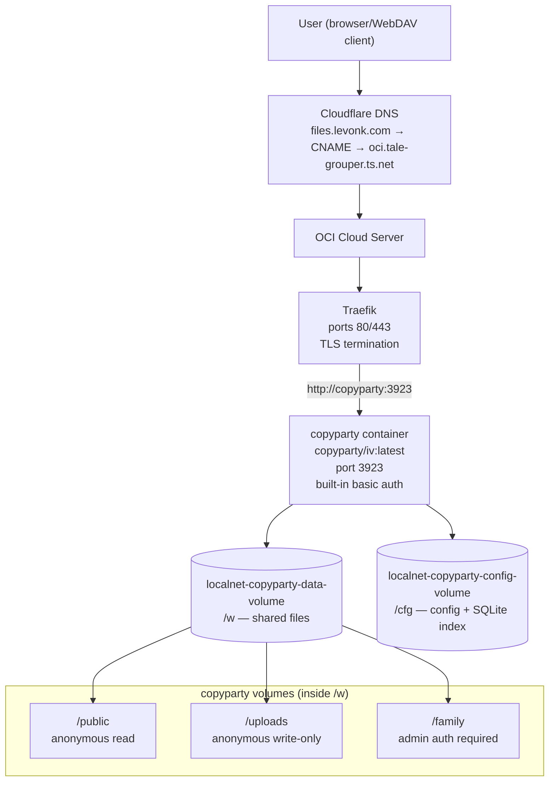

# PRD: Deploy copyparty File Sharing Service

## Goal

Deploy [copyparty](https://github.com/9001/copyparty) as a self-hosted file
sharing server on the OCI cloud server, accessible at `files.levonk.com` behind
Traefik. copyparty provides WebDAV, chunked uploads, media thumbnails, search,
and multi-volume permissions in a single lightweight container.

## Background

Research (see `internal-docs/research/service/copyparty/`) compared copyparty
against Nextcloud, Seafile, FileBrowser, Syncthing, MinIO, and ownCloud oCIS.
copyparty scored 9.0/10 for this use case (single OCI host, Traefik-proxied,
personal/family file sharing) due to its tiny footprint, file-share-first
design, Traefik compatibility, and plain-files backup story.

## User Decisions

| Decision | Choice | Rationale |
|----------|--------|-----------|
| Target machine | oci-cloud-server | Where all public-facing services run behind Traefik |
| Domain | files.levonk.com | Function-based name; CNAME to oci.tale-grouper.ts.net |
| Auth strategy | Built-in basic auth | No Authelia dependency; admin password in vault |
| Image edition | copyparty/iv | Image+video thumbnails (~211 MiB); full media gallery |
| Share layout | Multi-volume | /public (anon read), /uploads (anon write-only), /family (auth) |

## Scope

### In Scope

- Shared infrastructure schemas (ports, domains, storage, networks)
- Client infrastructure overrides (levonk-specific domain)
- Cloudflare DNS CNAME for `files.levonk.com`
- Ansible role `storage-copyparty` (defaults, tasks, handlers, meta, templates, README)
- copyparty config file template (multi-volume: /public, /uploads, /family)
- Vault secret: `vault_copyparty_admin_password` (admin account password)
- Traefik dynamic config for `files.levonk.com` (HTTP→HTTPS redirect, Authelia NOT used — copyparty handles auth internally)
- Service catalog entry in `services.yml` with `source_repo`, monitoring fields
- Deploy playbook `deploy-copyparty.yml`
- Service catalog regeneration (both client and shared)
- Ansible lint and syntax-check validation

### Out of Scope

- Authelia SSO integration (copyparty uses built-in basic auth — can be added later via IdP headers if desired)
- Desktop sync clients (copyparty supports WebDAV mounting; no native sync client)
- FTP/SFTP/SMB protocols (HTTP/WebDAV only for initial deployment)
- Backup job configuration (copyparty stores plain files in a Docker volume — standard volume backup applies; no database to dump)
- Monitoring stack integration (metadata only — Prometheus/Uptime Kuma not yet deployed)
- Homepage/TraLa dashboard integration (optional follow-up)

## Architecture

### Current Architecture

```
Internet → Cloudflare DNS (*.levonk.com CNAME → oci.tale-grouper.ts.net)
         → OCI Cloud Server
           → Traefik (ports 80/443)
             → Existing services (LiteLLM, n8n, Authelia, dashboards, ...)
```

### Target Architecture

```
Internet → Cloudflare DNS (files.levonk.com CNAME → oci.tale-grouper.ts.net)
         → OCI Cloud Server
           → Traefik (ports 80/443)
             → copyparty container (port 3923, traefik-network)
               → /public  (anonymous read — browse files without login)
               → /uploads (anonymous write-only — drop files without login)
               → /family  (auth required — admin basic auth for read/write)
               → /cfg     (config file, SQLite index in /cfg/hists)
             → Docker volume: localnet-copyparty-data-volume (/w)
             → Docker volume: localnet-copyparty-config-volume (/cfg)
```

### Architecture Diagram



## Requirements

### Functional Requirements

- **FR-1**: copyparty is accessible at `https://files.levonk.com` via Traefik with automatic HTTPS (Let's Encrypt)
- **FR-2**: Three shared volumes are configured:
  - `/public` — anonymous users can browse and download files (read-only)
  - `/uploads` — anonymous users can upload files (write-only, cannot list)
  - `/family` — requires admin login (basic auth) for read and write
- **FR-3**: Admin account is configured with a password stored in the Ansible vault
- **FR-4**: copyparty runs as a non-root user (UID 100000 via userns-remap or container user)
- **FR-5**: SQLite index/thumbnails are stored in `/cfg/hists` (not in the data volume) for performance
- **FR-6**: Container restarts automatically unless manually stopped
- **FR-7**: Health check verifies the HTTP server responds on port 3923

### Non-Functional Requirements

- **NFR-1**: All IPs, ports, domains, and storage paths reference `infra_*` variables (no hardcoding)
- **NFR-2**: No secrets in plaintext — admin password is `vault_copyparty_admin_password` in the client vault
- **NFR-3**: No client-specific values in `shared/` — role defaults use `| default()` fallbacks
- **NFR-4**: Container uses `community.docker.docker_container` (never `docker compose`)
- **NFR-5**: Image pull uses `source: pull` (never `source: build`)
- **NFR-6**: Healthcheck durations are strings with unit suffixes (`"30s"`, not `30`)
- **NFR-7**: Handler uses `state: started` + `restart: true` (not `state: restarted`)
- **NFR-8**: Service catalog entry includes `source_repo: "https://github.com/9001/copyparty"`
- **NFR-9**: Ansible lint passes (`just ansible-lint-internal`)
- **NFR-10**: Playbook syntax check passes (`just ansible-syntax`)

## Technical Decisions

### Image: `copyparty/iv:latest` (upstream, multi-arch)

- Official Docker Hub image, multi-arch (amd64 + arm64)
- `iv` edition adds video thumbnails on top of image thumbnails (~211 MiB)
- No locally-built image needed — skip Phase 3 (Build Pipeline) of the implementation guide
- Pull from Docker Hub via `source: pull`

### Port: 3923 (copyparty default)

- Port 3923 is currently unallocated in both shared and client `ports.yml`
- Use the copyparty default for both host and container port
- Variables: `infra_port_storage_copyparty_host` / `infra_port_storage_copyparty_container`

### Network: traefik-network

- copyparty joins `traefik-network` (same as n8n, LiteLLM, dashboards)
- No new network variable needed — reference `infra_network_proxy_traefik_network_name`

### Domain: files.levonk.com

- Shared schema: `infra_domain_storage_copyparty: "files.{{ infra_domain_base }}"`
- Client override: `infra_domain_storage_copyparty: "files.levonk.com"`
- CNAME → `oci.tale-grouper.ts.net` (Tailscale FQDN)

### Auth: Built-in basic auth (no Authelia)

- copyparty handles auth internally via `[accounts]` in the config file
- Admin password stored in vault as `vault_copyparty_admin_password`
- Traefik dynamic config does NOT include the `authelia` middleware
- The `/public` and `/uploads` volumes are accessible without auth (volume-level permissions)
- The `/family` volume requires admin login

### Storage: Docker volumes

- `localnet-copyparty-data-volume` → mounted at `/w` (shared files: /public, /uploads, /family)
- `localnet-copyparty-config-volume` → mounted at `/cfg` (config file + SQLite index in /cfg/hists)
- Both are Docker named volumes (managed by `community.docker.docker_volume`)

### Config file: Ansible template

- Template: `roles/storage-copyparty/templates/copyparty.conf.j2`
- Rendered to: `/cfg/copyparty.conf` inside the config volume
- Loaded via `PRTY_CONFIG=/cfg/copyparty.conf` env var
- Sections: `[global]`, `[accounts]`, `[/public]`, `[/uploads]`, `[/family]`

## Implementation Plan

Follow the phases in `infrahub-add-new-service.md`:

1. **Phase 1**: Shared infrastructure schemas (ports, domains, storage)
2. **Phase 2**: Client infrastructure overrides (domain) + DNS CNAME + service catalog entry + catalog regeneration
3. **Phase 3**: SKIP (upstream image, no build pipeline)
4. **Phase 4**: Vault secret (`vault_copyparty_admin_password`) — agent → user handoff
5. **Phase 5**: Create `storage-copyparty` Ansible role (defaults, tasks, handlers, meta, templates, README)
6. **Phase 6**: Traefik dynamic config (`copyparty.yml.j2`) + register in Traefik role tasks
7. **Phase 7**: SKIP (dashboard integration is optional follow-up)
8. **Phase 8**: Create `deploy-copyparty.yml` playbook

## Acceptance Criteria

- [ ] `https://files.levonk.com` resolves and returns the copyparty web UI
- [ ] `/public` is browsable without login (anonymous read)
- [ ] `/uploads` accepts file uploads without login (anonymous write-only)
- [ ] `/family` requires admin login (basic auth) for read/write
- [ ] Container is running, healthy, and on `traefik-network`
- [ ] No hardcoded IPs, ports, or domains in any file (all `infra_*` variables)
- [ ] Admin password is in the vault, not in plaintext
- [ ] `just ansible-lint-internal` passes
- [ ] `just ansible-syntax` passes
- [ ] Service catalog (`SERVICES.md`) includes copyparty with `source_repo` link
- [ ] DNS CNAME for `files.levonk.com` is deployed and resolves

## Risks & Mitigations

| Risk | Mitigation |
|------|------------|
| Default copyparty config is wide-open (read/write to all) | Config template explicitly sets per-volume permissions; no default-open volumes |
| userns-remap UID mismatch causes permission errors | Use `infra_storage_userns_remap_uid` for volume ownership, matching existing pattern |
| SQLite index on network share is slow | Store `.hist` in `/cfg/hists` (config volume), not in `/w` (data volume) |
| Admin password in config file is visible to anyone with container access | Use argon2 hash in config (not plaintext); vault stores the plaintext for first-boot, config stores the hash |
| Port 3923 conflicts with future service | Documented in `ports.yml` with comment; conflict check done in Phase 1 |

## References

- Research: `internal-docs/research/service/copyparty/copyparty-overview.md`
- Alternatives: `internal-docs/research/service/copyparty/alternatives-comparison.md`
- Implementation guide: `.agents/workflows/infrahub-add-new-service.md`
- Upstream: https://github.com/9001/copyparty
- Traefik example: https://github.com/9001/copyparty/blob/hovudstraum/contrib/traefik/copyparty.yaml
