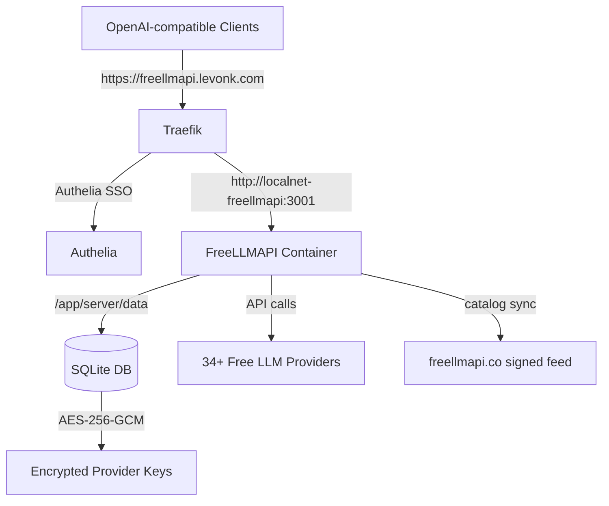

# PRD: Deploy FreeLLMAPI to Infrahub

## Feature Overview

Deploy [FreeLLMAPI](https://github.com/tashfeenahmed/freellmapi) as a new AI
gateway service on the OCI cloud server, alongside the existing LiteLLM
gateway. FreeLLMAPI aggregates free tiers from 34+ LLM providers behind a
single OpenAI-compatible `/v1` endpoint, with automatic fallover, per-key
rate tracking, and a self-updating model catalog.

## Problem Statement

The existing LiteLLM gateway serves as the enterprise AI gateway with spend
tracking and virtual keys. FreeLLMAPI serves a different purpose: it
aggregates **free-tier** LLM providers behind a single endpoint with
automatic fallover and rate-limit tracking. This gives access to ~7.4B
tokens/month of free inference capacity across 34+ providers without
spending any budget.

## Goals

- Deploy FreeLLMAPI container on `oci-cloud-server` using the upstream
  `ghcr.io/tashfeenahmed/freellmapi:latest` image
- Expose it via Traefik at `freellmapi.levonk.com` behind Authelia SSO
- Store the encryption key in the Ansible vault (user handoff)
- Add the service to the service catalog with monitoring metadata
- Ensure all IPs, ports, and domains use `infra_*` variables

## Non-Goals

- Migrating or replacing LiteLLM (they coexist)
- Configuring provider API keys (done through the dashboard after deploy)
- Building a custom Docker image (using upstream image)

## Architecture

## Technical Decisions

| Decision | Choice | Rationale |
|----------|--------|-----------|
| Image | `ghcr.io/tashfeenahmed/freellmapi:latest` | Upstream multi-arch image, no local build needed |
| Host port | 3003 | Free in both shared and levonk port allocations |
| Container port | 3001 | Default in the image |
| Role name | `ai-freellmapi` | Follows `ai-` prefix convention |
| Domain | `freellmapi.levonk.com` | Follows existing AI service domain pattern |
| Network | `traefik-network` | For Traefik routing |
| Secret | `vault_ai_freellmapi_encryption_key` | AES-256-GCM for provider keys |
| Trust proxy | `1` | Single Traefik reverse proxy hop |

## Implementation Plan

Follows `infrahub-add-new-service.md` Phases 1-8:

1. **Phase 1**: Add shared infrastructure schemas (ports, domains, storage)
2. **Phase 2**: Add client infrastructure values, DNS record, service catalog
3. **Phase 3**: Skip (upstream image, no local build)
4. **Phase 4**: Add vault secret (user handoff for encryption key)
5. **Phase 5**: Create `ai-freellmapi` Ansible role
6. **Phase 6**: Create Traefik dynamic config
7. **Phase 7**: Dashboard integration (optional, TraLa auto-discovery)
8. **Phase 8**: Add to AI pipeline playbook

## Success Criteria

- [ ] Container runs and passes health check (`/api/ping` returns 200)
- [ ] Traefik routes `freellmapi.levonk.com` to the container
- [ ] Authelia SSO protects the dashboard
- [ ] No hardcoded IPs, ports, or domains in any config file
- [ ] Service catalog entry has `source_repo` link
- [ ] Ansible syntax check and lint pass
- [ ] `just generate-service-catalog` reports all services have `source_repo`

## Research

See `internal-docs/research/service/freellmapi/overview.md` for full service
research including environment variables, health check, Docker Compose
reference, and comparison with LiteLLM.
