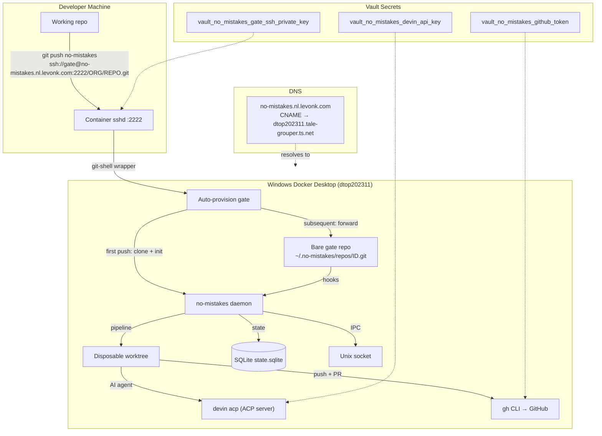
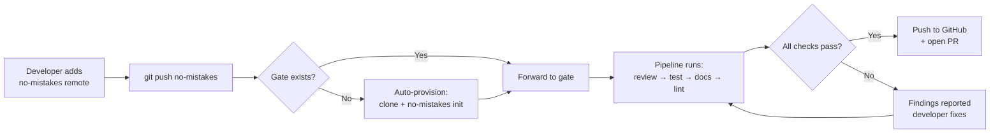

# PRD: no-mistakes Shared Git Gate Service

## Problem Statement

Levonk developers need a centralized AI-driven code quality gate that all
projects can push through before opening PRs. `no-mistakes` is a local git
gate proxy that intercepts pushes, runs an AI validation pipeline
(review → test → docs → lint), and only forwards clean branches to GitHub
with an auto-opened PR.

**The challenge**: `no-mistakes` is designed as a per-developer local tool
(local bare git repo, Unix socket daemon, AI agents as local subprocesses).
There is no built-in server/remote mode. We need to deploy it as a shared
server on the Windows Docker Desktop host (dtop202311) so all levonk
projects can push through a single gate instance.

## Goal

Deploy a shared `no-mistakes` gate service on dtop202311 (Windows Docker
Desktop) that:
1. Accepts SSH git pushes from authorized developers
2. Auto-provisions per-repo gates on first push
3. Runs the no-mistakes validation pipeline using an AI agent (devin-cli
   via ACP, configurable)
4. Forwards validated branches to GitHub and opens clean PRs
5. Is accessible at `no-mistakes.nl.levonk.com` (DNS CNAME to dtop202311
   Tailscale FQDN, SSH on port 2222)

## Scope

### In Scope

- **Shared infrastructure schemas**: Port, domain, storage variables in
  `shared/active/02-config/ansible/infrastructure/`
- **Client infrastructure values**: Port/domain overrides in
  `levonk/active/02-config/ansible/infrastructure/`
- **DNS record**: CNAME `no-mistakes.nl.levonk.com` → dtop202311 Tailscale FQDN
- **Container image**: Multi-stage Dockerfile building no-mistakes from
  source + sshd + git + devin-cli + acpx + gh CLI
- **Build pipeline**: Entry in `scripts/build-and-push-images.sh`
- **Ansible role**: `devops-no-mistakes` role (defaults, tasks, handlers,
  meta, templates)
- **Vault secrets**: GitHub token, SSH key pair, Devin API key
- **Playbook**: `deploy-no-mistakes.yml`
- **Service catalog**: Entry in `services.yml` with `source_repo`
- **No Traefik routing**: SSH traffic does not go through Traefik (HTTP/HTTPS
  only). DNS resolves to dtop202311 Tailscale IP, SSH connects on port 2222.

### Out of Scope

- Web UI for the gate (no-mistakes has a TUI, not a web UI — future work
  could expose the AXI interface via HTTP)
- Multi-arch builds (dtop202311 is X86 only; no-mistakes itself supports
  arm64 but the target is X86)
- Automatic developer onboarding (developers configure SSH manually;
  future work could automate key distribution)

## Architecture Diagram



## User Experience Flow

This is a CLI/developer-tool service, not a graphical app. The "UX flow" is
the developer workflow:



## Functional Requirements

### FR-1: SSH Git Transport
The service MUST accept git pushes over SSH on port 2222 using a dedicated
`gate` user with git-shell.

### FR-2: Auto-Provision on First Push
When a push arrives for a repo path that has no gate yet, the service MUST
automatically clone the upstream repo, run `no-mistakes init`, and create
the gate. Subsequent pushes forward directly to the existing gate.

### FR-3: AI Agent Pipeline
The service MUST run the no-mistakes validation pipeline using an AI agent.
The default agent is configurable via `$NM_HOME/config.yaml`. Initial
configuration supports `acp:devin` via `devin acp` + `acpx`.

### FR-4: GitHub Integration
The service MUST push validated branches to GitHub and open PRs using the
`gh` CLI, authenticated with a GitHub token from the vault.

### FR-5: Persistent State
The service MUST persist gate repos, SQLite state, and daemon config across
container restarts via Docker volumes.

### FR-6: DNS Resolution
The service MUST be reachable at `no-mistakes.nl.levonk.com` via a Cloudflare
CNAME record pointing to `dtop202311.tale-grouper.ts.net`.

## Non-Functional Requirements

### NFR-1: Security
- SSH key authentication only (no password auth)
- Dedicated `gate` user with restricted git-shell access
- All secrets (GitHub token, SSH keys, Devin API key) in Ansible vault
- Container runs with userns-remap (UID 100000) per infrahub convention

### NFR-2: Reliability
- Container restart policy: unless-stopped
- Daemon auto-starts on container start via entrypoint script
- State persists across restarts (volumes for $NM_HOME)

### NFR-3: Observability
- Container logs via json-file driver (10m max-size, 5 files)
- no-mistakes daemon logs at $NM_HOME/logs/daemon.log
- Healthcheck: SSH port reachable

### NFR-4: Maintainability
- All IPs, ports, domains, storage paths reference `infra_*` variables
- No hardcoded values in role defaults (use `| default()` fallbacks)
- Follows infrahub-add-new-service.md implementation guide phases 1-8

## Technical Design

### Container Image

**Build method**: Multi-stage Dockerfile, locally-built
**Base**: `golang:1.23-alpine` (build stage) → `alpine:3.20` (runtime)
**Components**:
- no-mistakes binary (built from source via `go install`)
- OpenSSH server (sshd)
- git
- devin-cli (ACP server for AI agent)
- acpx (ACP bridge for no-mistakes)
- gh CLI (GitHub PR creation)
- git-shell (restricted shell for gate user)

### Directory Structure (Container)

```
/home/gate/                    # gate user home
├── .no-mistakes/              # NM_HOME (mounted volume)
│   ├── config.yaml            # Global config (templated by Ansible)
│   ├── repos/                 # Bare gate repos
│   ├── worktrees/             # Disposable worktrees
│   ├── state.sqlite           # Pipeline state
│   ├── socket                 # Daemon IPC socket
│   └── logs/                  # Daemon + pipeline logs
├── .ssh/
│   └── authorized_keys        # Public keys (templated by Ansible)
└── git-shell-commands/        # Custom git-shell wrappers
    └── no-mistakes-gate       # Auto-provision wrapper
```

### Auto-Provision Wrapper

The `git-shell-commands/no-mistakes-gate` script:
1. Parses the repo path from the SSH command
2. Computes the gate ID (SHA-256 of absolute path, first 12 hex chars)
3. If gate doesn't exist at `$NM_HOME/repos/<id>.git`:
   a. Clone upstream: `git clone https://github.com/<org>/<repo> /tmp/provision`
   b. Run `cd /tmp/provision && no-mistakes init`
   c. Remove clone (gate persists in `$NM_HOME`)
4. Forward `git-receive-pack` to the gate repo

### Ansible Role: `devops-no-mistakes`

Follows the Windows Docker Desktop SSH-tunneled pattern (like
`career-jobops`):
- Uses `ansible.builtin.shell` with `DOCKER_HOST: ssh://` and
  `delegate_to: localhost`
- community.docker modules can't run on Windows (Ansible core basic.py
  imports grp, Unix-only)

### Secrets (Vault)

| Variable | Purpose |
|----------|---------|
| `vault_no_mistakes_github_token` | GitHub token for push/PR/clone |
| `vault_no_mistakes_gate_ssh_private_key` | SSH private key for gate user |
| `vault_no_mistakes_gate_ssh_public_key` | SSH public key (non-secret, but stored with private key for convenience) |
| `vault_no_mistakes_devin_api_key` | Devin/Windsurf API key for AI agent |

### Infrastructure Variables

| Variable | File | Value |
|----------|------|-------|
| `infra_port_devops_no_mistakes_ssh_host` | ports.yml | 2222 |
| `infra_port_devops_no_mistakes_ssh_container` | ports.yml | 2222 |
| `infra_domain_devops_no_mistakes` | domains.yml | no-mistakes.nl.levonk.com |
| `infra_storage_no_mistakes_volume` | storage.yml | localnet-no-mistakes-data |
| `infra_storage_no_mistakes_config_dir` | storage.yml | {{ infra_storage_services_dir }}/no-mistakes |

### Service Catalog Entry

```yaml
- name: "no-mistakes Gate"
  container: "localnet-no-mistakes"
  machine: "dtop202311"
  category: "infra"
  description: "Shared AI-driven git gate proxy — validates pushes before GitHub PR"
  source_repo: "https://github.com/kunchenguid/no-mistakes"
  domains:
    - "infra_domain_devops_no_mistakes"
  ports:
    - host: "infra_port_devops_no_mistakes_ssh_host"
      container: "infra_port_devops_no_mistakes_ssh_container"
      label: "SSH Git"
  network: "traefik-windows-network"
```

## Implementation Phases

Follows `infrahub-add-new-service.md` phases 1-8:

1. **Phase 1**: Shared infrastructure schemas (ports, domains, storage)
2. **Phase 2**: Client infrastructure values + DNS + service catalog
3. **Phase 3**: Build pipeline (Dockerfile + build-and-push-images.sh)
4. **Phase 4**: Vault secrets (agent → user handoff)
5. **Phase 5**: Ansible role (`devops-no-mistakes`)
6. **Phase 6**: No Traefik routing (SSH, not HTTP)
7. **Phase 7**: No dashboard integration (CLI tool, not web UI)
8. **Phase 8**: Playbook (`deploy-no-mistakes.yml`)

## Acceptance Criteria

- [ ] Container image builds and pushes to local registry
- [ ] Ansible role passes `ansible-lint` and syntax check
- [ ] Service catalog entry has `source_repo` link
- [ ] Both `SERVICES.md` catalogs regenerated with no-mistakes entry
- [ ] DNS CNAME record added and deployed
- [ ] Vault secrets added (via user handoff)
- [ ] Container deploys to dtop202311 and starts cleanly
- [ ] SSH connection to `no-mistakes.nl.levonk.com:2222` succeeds with
      gate user key
- [ ] First push to a test repo auto-provisions the gate
- [ ] Pipeline runs (or fails gracefully if AI agent not yet configured)
- [ ] No hardcoded IPs, ports, or domains in role/playbook

## Risks and Mitigations

| Risk | Likelihood | Impact | Mitigation |
|------|-----------|--------|------------|
| no-mistakes daemon doesn't start in container | Medium | High | Entrypoint script with retry logic; healthcheck on SSH port |
| Auto-provision fails (upstream clone auth) | Medium | High | Use GITHUB_TOKEN for clone auth; log failures |
| Devin CLI not available in container | High | Medium | Make agent configurable; start with no agent (pipeline fails gracefully) |
| SSH key distribution to developers | Low | Medium | Document in README; private key in vault |
| Container image too large | Low | Low | Multi-stage build; Alpine base; strip build deps |

## Dependencies

- no-mistakes upstream (https://github.com/kunchenguid/no-mistakes)
- devin-cli (for ACP agent support)
- acpx (ACP bridge binary)
- gh CLI (for GitHub PR creation)
- dtop202311 Windows Docker Desktop host (already deployed)
- Cloudflare DNS (already configured)
- Local Docker registry (100.90.22.85:5000, already deployed)
