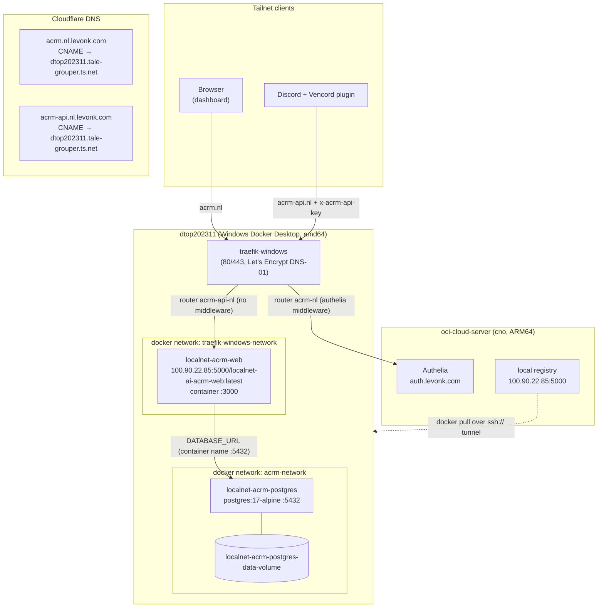

# ACRM — nl-Region Deployment Design

Target: deploy ACRM's Next.js web app + a dedicated Postgres into the infrahub
disciplined deployment system on the **nl region** — `dtop202311`, a Windows
Docker Desktop host reachable over Tailscale.

- Inventory: `levonk/active/02-config/ansible/inventories/windows-docker.yml`
  (group `windows_docker_hosts`; SSH `ansible@dtop202311.tale-grouper.ts.net`,
  `ansible_shell_type: powershell`, `ansible_become: false`)
- Vault auto-loads via the `infrahub-levonk-all.vault` parent group in the
  inventory — no explicit vars_file needed for vault vars on this inventory.

## 1. Architecture



Traffic stays inside the tailnet: `*.nl.levonk.com` CNAMEs resolve to
`dtop202311.tale-grouper.ts.net`, which only resolves via Tailscale MagicDNS —
clients outside the tailnet cannot reach the service. TLS terminates on the
Windows Traefik via Let's Encrypt DNS-01 (Cloudflare), so HTTP on the tailnet
is still encrypted.

## 2. Why the Windows Traefik, not OCI cross-machine routing

Two Traefik roles exist:

- `proxy-traefik` (OCI) — serves `*.levonk.com` and *some* `*.nl.levonk.com`
  records by routing cross-machine to `http://dtop202311.tale-grouper.ts.net:<host_port>`
  (see `proxy-traefik/templates/dynamic/cc-nl.yml.j2`).
- `proxy_traefik_windows` (Windows host) — Traefik container bound to the
  Windows host's 80/443, serving `*.nl.levonk.com` by container name on
  `traefik-windows-network`.

`*.nl.levonk.com` DNS CNAMEs point to `dtop202311.tale-grouper.ts.net`, so
requests land directly on the Windows Traefik — the deployed precedent for nl
services (stirling, hister, verdaccio-nl, start-nl, nixcache-nl, media-nl) is
the **Windows Traefik with container-name upstreams**. ACRM follows that
precedent. The OCI `cc-nl.yml.j2` cross-machine pattern is the exception
(Control Center is dual-published); ACRM does not need it.

## 3. Containers

| Container | Image | Networks | Ports | Volumes |
|-----------|-------|----------|-------|---------|
| `localnet-acrm-web` | `{{ infra_registry }}/localnet-ai-acrm-web:latest` | `acrm-network` + `traefik-windows-network` | `4538:3000/tcp` | none (stateless) |
| `localnet-acrm-postgres` | `postgres:17-alpine` | `acrm-network` only | `5440:5432/tcp` | `localnet-acrm-postgres-data-volume` → `/var/lib/postgresql/data` |

Notes:

- **amd64 only**: nl is `linux/amd64`. The image can be built single-arch
  (`PLATFORMS=linux/amd64`); building both arches is harmless.
- **postgres:17-alpine** matches the version used in acrm's dev/e2e recipe
  (`docker run ... postgres:17-alpine` in `acrm/AGENTS.md`).
- Postgres publishes host port `5440` for tailnet-side debugging/psql access,
  consistent with the per-service postgres host-port convention (n8n=5438,
  qm=5437, litellm=5435 …). It is not required for the app path.
- The postgres official image's entrypoint chowns
  `/var/lib/postgresql/data` itself — no `localnet-volume-init` chown pass is
  needed. (Volume-init is only required when a non-root container can't fix
  ownership itself; hister/stirling needed it because they run `--user 1000`
  against an app dir. Postgres drops privileges after init.)
- **Secrets on the CLI**: all nl roles pass env via `docker run -e`. Use
  `no_log: true` on the deploy tasks that carry `ACRM_API_KEY` /
  `POSTGRES_PASSWORD` so values never hit Ansible output or shell history
  files rendered to logs.

### Environment

`localnet-acrm-web`:

| Var | Value |
|-----|-------|
| `NODE_ENV` | `production` (baked into image) |
| `PORT` | `{{ acrm_web_container_port }}` (3000) |
| `DATABASE_URL` | `postgresql://{{ acrm_postgres_user }}:{{ acrm_postgres_password }}@{{ acrm_postgres_container_name }}:{{ acrm_postgres_container_port }}/{{ acrm_postgres_db }}` |
| `ACRM_API_KEY` | `{{ acrm_api_key }}` ← `vault_acrm_api_key` |
| `ACRM_SAFETY_KEYWORDS` | optional, comma-separated extra safety-latch keywords |
| `TZ` | `{{ localnet_tz \| default('UTC') }}` |
| `BETTER_AUTH_SECRET` / `BETTER_AUTH_URL` | **omit** — better-auth session helper is a stub (`getCurrentUser` returns null); dashboard is gated by Authelia instead |

`localnet-acrm-postgres`:

| Var | Value |
|-----|-------|
| `POSTGRES_USER` | `{{ acrm_postgres_user }}` (`acrm`) |
| `POSTGRES_PASSWORD` | `{{ acrm_postgres_password }}` ← `vault_acrm_postgres_password` |
| `POSTGRES_DB` | `{{ acrm_postgres_db }}` (`acrm`) |
| `TZ` | `{{ localnet_tz \| default('UTC') }}` |

### DB migrations

`pnpm run db:migrate` (in `apps/active/web`) runs `drizzle-kit migrate`
against `DATABASE_URL`. `drizzle-kit` is a **production** dependency
(`apps/active/web/package.json` deps, not devDeps) and migration SQL ships in
`apps/active/web/src/db/migrations`, so the deployed image can self-migrate.

Plan: an Ansible task runs a one-off container
(`docker run --rm --network acrm-network -e DATABASE_URL=... <image> sh -c 'cd <web dir> && pnpm run db:migrate'`)
**after** postgres is healthy and **before** (re)starting the web container,
gated on `ai_acrm_run_migrations: true`. This keeps app startup deterministic
and makes the migration step visible/idempotent in the play. The Dockerfile
story must document the web app's working directory inside the image
(e.g. `/app/apps/active/web`) so this command is correct.

### Health checks

- web: `wget -qO- http://127.0.0.1:{{ acrm_web_container_port }}/ || exit 1`
  (busybox wget is present in `node:*-alpine`; `/` is a static landing page
  that returns 200 — there is no `/api/health` route today; adding one is a
  cheap acrm-repo follow-up)
- postgres: `pg_isready -h 127.0.0.1 -U {{ acrm_postgres_user }} -d {{ acrm_postgres_db }}`
- Wait-for-healthy loops via `docker inspect --format '{{.State.Health.Status}}'`
  (verdaccio/hister pattern, `until: … == "healthy"`, `retries: infra_retry_extended`,
  `delay: infra_delay_default`).

## 4. Domains, Traefik, and the two-domain auth split

The Vencord plugin POSTs JSON and cannot perform an SSO browser flow, so ACRM
needs the **stirling-style split**:

| Domain | Traefik router | Middleware | Consumer |
|--------|----------------|------------|----------|
| `acrm.nl.levonk.com` | `acrm-nl-https` | `authelia` (forwardAuth → Authelia on OCI) | Browser dashboard |
| `acrm-api.nl.levonk.com` | `acrm-api-nl-https` | none — app-level `x-acrm-api-key` auth | Vencord plugin, scripts |

- New template:
  `roles/proxy_traefik_windows/templates/dynamic/acrm-nl.yml.j2` — both routers
  point at service `acrm-nl` → `http://localnet-acrm-web:{{ infra_port_ai_acrm_container }}`.
  Model on `stirling-nl.yml.j2` (its API-subdomain routers omit the authelia
  middleware block) but keep it simpler: no `tls.domains`/SAN block needed —
  each router gets `certResolver: letsencrypt` on its own host rule.
- Register in `roles/proxy_traefik_windows/`:
  - `defaults/main.yml`: `proxy_traefik_windows_acrm_enabled`,
    `proxy_traefik_windows_acrm_domain` (= `infra_domain_ai_acrm`),
    `proxy_traefik_windows_acrm_api_domain` (= `infra_domain_ai_acrm_api`),
    `proxy_traefik_windows_acrm_container_name`/`_container_port`; also add the
    domains to the `proxy_traefik_windows_acme_domains` list used for cert
    coverage (see the `*_enabled | ternary([domain], [])` chain in defaults).
  - `tasks/main.yml`: render + `docker cp` tasks for `acrm-nl.yml`, plus a
    `docker network connect traefik-windows-network localnet-acrm-web` task
    (all gated on `proxy_traefik_windows_acrm_enabled | bool`).
- Authelia: no ACL change needed — `proxy_authelia_rules` in
  `levonk/.../host_vars/oci-cloud-server.yml` already ends with
  `domain: "*.levonk.com" → one_factor`, which covers `acrm.nl.levonk.com`;
  the session cookie domain is `levonk.com`.
- Alternative considered (rejected): verdaccio-style single domain where
  `PathPrefix("/api/")` bypasses Authelia. Two domains is cleaner for a
  token-authenticated API and matches the stated requirement.

### DNS records

Mechanism (verified): `cloudflare-dns` role consumes a `cloudflare_dns_records`
list. Records live in **two** places by convention:

1. The canonical list in `playbooks/configure-cloudflare-dns.yml`
   (`vars.cloudflare_dns_records`, runs on `localhost`) — all `*.nl.*` services
   get `type: CNAME → {{ ts_fqdn_windows_docker }}` where
   `ts_fqdn_windows_docker: "{{ infra_tailscale_fqdn_windows_docker }}"`.
2. Optionally a Phase-0 DNS play inside the service's own deploy playbook
   (n8n/paperclip pattern) so `just ansible-deploy-acrm` is self-contained.

Recommendation: do both — central list entries + a `dns`-tagged Phase 0 in
`deploy-acrm.yml`.

Record types:

- `acrm.nl.levonk.com` → `CNAME` → `dtop202311.tale-grouper.ts.net` ✅ (same as
  every other nl service).
- `acrm-api.nl.levonk.com` → `CNAME` → `dtop202311.tale-grouper.ts.net` —
  **recommended** for consistency. The stirling precedent used
  `type: A → {{ ts_ip_windows_docker }}` (`infra_tailscale_ip_windows_docker`),
  but that variable is **currently wrong** (`100.90.22.85` = OCI; dtop202311 is
  `100.81.103.34` per live `tailscale status`) — so stirling-api.nl is almost
  certainly broken today. CNAME→FQDN resolves via MagicDNS for any tailnet
  client, which is all we need (the Vencord plugin host is a tailnet Mac).
  If a non-MagicDNS client ever needs the API, fix
  `infra_tailscale_ip_windows_docker` to `100.81.103.34` first, then switch to
  an A record.

## 5. Infrastructure variables to add

Shared schemas (`shared/active/02-config/ansible/infrastructure/`):

```yaml
# ports.yml (nl-region block; 4538/5440 verified free in shared + levonk)
infra_port_ai_acrm_host: "4538"
infra_port_ai_acrm_container: "3000"
infra_port_ai_acrm_postgres_host: "5440"
infra_port_ai_acrm_postgres_container: "5432"

# domains.yml
infra_domain_ai_acrm: "acrm.nl.{{ infra_domain_base }}"
infra_domain_ai_acrm_api: "acrm-api.nl.{{ infra_domain_base }}"
infra_hostname_acrm_web: "localnet-acrm-web"
infra_hostname_acrm_postgres: "localnet-acrm-postgres"

# networks.yml
infra_network_ai_acrm_network_name: "acrm-network"

# storage.yml
infra_storage_acrm_postgres_data_volume: "localnet-acrm-postgres-data-volume"
```

Client values (`levonk/active/02-config/ansible/infrastructure/domains.yml` —
concrete `levonk.com` entries per the stirling pattern):

```yaml
infra_domain_ai_acrm: "acrm.nl.levonk.com"
infra_domain_ai_acrm_api: "acrm-api.nl.levonk.com"
```

Fallback placeholders (`shared/.../infrastructure/values.yml`): add
`infra_value_acrm_*` entries (empty domains, `localnet-acrm-*` names,
`"change-me"` password, `"UTC"` tz) so role `default()` chains resolve.

`services.yml` entries (`shared/.../infrastructure/services.yml`) — model on
the Stirling-PDF and n8n-postgres entries:

```yaml
- name: "ACRM Web"
  container: "{{ infra_hostname_acrm_web }}"
  machine: "dtop202311"
  category: "api"
  description: "Context-aware communication intelligence platform (web + v1 API)"
  source_repo: "https://github.com/levonk/acrm"
  domains:
    - "infra_domain_ai_acrm"
    - "infra_domain_ai_acrm_api"
  ports:
    - host: "infra_port_ai_acrm_host"
      container: "infra_port_ai_acrm_container"
      label: "Web/API"
  traefik: true
  network: "traefik-windows-network"
  health_endpoint: "/"
  metrics_path: null
  pipeline: "none"
  alert_labels:
    pipeline: "none"
    stage: "api"
    service: "acrm"

- name: "ACRM Postgres"
  container: "{{ infra_hostname_acrm_postgres }}"
  machine: "dtop202311"
  category: "passive"
  description: "PostgreSQL database for ACRM (graph, messages, typing events)"
  source_repo: "https://github.com/postgres/postgres"
  ports:
    - host: "infra_port_ai_acrm_postgres_host"
      container: "infra_port_ai_acrm_postgres_container"
      label: "PostgreSQL"
  network: "acrm-network"
```

Then regenerate both catalogs (`just generate-service-catalog` /
`generate-service-catalog-shared`) — implementation story, not part of this
planning change.

## 6. Secrets (vault handoff)

Two vault keys in `levonk/.../group_vars/infrahub-levonk-all.vault.yml`:

```yaml
vault_acrm_api_key: "<openssl rand -hex 32>"
vault_acrm_postgres_password: "<openssl rand -base64 32>"
```

Role defaults reference them safely:
`acrm_api_key: "{{ vault_acrm_api_key | default('') }}"`,
`acrm_postgres_password: "{{ vault_acrm_postgres_password | default('') }}"`.
The role's assert block should fail fast when they're empty (`| length > 0`)
since an unset `ACRM_API_KEY` puts the v1 API into open development mode —
acceptable on localhost, not acceptable behind a routable domain.

## 7. Backup

`devops-restoredrill` runs systemd timers + `docker exec` on Linux (OCI) — it
cannot drive backups on the Windows host, and **no nl postgres has a backup
pattern today** (acrm-postgres is the first nl postgres).

Recommendation: **defer with rationale**, file a follow-up story:
`localnet-acrm-postgres-backup` sidecar on `acrm-network` running pg_dump on a
schedule (e.g. `prodrigestivill/postgres-backup-local`, or an alpine+cron
image built in-repo), writing timestamped dumps to a
`localnet-acrm-backup-volume`. A later iteration can ship dumps off-machine
(restic to the OCI host or the rustfs S3 bucket). Deferral is acceptable
because the initial deployment's data is a personal single-user instance and
the schema is rebuildable; do not defer once real history accumulates.

## 8. Monitoring / validation

- `services.yml`: `health_endpoint: "/"`, `metrics_path: null`,
  `pipeline: "none"`, alert_labels as above.
- Role-level: `ai_acrm_verify_health` flag + `verify` tag (hister pattern).
- Playbook-level `validate-acrm.yml` can come later; at minimum the deploy
  playbook's final play asserts `docker inspect` health for both containers
  and curls `https://acrm-api.nl.levonk.com/` (expect 200 from the landing
  page — the api domain has no Authelia so this also proves the route).

## 9. Windows-specific gotchas (from existing roles)

- `community.docker` modules fail on Windows (`grp` import) — everything is
  `ansible.builtin.shell`/`command` + `DOCKER_HOST: ssh://…` +
  `delegate_to: localhost`.
- `docker pull` for **public** images should set
  `DOCKER_CONFIG: ~/.docker-no-creds` (avoids the macOS keychain modal —
  see `tools-stirling-pdf/tasks/deploy-windows.yml:45`). For the
  **registry** image this is unnecessary (registry is anonymous HTTP on the
  tailnet) but harmless.
- `state: restarted` doesn't exist in this pattern — the roles do
  `docker rm -f <name> || true` then `docker run -d …`.
- The SSH tunnel requires a working `ssh ansible@dtop202311.tale-grouper.ts.net`
  from the controller (the inventory's `lzkmbp2016-micro-oracle` key).
- `docker run -e` secrets appear in `docker inspect` — acceptable on a
  single-user tailnet host; `no_log: true` on the Ansible side.

## 10. Build & push

`localnet-ai-acrm-web` is built **from the acrm repo** (private repo +
pnpm workspace ⇒ root build context; `scripts/build-and-push-images.sh`
only supports contexts under `shared/active/03-container/services/`).
Plan: a documented `just` recipe in the acrm repo, e.g.

```bash
docker buildx build --platform linux/amd64 \
  -t 100.90.22.85:5000/localnet-ai-acrm-web:latest --push .
```

with `REGISTRY`/`TAG` env overrides. Optional follow-up: extend
`build-and-push-images.sh` to accept external context paths (see
[`packaging-analysis.md`](packaging-analysis.md)).
