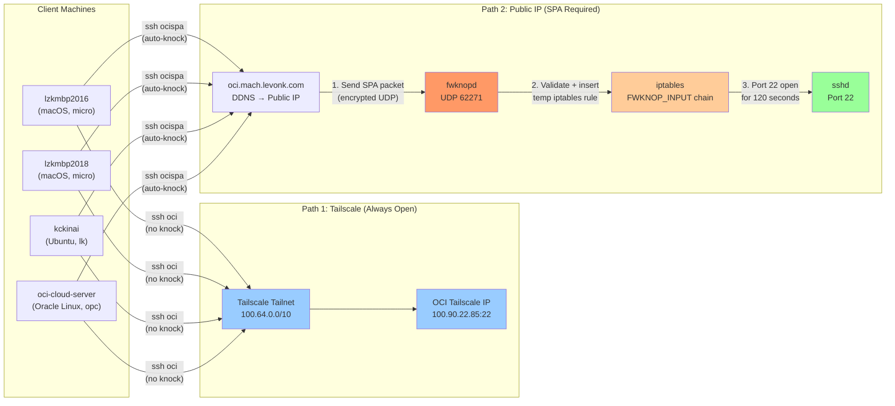
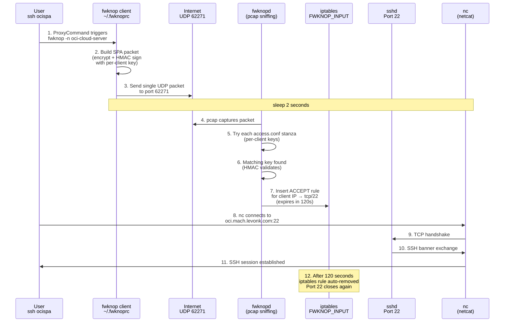
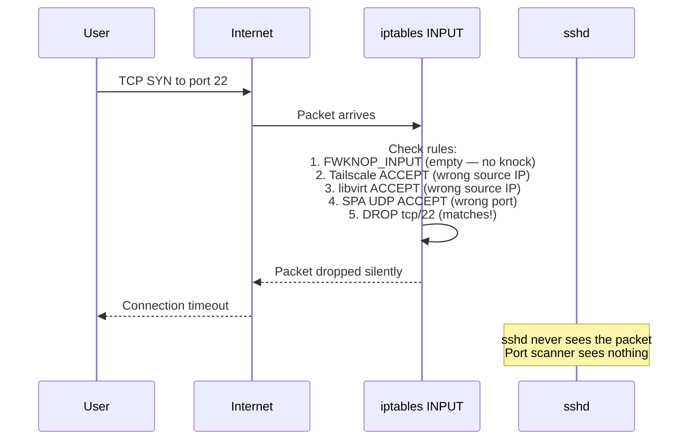
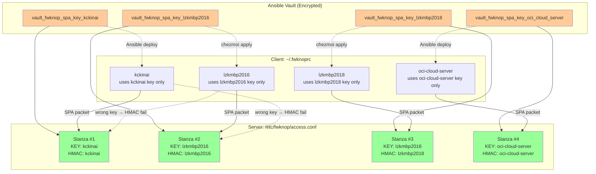
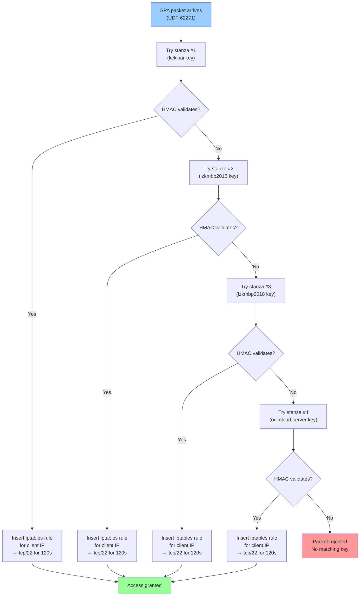
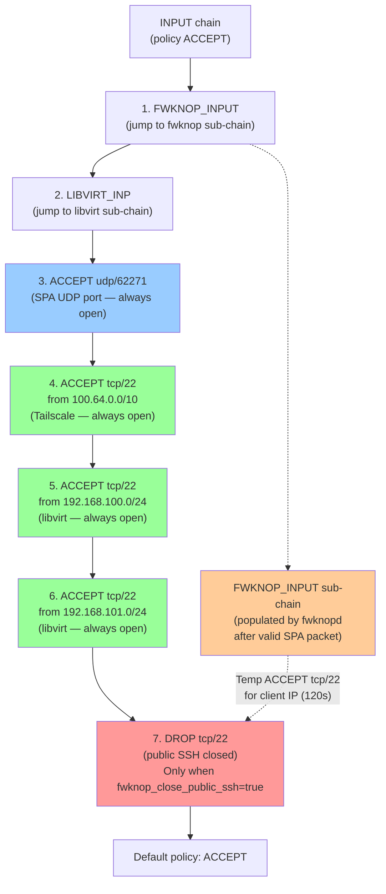
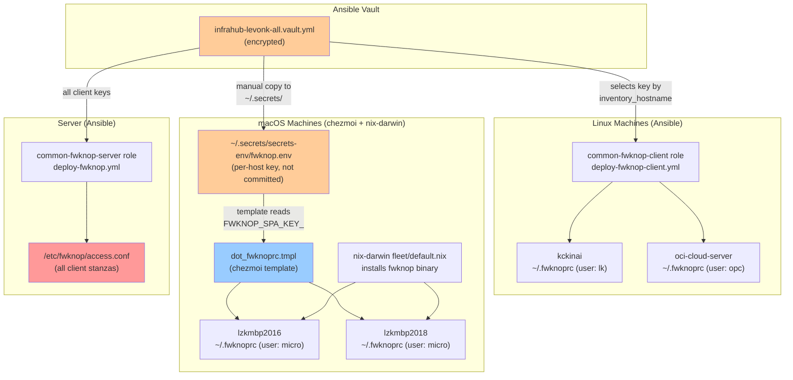
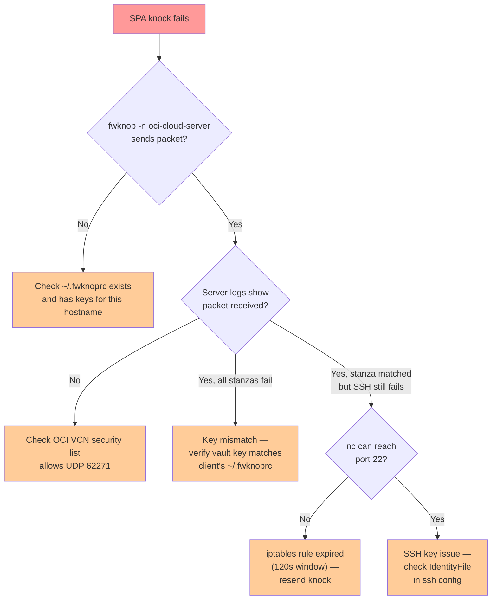

# OCI Cloud Server — SSH Access Guide

This document explains how SSH access to the OCI cloud server works,
including the fwknop SPA (Single Packet Authorization) layer, the
Tailscale parallel path, and the per-client key architecture.

## Access Paths Overview

There are two ways to reach the OCI cloud server via SSH:



| Path | Command | Knock needed? | Always works? |
|------|---------|---------------|---------------|
| Tailscale | `ssh oci` | No | Yes (if Tailscale is up) |
| Public IP + SPA | `ssh ocispa` | Yes (automatic) | Yes (if public IP + fwknopd are up) |

## SPA Flow: Step by Step

When you run `ssh ocispa`, the ProxyCommand does three things in sequence:



### What happens without a knock

If you try `ssh opc@oci.mach.levonk.com` directly (no knock):



## Per-Client Key Architecture

Each machine has its own SPA key pair. The server's `access.conf` has
one stanza per client. This provides compartmentalization: compromise
of one client only exposes that client's key.



### How stanza matching works

When a SPA packet arrives, fwknopd tries each stanza in order:



### Server log example

When lzkmbp2016 sends a knock, the server logs show:

```
(stanza #1) SPA Packet from IP: 172.56.120.5 received with access source match
[172.56.120.5] (stanza #1) Error creating fko context: HMAC_COMPAREFAIL
(stanza #2) SPA Packet from IP: 172.56.120.5 received with access source match
Added access rule to FWKNOP_INPUT for 172.56.120.5 -> 0.0.0.0/0 tcp/22, expires at 1786840865
```

- Stanza #1 (kckinai key) — tried first, HMAC fails (wrong key)
- Stanza #2 (lzkmbp2016 key) — matches, access rule inserted

The "HMAC_COMPAREFAIL" for non-matching stanzas is **expected** and not an error.

## iptables Rule Chain

The OCI server uses raw iptables (no UFW, no firewalld). The INPUT
chain has this order:



### Rule evaluation order

1. **FWKNOP_INPUT** — fwknopd's dynamic chain. After a valid knock, this
   contains a temporary ACCEPT rule for the client's IP. If no knock has
   been sent, this chain is empty and packets fall through.
2. **LIBVIRT_INP** — libvirt's chain for VM traffic.
3. **SPA UDP port** — always allows UDP 62271 so SPA packets can reach fwknopd.
4. **Tailscale SSH** — always allows TCP/22 from the Tailscale CGNAT range.
5. **libvirt SSH** — always allows TCP/22 from libvirt bridge networks.
6. **DROP public SSH** — drops TCP/22 from anywhere else. This is the rule
   that makes port 22 invisible to scanners. Only present when
   `fwknop_close_public_ssh=true`.
7. **Default policy** — ACCEPT (but the DROP rule above catches public SSH first).

## Key Distribution Model

Keys are distributed through different channels depending on the machine type:



### Key selection by hostname

| Machine | Hostname | Username | Key variable | Distribution |
|---------|----------|----------|-------------|-------------|
| kckinai | `kckinai` | `lk` | `vault_fwknop_spa_key_kckinai` | Ansible role |
| lzkmbp2016 | `lzkmbp2016` | `micro` | `vault_fwknop_spa_key_lzkmbp2016` | chezmoi template |
| lzkmbp2018 | `lzkmbp2018` | `micro` | `vault_fwknop_spa_key_lzkmbp2018` | chezmoi template |
| oci-cloud-server | `oci-cloud-server` | `opc` | `vault_fwknop_spa_key_oci_cloud_server` | Ansible role |

## Operational Procedures

### Closing public SSH (require SPA)

```bash
just ansible-deploy-fwknop-close-ssh
```

This adds the iptables DROP rule for public TCP/22. Tailscale and
SPA-opened access remain unaffected.

### Reopening public SSH (disable SPA requirement)

```bash
just ansible-deploy-fwknop
```

This removes the DROP rule. Port 22 is open to the public again. fwknopd
keeps running but the SPA knock is no longer required.

### Adding a new client

1. Generate a key pair:
   ```bash
   fwknop --key-gen --key-len 32 --hmac-key-len 64
   ```
2. Add to vault:
   ```yaml
   vault_fwknop_spa_key_<hostname>: "<KEY_BASE64 value>"
   vault_fwknop_hmac_key_<hostname>: "<HMAC_KEY_BASE64 value>"
   ```
3. Add to `fwknop_clients` in `common-fwknop-server/defaults/main.yml`
4. Add to `fwknop_client_key_map` in `common-fwknop-client/defaults/main.yml`
5. Redeploy server: `just ansible-deploy-fwknop-close-ssh`
6. Deploy client config: `just ansible-deploy-fwknop-client` (Linux)
   or `chezmoi apply` (macOS)

### Revoking a client

1. Remove the client's entry from `fwknop_clients` in the server role
2. Redeploy server: `just ansible-deploy-fwknop-close-ssh`
3. The client's key will no longer match any stanza — SPA packets rejected

### Rotating a client's key

1. Generate a new key pair: `fwknop --key-gen --key-len 32 --hmac-key-len 64`
2. Update the vault entry for that client
3. Redeploy server: `just ansible-deploy-fwknop-close-ssh`
4. Redeploy client: `just ansible-deploy-fwknop-client` or `chezmoi apply`

## Troubleshooting

### SPA knock doesn't work



### Locked out of public SSH

If SPA is broken and you can't reach the server via public IP:

1. **Use Tailscale** (always works, no knock needed):
   ```bash
   ssh oci
   ```
2. **Redeploy fwknop** from the control machine:
   ```bash
   just ansible-deploy-fwknop
   ```
3. **Or reopen port 22** temporarily:
   ```bash
   just ansible-deploy-fwknop  # runs without fwknop_close_public_ssh=true
   ```

### Checking server logs

```bash
# Via Tailscale (always available)
ssh oci 'sudo journalctl -u fwknopd -n 20'

# Look for:
# - "SPA Packet from IP: X received" = packet arrived
# - "Added access rule to FWKNOP_INPUT" = key matched, rule inserted
# - "HMAC_COMPAREFAIL" = wrong key (expected for non-matching stanzas)
# - "Sniffing interface: any" = fwknopd is running
```

### Checking iptables rules

```bash
ssh oci 'sudo iptables -L INPUT -n --line-numbers'
ssh oci 'sudo iptables -L FWKNOP_INPUT -n'
```

The `FWKNOP_INPUT` chain shows temporary ACCEPT rules with expiry
timestamps in the comment field.
