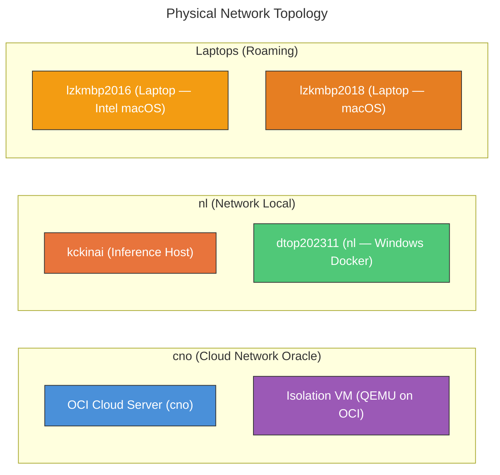
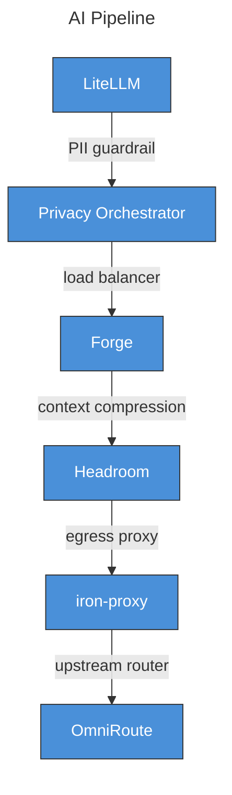
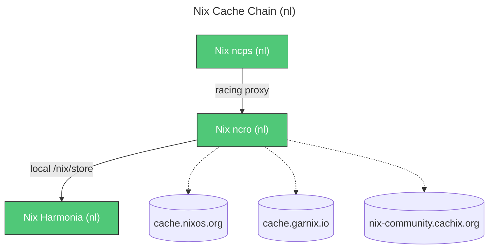
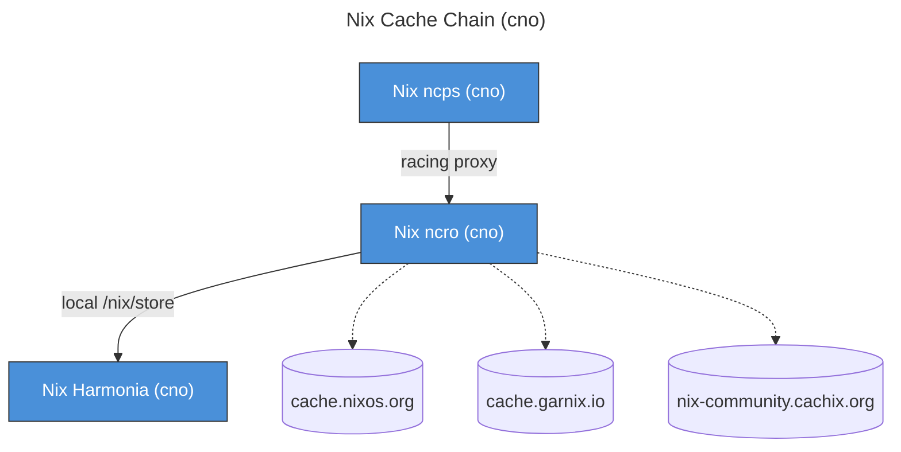

# Levonk Service Catalog

> **Auto-generated** from `infrastructure/*.yml` — last updated: 2026-08-10 02:04
> Regenerate with: `just generate-service-catalog`
> Source: `shared/active/02-config/ansible/infrastructure/services.yml`

**66 services** across 4 machines:
  - OCI Cloud Server (cno): 47
  - kckinai (Inference Host): 1
  - dtop202311 (nl — Windows Docker): 17
  - Isolation VM (QEMU on OCI): 1

## Table of Contents

- [Machine Legend](#machine-legend)
- [Service Topology](#service-topology)
- [Service Chains](#service-chains)
  - [AI Pipeline](#ai-pipeline)
  - [Nix Cache Chain (nl)](#nix-cache-chain-nl)
  - [Nix Cache Chain (cno)](#nix-cache-chain-cno)
- [All Services (Alphabetical)](#all-services-alphabetical)
- [Services by Category](#services-by-category)
  - [🌐 UI (Web Apps)](#ui-web-apps)
  - [🔌 API (HTTP Services)](#api-http-services)
  - [🖥️ Console / Dashboard](#console-dashboard)
  - [🗄️ Passive (Databases / Caches / Queues)](#passive-databases-caches-queues)
  - [🔗 Proxy Chain (Internal)](#proxy-chain-internal)
  - [🔒 VPN / Mesh Networking](#vpn-mesh-networking)
  - [📡 DNS](#dns)
  - [🛡️ Security / SSO](#security-sso)
  - [⚙️ Infrastructure](#infrastructure)
- [Machine Reference](#machine-reference)

## Machine Legend

## Service Topology

```mermaid
---
title: Levonk Service Topology
---
flowchart TD
    subgraph oci_cloud_server["OCI Cloud Server (cno)"]
        agentmemory["🌐 agentmemory"]
        AI_Dashboard["🌐 AI Dashboard"]
        Authelia["🛡️ Authelia"]
        Authelia_Postgres["🗄️ Authelia Postgres"]
        CoreDNS["📡 CoreDNS"]
        CrowdSec["🛡️ CrowdSec"]
        dnsdist["📡 dnsdist"]
        Forge["🔗 Forge"]
        Gost_Egress["🔗 Gost Egress"]
        Headroom["🔗 Headroom"]
        Homepage["⚙️ Homepage"]
        Host_Exit_Node__cno_["🔒 Host Exit Node (cno)"]
        iron_proxy["🔗 iron-proxy"]
        Langfuse_ClickHouse["🗄️ Langfuse ClickHouse"]
        Langfuse_MinIO["🗄️ Langfuse MinIO"]
        Langfuse_Postgres["🗄️ Langfuse Postgres"]
        Langfuse_Redis["🗄️ Langfuse Redis"]
        Langfuse_Web["🌐 Langfuse Web"]
        Langfuse_Worker["🗄️ Langfuse Worker"]
        LiteLLM["🌐 LiteLLM"]
        LiteLLM_Postgres["🗄️ LiteLLM Postgres"]
        LiteLLM_Redis["🗄️ LiteLLM Redis"]
        Local_Registry["⚙️ Local Registry"]
        MITM_Proxy["🔗 MITM Proxy"]
        n8n["🌐 n8n"]
        n8n_Grafana["🖥️ n8n Grafana"]
        n8n_Postgres["🗄️ n8n Postgres"]
        n8n_Prometheus["🗄️ n8n Prometheus"]
        Nix_Harmonia__cno_["⚙️ Nix Harmonia (cno)"]
        Nix_ncps__cno_["⚙️ Nix ncps (cno)"]
        Nix_ncro__cno_["🔗 Nix ncro (cno)"]
        NordVPN["🔒 NordVPN"]
        Omnigent["🌐 Omnigent"]
        Omnigent_Postgres["🗄️ Omnigent Postgres"]
        OmniRoute["🔌 OmniRoute"]
        Pi["🔌 Pi"]
        Privacy_Orchestrator["🔗 Privacy Orchestrator"]
        Privoxy["🔗 Privoxy"]
        SearXNG["🌐 SearXNG"]
        Tailscale["🔒 Tailscale"]
        Tor_Exit_Node__cno_["🔒 Tor Exit Node (cno)"]
        Tor_Tailscale_Exit__cno_["🔒 Tor Tailscale Exit (cno)"]
        Traefik["🖥️ Traefik"]
        TraLa["⚙️ TraLa"]
        Varnish_Cache["🔗 Varnish Cache"]
        Verdaccio_NPM_Registry__cno_["⚙️ Verdaccio NPM Registry (cno)"]
        VPN_Tailscale_Exit__cno_["🔒 VPN Tailscale Exit (cno)"]
    end
    subgraph kckinai["kckinai (Inference Host)"]
        kckinai_Host["⚙️ kckinai Host"]
    end
    subgraph dtop202311["dtop202311 (nl — Windows Docker)"]
        Directory_Empire["🌐 Directory Empire"]
        Host_Exit_Node__nl_["🔒 Host Exit Node (nl)"]
        JobOps["🌐 JobOps"]
        Nix_Harmonia__nl_["⚙️ Nix Harmonia (nl)"]
        Nix_ncps__nl_["⚙️ Nix ncps (nl)"]
        Nix_ncro__nl_["🔗 Nix ncro (nl)"]
        NordVPN_Exit_Node__nl_["🔒 NordVPN Exit Node (nl)"]
        QM_Core["🔌 QM Core"]
        QM_Postgres["🗄️ QM Postgres"]
        QM_Web_UI["🌐 QM Web UI"]
        RustFS["🗄️ RustFS"]
        Tor_Exit_Node__nl_["🔒 Tor Exit Node (nl)"]
        Tor_Tailscale_Exit__nl_["🔒 Tor Tailscale Exit (nl)"]
        Verdaccio_NPM_Registry__nl_["⚙️ Verdaccio NPM Registry (nl)"]
        VPN_Tailscale_Exit__nl_["🔒 VPN Tailscale Exit (nl)"]
        WorldMonitor["🌐 WorldMonitor"]
        WorldMonitor_Redis["🗄️ WorldMonitor Redis"]
    end
    subgraph isolation_vm["Isolation VM (QEMU on OCI)"]
        Isolation_VM["⚙️ Isolation VM"]
    end

    %% Service chain connections (data-driven from services.yml)
    LiteLLM -->|PII guardrail| Privacy_Orchestrator
    Privacy_Orchestrator -->|load balancer| Forge
    Forge -->|context compression| Headroom
    Headroom -->|egress proxy| iron_proxy
    iron_proxy -->|upstream router| OmniRoute
    Nix_ncps__nl_ -->|racing proxy| Nix_ncro__nl_
    Nix_ncro__nl_ -->|local /nix/store| Nix_Harmonia__nl_
    Nix_ncps__cno_ -->|racing proxy| Nix_ncro__cno_
    Nix_ncro__cno_ -->|local /nix/store| Nix_Harmonia__cno_
    %% Trace forwarding
    LiteLLM -.-> Langfuse_Web

    %% Traefik routes to UI/API services
    Traefik --> LiteLLM
    Traefik --> OmniRoute
    Traefik --> Headroom
    Traefik --> AI_Dashboard
    Traefik --> Omnigent
    Traefik --> agentmemory
    Traefik --> Langfuse_Web
    Traefik --> Authelia
    Traefik --> SearXNG
    Traefik --> Homepage
    Traefik --> TraLa
    Traefik --> JobOps
    Traefik --> RustFS
    Traefik --> QM_Web_UI
    Traefik --> Verdaccio_NPM_Registry__cno_
    Traefik --> Verdaccio_NPM_Registry__nl_
    Traefik --> n8n
    Traefik --> n8n_Grafana
    Traefik --> Nix_ncps__nl_
    Traefik --> Nix_ncps__cno_
    Traefik --> Directory_Empire

    %% Auth middleware
    Traefik -.-> Authelia
    Traefik -.-> CrowdSec

    %% SearXNG routes through NordVPN
    SearXNG -.-> NordVPN

    %% Cross-machine: Traefik (OCI) → JobOps (Windows Docker)
    Traefik -.-> JobOps

    %% Database connections
    LiteLLM -.-> LiteLLM_Postgres
    LiteLLM -.-> LiteLLM_Redis
    Omnigent -.-> Omnigent_Postgres
    Omnigent -.-> Pi
    Authelia -.-> Authelia_Postgres
    Langfuse_Web -.-> Langfuse_Postgres
    Langfuse_Web -.-> Langfuse_ClickHouse
    Langfuse_Web -.-> Langfuse_Redis
    Langfuse_Web -.-> Langfuse_MinIO
    Langfuse_Web -.-> Langfuse_Worker
    WorldMonitor -.-> WorldMonitor_Redis

    %% Machine color coding
    classDef machine_oci fill:#4A90D9,color:#fff,stroke:#333,stroke-width:1px
    class LiteLLM,LiteLLM_Postgres,LiteLLM_Redis,OmniRoute,Headroom,Forge,iron_proxy,Privacy_Orchestrator,MITM_Proxy,Privoxy,Varnish_Cache,Gost_Egress,AI_Dashboard,Omnigent,Omnigent_Postgres,Pi,agentmemory,Langfuse_Web,Langfuse_Worker,Langfuse_Postgres,Langfuse_ClickHouse,Langfuse_Redis,Langfuse_MinIO,Traefik,Authelia,Authelia_Postgres,CrowdSec,NordVPN,Tailscale,Tor_Exit_Node__cno_,VPN_Tailscale_Exit__cno_,Tor_Tailscale_Exit__cno_,Host_Exit_Node__cno_,CoreDNS,dnsdist,SearXNG,Homepage,TraLa,Local_Registry,Verdaccio_NPM_Registry__cno_,n8n,n8n_Postgres,n8n_Grafana,n8n_Prometheus,Nix_Harmonia__cno_,Nix_ncps__cno_,Nix_ncro__cno_ machine_oci
    classDef machine_kckinai fill:#E8743C,color:#fff,stroke:#333,stroke-width:1px
    class kckinai_Host machine_kckinai
    classDef machine_dtop fill:#50C878,color:#fff,stroke:#333,stroke-width:1px
    class NordVPN_Exit_Node__nl_,Tor_Exit_Node__nl_,VPN_Tailscale_Exit__nl_,Tor_Tailscale_Exit__nl_,Host_Exit_Node__nl_,WorldMonitor,WorldMonitor_Redis,JobOps,RustFS,QM_Web_UI,QM_Core,QM_Postgres,Verdaccio_NPM_Registry__nl_,Nix_Harmonia__nl_,Nix_ncps__nl_,Nix_ncro__nl_,Directory_Empire machine_dtop
    classDef machine_vm fill:#9B59B6,color:#fff,stroke:#333,stroke-width:1px
    class Isolation_VM machine_vm
```

## Service Chains

### AI Pipeline

*Request flow for AI inference — gateway → proxy chain → upstream providers*

### Nix Cache Chain (nl)

*Nix binary cache proxy chain (nl region) — client → cache → racer → upstreams*

### Nix Cache Chain (cno)

*Nix binary cache proxy chain (cno region) — client → cache → racer → upstreams*

## All Services (Alphabetical)

| Service | Container | Machine | Domain(s) | Port(s) (host→container) | Network | Storage | Category | Source |
|---------|-----------|---------|-----------|--------------------------|---------|---------|----------|--------|
| agentmemory | `agentmemory` | OCI Cloud Server (cno) | [agentmemory.levonk.com](https://agentmemory.levonk.com) | `3111`→`3111` (REST/MCP) | — | `/opt/localnet/data/agentmemory` `/opt/localnet/services/agentmemory/config` | UI (Web Apps) | [rohitg00/agentmemory](https://github.com/rohitg00/agentmemory) |
| AI Dashboard | `ai-dashboard` | OCI Cloud Server (cno) | [ai-dashboard.levonk.com](https://ai-dashboard.levonk.com) | `3000`→`3000` (Web) | — | — | UI (Web Apps) | [levonk/ai-dashboard](https://github.com/levonk/ai-dashboard) |
| Authelia | `authelia` | OCI Cloud Server (cno) | [auth.levonk.com](https://auth.levonk.com) | `9091`→`9091` (Web) | — | — | Security / SSO | [authelia/authelia](https://github.com/authelia/authelia) |
| Authelia Postgres | `authelia-postgres` | OCI Cloud Server (cno) | — | `5432`→`5432` (PostgreSQL) | authelia-network | — | Passive (Databases / Caches / Queues) | [docker-library/postgres](https://github.com/docker-library/postgres) |
| CoreDNS | `coredns` | OCI Cloud Server (cno) | — | `15354`→`15353` (DNS) `9153`→`9153` (Metrics) | localnet-network | — | DNS | [coredns/coredns](https://github.com/coredns/coredns) |
| CrowdSec | `crowdsec` | OCI Cloud Server (cno) | — | `8080`→`8080` (LAPI) | crowdsec-network | — | Security / SSO | [crowdsecurity/crowdsec](https://github.com/crowdsecurity/crowdsec) |
| Directory Empire | `localnet-dashboard-directory-empire` | dtop202311 (nl — Windows Docker) | [de.nl.levonk.com](https://de.nl.levonk.com) | `4530`→`3000` (Web) | traefik-windows-network | `localnet-directory-empire-config-volume` (volume) | UI (Web Apps) | [lrepo52/directory-empire](https://github.com/lrepo52/directory-empire) |
| dnsdist | `dnsdist` | OCI Cloud Server (cno) | — | `5501`→`5501` (DNS) `8083`→`8083` (Metrics) | localnet-network | — | DNS | [PowerDNS/dnsdist](https://github.com/PowerDNS/dnsdist) |
| Forge | `forge` | OCI Cloud Server (cno) | — | `8083`→`8081` (API) | forge-network | — | Proxy Chain (Internal) | [antoinezambelli/forge](https://github.com/antoinezambelli/forge) |
| Gost Egress | `localnet-proxy-gost` | OCI Cloud Server (cno) | — | `11080`→`1080` (SOCKS5) | localnet-network | — | Proxy Chain (Internal) | [go-gost/gost](https://github.com/go-gost/gost) |
| Headroom | `headroom` | OCI Cloud Server (cno) | [aishrink.levonk.com](https://aishrink.levonk.com) | `8787`→`8787` (API) | — | — | Proxy Chain (Internal) | [chopratejas/headroom](https://github.com/chopratejas/headroom) |
| Homepage | `homepage` | OCI Cloud Server (cno) | [start.levonk.com](https://start.levonk.com) | `8084`→`3000` (Web) | — | — | Infrastructure | [gethomepage/homepage](https://github.com/gethomepage/homepage) |
| Host Exit Node (cno) | `—` | OCI Cloud Server (cno) | — | — | — | — | VPN / Mesh Networking | [tailscale/tailscale](https://github.com/tailscale/tailscale) |
| Host Exit Node (nl) | `—` | dtop202311 (nl — Windows Docker) | — | — | — | — | VPN / Mesh Networking | [tailscale/tailscale](https://github.com/tailscale/tailscale) |
| iron-proxy | `iron-proxy` | OCI Cloud Server (cno) | — | `8880` (HTTP) `9443` (HTTPS) | proxy-chain-network | — | Proxy Chain (Internal) | [ironsh/iron-proxy](https://github.com/ironsh/iron-proxy) |
| Isolation VM | `isolation-vm` | Isolation VM (QEMU on OCI) | — | — | — | `/opt/localnet/data/isolation-vm` `/opt/localnet/config/isolation-vm` | Infrastructure | [www.qemu.org](https://www.qemu.org/) |
| JobOps | `localnet-jobops` | dtop202311 (nl — Windows Docker) | [jobops.levonk.com](https://jobops.levonk.com) | `3005`→`3001` (Web) | — | `localnet-jobops-data-volume` (volume) | UI (Web Apps) | [DaKheera47/job-ops](https://github.com/DaKheera47/job-ops) |
| kckinai Host | `kckinai` | kckinai (Inference Host) | [kckinai.levonk.com](https://kckinai.levonk.com) | — | — | — | Infrastructure | [tailscale.com](https://tailscale.com/) |
| Langfuse ClickHouse | `langfuse-clickhouse` | OCI Cloud Server (cno) | — | `8123` (HTTP) `9000` (TCP) | langfuse-network | — | Passive (Databases / Caches / Queues) | [ClickHouse/ClickHouse](https://github.com/ClickHouse/ClickHouse) |
| Langfuse MinIO | `langfuse-minio` | OCI Cloud Server (cno) | — | `9190`→`9000` (S3 API) `9001` (Console) | langfuse-network | — | Passive (Databases / Caches / Queues) | [minio/minio](https://github.com/minio/minio) |
| Langfuse Postgres | `langfuse-postgres` | OCI Cloud Server (cno) | — | `5434`→`5432` (PostgreSQL) | langfuse-network | — | Passive (Databases / Caches / Queues) | [docker-library/postgres](https://github.com/docker-library/postgres) |
| Langfuse Redis | `langfuse-redis` | OCI Cloud Server (cno) | — | `6379` (Redis) | langfuse-network | — | Passive (Databases / Caches / Queues) | [redis/redis](https://github.com/redis/redis) |
| Langfuse Web | `langfuse-web` | OCI Cloud Server (cno) | [langfuse.levonk.com](https://langfuse.levonk.com) | `3001`→`3000` (Web) | — | — | UI (Web Apps) | [langfuse/langfuse](https://github.com/langfuse/langfuse) |
| Langfuse Worker | `langfuse-worker` | OCI Cloud Server (cno) | — | `3030` (Worker) | langfuse-network | — | Passive (Databases / Caches / Queues) | [langfuse/langfuse](https://github.com/langfuse/langfuse) |
| LiteLLM | `litellm` | OCI Cloud Server (cno) | [aigate.levonk.com](https://aigate.levonk.com) [aigate-api.levonk.com](https://aigate-api.levonk.com) | `4000`→`4000` (Web/API) | — | `/opt/localnet/data/litellm` `/opt/localnet/services/litellm/config` | UI (Web Apps) | [BerriAI/litellm](https://github.com/BerriAI/litellm) |
| LiteLLM Postgres | `litellm-postgres` | OCI Cloud Server (cno) | — | `5435`→`5432` (PostgreSQL) | proxy-chain-network | — | Passive (Databases / Caches / Queues) | [docker-library/postgres](https://github.com/docker-library/postgres) |
| LiteLLM Redis | `litellm-redis` | OCI Cloud Server (cno) | — | `6379` (Redis) | proxy-chain-network | — | Passive (Databases / Caches / Queues) | [redis/redis](https://github.com/redis/redis) |
| Local Registry | `registry` | OCI Cloud Server (cno) | — | `5000`→`5000` (Registry) | traefik-network | — | Infrastructure | [distribution/distribution](https://github.com/distribution/distribution) |
| MITM Proxy | `mitmproxy` | OCI Cloud Server (cno) | — | `3128`→`3128` (HTTP Proxy) | localnet-network | — | Proxy Chain (Internal) | [mitmproxy/mitmproxy](https://github.com/mitmproxy/mitmproxy) |
| n8n | `localnet-n8n` | OCI Cloud Server (cno) | [n8n.levonk.com](https://n8n.levonk.com) | `3106`→`5678` (Web UI) | n8n-network | `localnet-n8n-data-volume` (volume) | UI (Web Apps) | [n8n-io/n8n](https://github.com/n8n-io/n8n) |
| n8n Grafana | `localnet-n8n-grafana` | OCI Cloud Server (cno) | [n8n-grafana.levonk.com](https://n8n-grafana.levonk.com) | `3108`→`3000` (Web UI) | n8n-network | `localnet-n8n-grafana-data-volume` (volume) | Console / Dashboard | [n8n-io/n8n-observability](https://github.com/n8n-io/n8n-observability) |
| n8n Postgres | `localnet-n8n-postgres` | OCI Cloud Server (cno) | — | `5438`→`5432` (PostgreSQL) | n8n-network | `localnet-n8n-postgres-data-volume` (volume) | Passive (Databases / Caches / Queues) | [postgres/postgres](https://github.com/postgres/postgres) |
| n8n Prometheus | `localnet-n8n-prometheus` | OCI Cloud Server (cno) | — | `3107`→`9090` (Web UI) | n8n-network | `localnet-n8n-prometheus-data-volume` (volume) | Passive (Databases / Caches / Queues) | [prometheus/prometheus](https://github.com/prometheus/prometheus) |
| Nix Harmonia (cno) | `localnet-nix-harmonia-cno` | OCI Cloud Server (cno) | — | `4523`→`5000` (HTTP (local only)) | traefik-network | — | Infrastructure | [nix-community/harmonia](https://github.com/nix-community/harmonia) |
| Nix Harmonia (nl) | `localnet-nix-harmonia` | dtop202311 (nl — Windows Docker) | — | `4523`→`5000` (HTTP (local only)) | traefik-windows-network | — | Infrastructure | [nix-community/harmonia](https://github.com/nix-community/harmonia) |
| Nix ncps (cno) | `localnet-nix-ncps-cno` | OCI Cloud Server (cno) | [nixcache.cno.levonk.com](https://nixcache.cno.levonk.com) | `4524`→`8080` (HTTP (via Traefik)) | traefik-network | — | Infrastructure | [kalbasit/ncps](https://github.com/kalbasit/ncps) |
| Nix ncps (nl) | `localnet-nix-ncps` | dtop202311 (nl — Windows Docker) | [nixcache.nl.levonk.com](https://nixcache.nl.levonk.com) | `4524`→`8080` (HTTP (via Traefik)) | traefik-windows-network | — | Infrastructure | [kalbasit/ncps](https://github.com/kalbasit/ncps) |
| Nix ncro (cno) | `localnet-nix-ncro-cno` | OCI Cloud Server (cno) | — | `4525`→`8081` (HTTP (internal, behind ncps)) | traefik-network | — | Proxy Chain (Internal) | [manic-systems/ncro](https://github.com/manic-systems/ncro) |
| Nix ncro (nl) | `localnet-nix-ncro` | dtop202311 (nl — Windows Docker) | — | `4525`→`8081` (HTTP (internal, behind ncps)) | traefik-windows-network | — | Proxy Chain (Internal) | [manic-systems/ncro](https://github.com/manic-systems/ncro) |
| NordVPN | `nordvpn` | OCI Cloud Server (cno) | — | `51820`→`51820` (WireGuard) `1080`→`1080` (SOCKS) `8888`→`8888` (HTTP Proxy) | vpn-network | — | VPN / Mesh Networking | [qdm12/gluetun](https://github.com/qdm12/gluetun) |
| NordVPN Exit Node (nl) | `nordvpn` | dtop202311 (nl — Windows Docker) | — | `1081`→`1080` (SOCKS) `8889`→`8888` (HTTP Proxy) `8444`→`8443` (HTTPS Proxy) | vpn-network | — | VPN / Mesh Networking | [qdm12/gluetun](https://github.com/qdm12/gluetun) |
| Omnigent | `omnigent` | OCI Cloud Server (cno) | [aiif.levonk.com](https://aiif.levonk.com) | `8000`→`8000` (Web/API) | — | — | UI (Web Apps), API (HTTP Services) | [omnigent-ai/omnigent](https://github.com/omnigent-ai/omnigent) |
| Omnigent Postgres | `omnigent-postgres` | OCI Cloud Server (cno) | — | `5433`→`5432` (PostgreSQL) | proxy-chain-network | — | Passive (Databases / Caches / Queues) | [docker-library/postgres](https://github.com/docker-library/postgres) |
| OmniRoute | `omniroute` | OCI Cloud Server (cno) | [airoute.levonk.com](https://airoute.levonk.com) | `20128`→`20128` (API) | — | — | API (HTTP Services) | [diegosouzapw/OmniRoute](https://github.com/diegosouzapw/OmniRoute) |
| Pi | `pi` | OCI Cloud Server (cno) | — | `8090`→`8090` (RPC) | proxy-chain-network | — | API (HTTP Services) | [earendil-works/pi](https://github.com/earendil-works/pi) |
| Privacy Orchestrator | `privacy-orchestrator` | OCI Cloud Server (cno) | — | `8082`→`8082` (API) | proxy-chain-network | — | Proxy Chain (Internal) | [levonk/ai-dashboard](https://github.com/levonk/ai-dashboard) |
| Privoxy | `privoxy` | OCI Cloud Server (cno) | — | `8118`→`8118` (HTTP Proxy) | localnet-network | — | Proxy Chain (Internal) | [www.privoxy.org](https://www.privoxy.org/) |
| QM Core | `qm-levonk-core` | dtop202311 (nl — Windows Docker) | — | `3104`→`8080` (Core API) | — | — | API (HTTP Services) | [yc-software/qm](https://github.com/yc-software/qm) |
| QM Postgres | `qm-levonk-pg` | dtop202311 (nl — Windows Docker) | — | `5437`→`5432` (PostgreSQL) | qm-levonk | `localnet-qm-postgres-data-volume` (volume) | Passive (Databases / Caches / Queues) | [docker-library/postgres](https://github.com/docker-library/postgres) |
| QM Web UI | `qm-levonk-web-ui` | dtop202311 (nl — Windows Docker) | [qm.levonk.com](https://qm.levonk.com) | `3105`→`8082` (Web UI) | — | — | UI (Web Apps) | [yc-software/qm](https://github.com/yc-software/qm) |
| RustFS | `localnet-rustfs` | dtop202311 (nl — Windows Docker) | [rustfs.levonk.com](https://rustfs.levonk.com) [rustfs-console.levonk.com](https://rustfs-console.levonk.com) | `9000`→`9000` (S3 API) `9001`→`9001` (Console) | — | `localnet-rustfs-data-volume` (volume) | Passive (Databases / Caches / Queues) | [rustfs/rustfs](https://github.com/rustfs/rustfs) |
| SearXNG | `searxng` | OCI Cloud Server (cno) | [search.levonk.com](https://search.levonk.com) | `8080`→`8080` (Web) | — | — | UI (Web Apps) | [searxng/searxng](https://github.com/searxng/searxng) |
| Tailscale | `tailscale` | OCI Cloud Server (cno) | — | `41641`→`41641` (WireGuard) | — | — | VPN / Mesh Networking | [tailscale/tailscale](https://github.com/tailscale/tailscale) |
| Tor Exit Node (cno) | `tor-exit` | OCI Cloud Server (cno) | — | `9001`→`9001` (ORPort) `9030`→`9030` (DirPort) `9050`→`9050` (SOCKS) | tor-network | — | VPN / Mesh Networking | [torproject/tor](https://github.com/torproject/tor) |
| Tor Exit Node (nl) | `tor-exit` | dtop202311 (nl — Windows Docker) | — | `9011`→`9001` (ORPort) `9031`→`9030` (DirPort) `9051`→`9050` (SOCKS) | tor-network | — | VPN / Mesh Networking | [torproject/tor](https://github.com/torproject/tor) |
| Tor Tailscale Exit (cno) | `tor-tailscale-exit` | OCI Cloud Server (cno) | — | — | tor-network | — | VPN / Mesh Networking | [torproject/tor](https://github.com/torproject/tor) |
| Tor Tailscale Exit (nl) | `tor-tailscale-exit` | dtop202311 (nl — Windows Docker) | — | — | tor-network | — | VPN / Mesh Networking | [torproject/tor](https://github.com/torproject/tor) |
| Traefik | `traefik` | OCI Cloud Server (cno) | [traefik.levonk.com](https://traefik.levonk.com) | `80`→`80` (HTTP) `443`→`443` (HTTPS) | traefik-network | — | Console / Dashboard | [traefik/traefik](https://github.com/traefik/traefik) |
| TraLa | `trala` | OCI Cloud Server (cno) | [start2.levonk.com](https://start2.levonk.com) | `8085`→`8080` (Web) | — | — | Infrastructure | [dannybouwers/trala](https://github.com/dannybouwers/trala) |
| Varnish Cache | `varnish` | OCI Cloud Server (cno) | — | `6081`→`6081` (HTTP) | localnet-network | — | Proxy Chain (Internal) | [varnishcache/varnish-cache](https://github.com/varnishcache/varnish-cache) |
| Verdaccio NPM Registry (cno) | `localnet-artifact-verdaccio` | OCI Cloud Server (cno) | [npmjs.cno.levonk.com](https://npmjs.cno.levonk.com) | `4873`→`4873` (Web/API) | traefik-network | — | Infrastructure | [verdaccio/verdaccio](https://github.com/verdaccio/verdaccio) |
| Verdaccio NPM Registry (nl) | `localnet-artifact-verdaccio-nl` | dtop202311 (nl — Windows Docker) | [npmjs.nl.levonk.com](https://npmjs.nl.levonk.com) | `4873`→`4873` (Web/API) | — | — | Infrastructure | [verdaccio/verdaccio](https://github.com/verdaccio/verdaccio) |
| VPN Tailscale Exit (cno) | `vpn-tailscale-exit` | OCI Cloud Server (cno) | — | — | vpn-network | — | VPN / Mesh Networking | [tailscale/tailscale](https://github.com/tailscale/tailscale) |
| VPN Tailscale Exit (nl) | `vpn-tailscale-exit` | dtop202311 (nl — Windows Docker) | — | — | vpn-network | — | VPN / Mesh Networking | [tailscale/tailscale](https://github.com/tailscale/tailscale) |
| WorldMonitor | `worldmonitor-app` | dtop202311 (nl — Windows Docker) | — | `3000`→`8080` (Web) | worldmonitor-net | — | UI (Web Apps) | [koala73/worldmonitor](https://github.com/koala73/worldmonitor) |
| WorldMonitor Redis | `worldmonitor-redis` | dtop202311 (nl — Windows Docker) | — | `8079`→`80` (Redis REST) | worldmonitor-net | `worldmonitor-redis-data` (volume) | Passive (Databases / Caches / Queues) | [redis/redis](https://github.com/redis/redis) |

## Services by Category

### 🌐 UI (Web Apps)

| Service | Container | Machine | Domain(s) | Port(s) | Network | Storage | Source |
|---------|-----------|---------|-----------|---------|---------|---------|--------|
| agentmemory | `agentmemory` | OCI Cloud Server (cno) | [agentmemory.levonk.com](https://agentmemory.levonk.com) | `3111`→`3111` (REST/MCP) | — | `/opt/localnet/data/agentmemory` `/opt/localnet/services/agentmemory/config` | [rohitg00/agentmemory](https://github.com/rohitg00/agentmemory) |
| AI Dashboard | `ai-dashboard` | OCI Cloud Server (cno) | [ai-dashboard.levonk.com](https://ai-dashboard.levonk.com) | `3000`→`3000` (Web) | — | — | [levonk/ai-dashboard](https://github.com/levonk/ai-dashboard) |
| Directory Empire | `localnet-dashboard-directory-empire` | dtop202311 (nl — Windows Docker) | [de.nl.levonk.com](https://de.nl.levonk.com) | `4530`→`3000` (Web) | traefik-windows-network | `localnet-directory-empire-config-volume` (volume) | [lrepo52/directory-empire](https://github.com/lrepo52/directory-empire) |
| JobOps | `localnet-jobops` | dtop202311 (nl — Windows Docker) | [jobops.levonk.com](https://jobops.levonk.com) | `3005`→`3001` (Web) | — | `localnet-jobops-data-volume` (volume) | [DaKheera47/job-ops](https://github.com/DaKheera47/job-ops) |
| Langfuse Web | `langfuse-web` | OCI Cloud Server (cno) | [langfuse.levonk.com](https://langfuse.levonk.com) | `3001`→`3000` (Web) | — | — | [langfuse/langfuse](https://github.com/langfuse/langfuse) |
| LiteLLM | `litellm` | OCI Cloud Server (cno) | [aigate.levonk.com](https://aigate.levonk.com) [aigate-api.levonk.com](https://aigate-api.levonk.com) | `4000`→`4000` (Web/API) | — | `/opt/localnet/data/litellm` `/opt/localnet/services/litellm/config` | [BerriAI/litellm](https://github.com/BerriAI/litellm) |
| n8n | `localnet-n8n` | OCI Cloud Server (cno) | [n8n.levonk.com](https://n8n.levonk.com) | `3106`→`5678` (Web UI) | n8n-network | `localnet-n8n-data-volume` (volume) | [n8n-io/n8n](https://github.com/n8n-io/n8n) |
| Omnigent | `omnigent` | OCI Cloud Server (cno) | [aiif.levonk.com](https://aiif.levonk.com) | `8000`→`8000` (Web/API) | — | — | [omnigent-ai/omnigent](https://github.com/omnigent-ai/omnigent) |
| QM Web UI | `qm-levonk-web-ui` | dtop202311 (nl — Windows Docker) | [qm.levonk.com](https://qm.levonk.com) | `3105`→`8082` (Web UI) | — | — | [yc-software/qm](https://github.com/yc-software/qm) |
| SearXNG | `searxng` | OCI Cloud Server (cno) | [search.levonk.com](https://search.levonk.com) | `8080`→`8080` (Web) | — | — | [searxng/searxng](https://github.com/searxng/searxng) |
| WorldMonitor | `worldmonitor-app` | dtop202311 (nl — Windows Docker) | — | `3000`→`8080` (Web) | worldmonitor-net | — | [koala73/worldmonitor](https://github.com/koala73/worldmonitor) |

### 🔌 API (HTTP Services)

| Service | Container | Machine | Domain(s) | Port(s) | Network | Storage | Source |
|---------|-----------|---------|-----------|---------|---------|---------|--------|
| Omnigent | `omnigent` | OCI Cloud Server (cno) | [aiif.levonk.com](https://aiif.levonk.com) | `8000`→`8000` (Web/API) | — | — | [omnigent-ai/omnigent](https://github.com/omnigent-ai/omnigent) |
| OmniRoute | `omniroute` | OCI Cloud Server (cno) | [airoute.levonk.com](https://airoute.levonk.com) | `20128`→`20128` (API) | — | — | [diegosouzapw/OmniRoute](https://github.com/diegosouzapw/OmniRoute) |
| Pi | `pi` | OCI Cloud Server (cno) | — | `8090`→`8090` (RPC) | proxy-chain-network | — | [earendil-works/pi](https://github.com/earendil-works/pi) |
| QM Core | `qm-levonk-core` | dtop202311 (nl — Windows Docker) | — | `3104`→`8080` (Core API) | — | — | [yc-software/qm](https://github.com/yc-software/qm) |

### 🖥️ Console / Dashboard

| Service | Container | Machine | Domain(s) | Port(s) | Network | Storage | Source |
|---------|-----------|---------|-----------|---------|---------|---------|--------|
| n8n Grafana | `localnet-n8n-grafana` | OCI Cloud Server (cno) | [n8n-grafana.levonk.com](https://n8n-grafana.levonk.com) | `3108`→`3000` (Web UI) | n8n-network | `localnet-n8n-grafana-data-volume` (volume) | [n8n-io/n8n-observability](https://github.com/n8n-io/n8n-observability) |
| Traefik | `traefik` | OCI Cloud Server (cno) | [traefik.levonk.com](https://traefik.levonk.com) | `80`→`80` (HTTP) `443`→`443` (HTTPS) | traefik-network | — | [traefik/traefik](https://github.com/traefik/traefik) |

### 🗄️ Passive (Databases / Caches / Queues)

| Service | Container | Machine | Domain(s) | Port(s) | Network | Storage | Source |
|---------|-----------|---------|-----------|---------|---------|---------|--------|
| Authelia Postgres | `authelia-postgres` | OCI Cloud Server (cno) | — | `5432`→`5432` (PostgreSQL) | authelia-network | — | [docker-library/postgres](https://github.com/docker-library/postgres) |
| Langfuse ClickHouse | `langfuse-clickhouse` | OCI Cloud Server (cno) | — | `8123` (HTTP) `9000` (TCP) | langfuse-network | — | [ClickHouse/ClickHouse](https://github.com/ClickHouse/ClickHouse) |
| Langfuse MinIO | `langfuse-minio` | OCI Cloud Server (cno) | — | `9190`→`9000` (S3 API) `9001` (Console) | langfuse-network | — | [minio/minio](https://github.com/minio/minio) |
| Langfuse Postgres | `langfuse-postgres` | OCI Cloud Server (cno) | — | `5434`→`5432` (PostgreSQL) | langfuse-network | — | [docker-library/postgres](https://github.com/docker-library/postgres) |
| Langfuse Redis | `langfuse-redis` | OCI Cloud Server (cno) | — | `6379` (Redis) | langfuse-network | — | [redis/redis](https://github.com/redis/redis) |
| Langfuse Worker | `langfuse-worker` | OCI Cloud Server (cno) | — | `3030` (Worker) | langfuse-network | — | [langfuse/langfuse](https://github.com/langfuse/langfuse) |
| LiteLLM Postgres | `litellm-postgres` | OCI Cloud Server (cno) | — | `5435`→`5432` (PostgreSQL) | proxy-chain-network | — | [docker-library/postgres](https://github.com/docker-library/postgres) |
| LiteLLM Redis | `litellm-redis` | OCI Cloud Server (cno) | — | `6379` (Redis) | proxy-chain-network | — | [redis/redis](https://github.com/redis/redis) |
| n8n Postgres | `localnet-n8n-postgres` | OCI Cloud Server (cno) | — | `5438`→`5432` (PostgreSQL) | n8n-network | `localnet-n8n-postgres-data-volume` (volume) | [postgres/postgres](https://github.com/postgres/postgres) |
| n8n Prometheus | `localnet-n8n-prometheus` | OCI Cloud Server (cno) | — | `3107`→`9090` (Web UI) | n8n-network | `localnet-n8n-prometheus-data-volume` (volume) | [prometheus/prometheus](https://github.com/prometheus/prometheus) |
| Omnigent Postgres | `omnigent-postgres` | OCI Cloud Server (cno) | — | `5433`→`5432` (PostgreSQL) | proxy-chain-network | — | [docker-library/postgres](https://github.com/docker-library/postgres) |
| QM Postgres | `qm-levonk-pg` | dtop202311 (nl — Windows Docker) | — | `5437`→`5432` (PostgreSQL) | qm-levonk | `localnet-qm-postgres-data-volume` (volume) | [docker-library/postgres](https://github.com/docker-library/postgres) |
| RustFS | `localnet-rustfs` | dtop202311 (nl — Windows Docker) | [rustfs.levonk.com](https://rustfs.levonk.com) [rustfs-console.levonk.com](https://rustfs-console.levonk.com) | `9000`→`9000` (S3 API) `9001`→`9001` (Console) | — | `localnet-rustfs-data-volume` (volume) | [rustfs/rustfs](https://github.com/rustfs/rustfs) |
| WorldMonitor Redis | `worldmonitor-redis` | dtop202311 (nl — Windows Docker) | — | `8079`→`80` (Redis REST) | worldmonitor-net | `worldmonitor-redis-data` (volume) | [redis/redis](https://github.com/redis/redis) |

### 🔗 Proxy Chain (Internal)

| Service | Container | Machine | Domain(s) | Port(s) | Network | Storage | Source |
|---------|-----------|---------|-----------|---------|---------|---------|--------|
| Forge | `forge` | OCI Cloud Server (cno) | — | `8083`→`8081` (API) | forge-network | — | [antoinezambelli/forge](https://github.com/antoinezambelli/forge) |
| Gost Egress | `localnet-proxy-gost` | OCI Cloud Server (cno) | — | `11080`→`1080` (SOCKS5) | localnet-network | — | [go-gost/gost](https://github.com/go-gost/gost) |
| Headroom | `headroom` | OCI Cloud Server (cno) | [aishrink.levonk.com](https://aishrink.levonk.com) | `8787`→`8787` (API) | — | — | [chopratejas/headroom](https://github.com/chopratejas/headroom) |
| iron-proxy | `iron-proxy` | OCI Cloud Server (cno) | — | `8880` (HTTP) `9443` (HTTPS) | proxy-chain-network | — | [ironsh/iron-proxy](https://github.com/ironsh/iron-proxy) |
| MITM Proxy | `mitmproxy` | OCI Cloud Server (cno) | — | `3128`→`3128` (HTTP Proxy) | localnet-network | — | [mitmproxy/mitmproxy](https://github.com/mitmproxy/mitmproxy) |
| Nix ncro (cno) | `localnet-nix-ncro-cno` | OCI Cloud Server (cno) | — | `4525`→`8081` (HTTP (internal, behind ncps)) | traefik-network | — | [manic-systems/ncro](https://github.com/manic-systems/ncro) |
| Nix ncro (nl) | `localnet-nix-ncro` | dtop202311 (nl — Windows Docker) | — | `4525`→`8081` (HTTP (internal, behind ncps)) | traefik-windows-network | — | [manic-systems/ncro](https://github.com/manic-systems/ncro) |
| Privacy Orchestrator | `privacy-orchestrator` | OCI Cloud Server (cno) | — | `8082`→`8082` (API) | proxy-chain-network | — | [levonk/ai-dashboard](https://github.com/levonk/ai-dashboard) |
| Privoxy | `privoxy` | OCI Cloud Server (cno) | — | `8118`→`8118` (HTTP Proxy) | localnet-network | — | [www.privoxy.org](https://www.privoxy.org/) |
| Varnish Cache | `varnish` | OCI Cloud Server (cno) | — | `6081`→`6081` (HTTP) | localnet-network | — | [varnishcache/varnish-cache](https://github.com/varnishcache/varnish-cache) |

### 🔒 VPN / Mesh Networking

| Service | Container | Machine | Domain(s) | Port(s) | Network | Storage | Source |
|---------|-----------|---------|-----------|---------|---------|---------|--------|
| Host Exit Node (cno) | `—` | OCI Cloud Server (cno) | — | — | — | — | [tailscale/tailscale](https://github.com/tailscale/tailscale) |
| Host Exit Node (nl) | `—` | dtop202311 (nl — Windows Docker) | — | — | — | — | [tailscale/tailscale](https://github.com/tailscale/tailscale) |
| NordVPN | `nordvpn` | OCI Cloud Server (cno) | — | `51820`→`51820` (WireGuard) `1080`→`1080` (SOCKS) `8888`→`8888` (HTTP Proxy) | vpn-network | — | [qdm12/gluetun](https://github.com/qdm12/gluetun) |
| NordVPN Exit Node (nl) | `nordvpn` | dtop202311 (nl — Windows Docker) | — | `1081`→`1080` (SOCKS) `8889`→`8888` (HTTP Proxy) `8444`→`8443` (HTTPS Proxy) | vpn-network | — | [qdm12/gluetun](https://github.com/qdm12/gluetun) |
| Tailscale | `tailscale` | OCI Cloud Server (cno) | — | `41641`→`41641` (WireGuard) | — | — | [tailscale/tailscale](https://github.com/tailscale/tailscale) |
| Tor Exit Node (cno) | `tor-exit` | OCI Cloud Server (cno) | — | `9001`→`9001` (ORPort) `9030`→`9030` (DirPort) `9050`→`9050` (SOCKS) | tor-network | — | [torproject/tor](https://github.com/torproject/tor) |
| Tor Exit Node (nl) | `tor-exit` | dtop202311 (nl — Windows Docker) | — | `9011`→`9001` (ORPort) `9031`→`9030` (DirPort) `9051`→`9050` (SOCKS) | tor-network | — | [torproject/tor](https://github.com/torproject/tor) |
| Tor Tailscale Exit (cno) | `tor-tailscale-exit` | OCI Cloud Server (cno) | — | — | tor-network | — | [torproject/tor](https://github.com/torproject/tor) |
| Tor Tailscale Exit (nl) | `tor-tailscale-exit` | dtop202311 (nl — Windows Docker) | — | — | tor-network | — | [torproject/tor](https://github.com/torproject/tor) |
| VPN Tailscale Exit (cno) | `vpn-tailscale-exit` | OCI Cloud Server (cno) | — | — | vpn-network | — | [tailscale/tailscale](https://github.com/tailscale/tailscale) |
| VPN Tailscale Exit (nl) | `vpn-tailscale-exit` | dtop202311 (nl — Windows Docker) | — | — | vpn-network | — | [tailscale/tailscale](https://github.com/tailscale/tailscale) |

### 📡 DNS

| Service | Container | Machine | Domain(s) | Port(s) | Network | Storage | Source |
|---------|-----------|---------|-----------|---------|---------|---------|--------|
| CoreDNS | `coredns` | OCI Cloud Server (cno) | — | `15354`→`15353` (DNS) `9153`→`9153` (Metrics) | localnet-network | — | [coredns/coredns](https://github.com/coredns/coredns) |
| dnsdist | `dnsdist` | OCI Cloud Server (cno) | — | `5501`→`5501` (DNS) `8083`→`8083` (Metrics) | localnet-network | — | [PowerDNS/dnsdist](https://github.com/PowerDNS/dnsdist) |

### 🛡️ Security / SSO

| Service | Container | Machine | Domain(s) | Port(s) | Network | Storage | Source |
|---------|-----------|---------|-----------|---------|---------|---------|--------|
| Authelia | `authelia` | OCI Cloud Server (cno) | [auth.levonk.com](https://auth.levonk.com) | `9091`→`9091` (Web) | — | — | [authelia/authelia](https://github.com/authelia/authelia) |
| CrowdSec | `crowdsec` | OCI Cloud Server (cno) | — | `8080`→`8080` (LAPI) | crowdsec-network | — | [crowdsecurity/crowdsec](https://github.com/crowdsecurity/crowdsec) |

### ⚙️ Infrastructure

| Service | Container | Machine | Domain(s) | Port(s) | Network | Storage | Source |
|---------|-----------|---------|-----------|---------|---------|---------|--------|
| Homepage | `homepage` | OCI Cloud Server (cno) | [start.levonk.com](https://start.levonk.com) | `8084`→`3000` (Web) | — | — | [gethomepage/homepage](https://github.com/gethomepage/homepage) |
| Isolation VM | `isolation-vm` | Isolation VM (QEMU on OCI) | — | — | — | `/opt/localnet/data/isolation-vm` `/opt/localnet/config/isolation-vm` | [www.qemu.org](https://www.qemu.org/) |
| kckinai Host | `kckinai` | kckinai (Inference Host) | [kckinai.levonk.com](https://kckinai.levonk.com) | — | — | — | [tailscale.com](https://tailscale.com/) |
| Local Registry | `registry` | OCI Cloud Server (cno) | — | `5000`→`5000` (Registry) | traefik-network | — | [distribution/distribution](https://github.com/distribution/distribution) |
| Nix Harmonia (cno) | `localnet-nix-harmonia-cno` | OCI Cloud Server (cno) | — | `4523`→`5000` (HTTP (local only)) | traefik-network | — | [nix-community/harmonia](https://github.com/nix-community/harmonia) |
| Nix Harmonia (nl) | `localnet-nix-harmonia` | dtop202311 (nl — Windows Docker) | — | `4523`→`5000` (HTTP (local only)) | traefik-windows-network | — | [nix-community/harmonia](https://github.com/nix-community/harmonia) |
| Nix ncps (cno) | `localnet-nix-ncps-cno` | OCI Cloud Server (cno) | [nixcache.cno.levonk.com](https://nixcache.cno.levonk.com) | `4524`→`8080` (HTTP (via Traefik)) | traefik-network | — | [kalbasit/ncps](https://github.com/kalbasit/ncps) |
| Nix ncps (nl) | `localnet-nix-ncps` | dtop202311 (nl — Windows Docker) | [nixcache.nl.levonk.com](https://nixcache.nl.levonk.com) | `4524`→`8080` (HTTP (via Traefik)) | traefik-windows-network | — | [kalbasit/ncps](https://github.com/kalbasit/ncps) |
| TraLa | `trala` | OCI Cloud Server (cno) | [start2.levonk.com](https://start2.levonk.com) | `8085`→`8080` (Web) | — | — | [dannybouwers/trala](https://github.com/dannybouwers/trala) |
| Verdaccio NPM Registry (cno) | `localnet-artifact-verdaccio` | OCI Cloud Server (cno) | [npmjs.cno.levonk.com](https://npmjs.cno.levonk.com) | `4873`→`4873` (Web/API) | traefik-network | — | [verdaccio/verdaccio](https://github.com/verdaccio/verdaccio) |
| Verdaccio NPM Registry (nl) | `localnet-artifact-verdaccio-nl` | dtop202311 (nl — Windows Docker) | [npmjs.nl.levonk.com](https://npmjs.nl.levonk.com) | `4873`→`4873` (Web/API) | — | — | [verdaccio/verdaccio](https://github.com/verdaccio/verdaccio) |

## Machine Reference

| Machine | Tailscale FQDN | Arch | SSH Key | Ansible User | DDNS | Description |
|---------|----------------|------|---------|--------------|------|-------------|
| OCI Cloud Server (cno) | `oci.tale-grouper.ts.net` | `arm64` | `~/.ssh/lzkmbp2016-micro-oracle` | `opc` | `oci.mach.levonk.com` | |
| kckinai (Inference Host) | `kckinai.tale-grouper.ts.net` | `arm64` | `~/.ssh/lzkmbp2016-micro-oracle` | `cuser` | `kckinai.mach.levonk.com` | |
| dtop202311 (nl — Windows Docker) | `dtop202311.tale-grouper.ts.net` | `amd64` | `~/.ssh/lzkmbp2016-micro-oracle` | `ansible` | `dtop202311.mach.levonk.com` | |
| Isolation VM (QEMU on OCI) | `192.168.100.147 (NAT bridge)` | `amd64` | `~/.ssh/lzkmbp2016-micro-oracle` | `cuser` | `—` | |
| lzkmbp2016 (Laptop — Intel macOS) | `lzkmbp2016.tale-grouper.ts.net` | `x86_64` | `~/.ssh/lzkmbp2016-micro-oracle` | `auser` | `lzkmbp2016.mach.levonk.com` | |
| lzkmbp2018 (Laptop — macOS) | `lzkmbp2018.tale-grouper.ts.net` | `x86_64` | `~/.ssh/lzkmbp2016-micro-oracle` | `auser` | `lzkmbp2018.mach.levonk.com` | |

---

*This file is generated by `generate_service_catalog.py`. Do not edit manually.*
*To add a service: add its ports/domains/storage to the infrastructure YAML files, add an entry to `services.yml` (including `source_repo`), then run `just generate-service-catalog`.*
