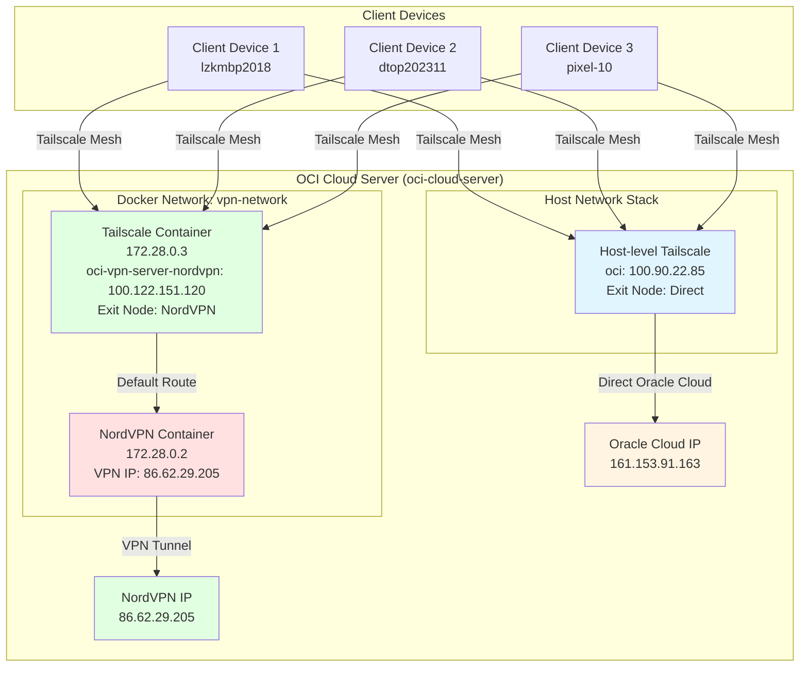

# Dual Exit Node Architecture for Levonk VPN Infrastructure

## Overview

The Levonk VPN infrastructure provides flexible exit node options by running two separate Tailscale instances on the OCI cloud server. This architecture allows clients to choose between direct Oracle Cloud routing (faster) or NordVPN routing (private) based on their specific needs.

## Architecture Diagram



## Network Configuration

### Docker Network Details
- **Network Name**: `vpn-network`
- **Subnet**: `172.28.0.0/16`
- **Gateway**: `172.28.0.1` (Docker bridge)
- **NordVPN Container**: `172.28.0.2`
- **Tailscale Container**: `172.28.0.3`

### Tailscale Exit Nodes

#### 1. Host-level Exit Node (`oci`)
- **Tailscale IP**: `100.90.22.85`
- **Hostname**: `oci`
- **Routing**: Direct Oracle Cloud connection
- **Public IP**: `161.153.91.163` (Oracle Cloud)
- **Use Case**: Regular use, faster performance, no VPN overhead

#### 2. Container-level Exit Node (`oci-vpn-server-nordvpn`)
- **Tailscale IP**: `100.122.151.120`
- **Hostname**: `oci-vpn-server-nordvpn`
- **Routing**: Through NordVPN container
- **Public IP**: `86.62.29.205` (NordVPN - Massachusetts, Boston)
- **Use Case**: Privacy, geo-location flexibility, VPN protection

## Routing Configuration

### NordVPN Container Routing
```
default via 10.100.0.1 dev tun0 (VPN tunnel)
10.100.0.0/20 dev tun0 (VPN subnet)
172.28.0.0/16 dev eth0 (Docker network)
```

### Tailscale Container Routing
```
default via 172.28.0.2 dev eth0 (NordVPN container)
172.28.0.0/16 dev eth0 (Docker network)
```

### NAT Masquerading Rules
```bash
# NordVPN container NAT rules
iptables -t nat -A POSTROUTING -s 172.28.0.0/16 -j MASQUERADE
iptables -A FORWARD -i eth0 -o tun0 -j ACCEPT
iptables -A FORWARD -i tun0 -o eth0 -m state --state RELATED,ESTABLISHED -j ACCEPT
```

## Client Usage

### Connect to Direct Exit Node (Faster)
```bash
sudo tailscale up --exit-node=oci
curl https://ipinfo.io/  # Returns: 161.153.91.163 (Oracle Cloud)
```

### Connect to NordVPN Exit Node (Private)
```bash
sudo tailscale up --exit-node=oci-vpn-server-nordvpn
curl https://ipinfo.io/  # Returns: 86.62.29.205 (NordVPN)
```

### No Exit Node (Direct)
```bash
sudo tailscale up
# Traffic routes directly through your device's internet connection
```

## Deployment Architecture

### Container Configuration

#### NordVPN Container
- **Image**: `qmcgaw/gluetun:latest`
- **VPN Provider**: NordVPN (OpenVPN 2.6)
- **Capabilities**: NET_ADMIN, NET_RAW
- **Devices**: `/dev/net/tun`
- **Network**: `vpn-network` (172.28.0.2)
- **Proxy Ports**: HTTP (8888), HTTPS (8443), SOCKS (1080), Shadowsocks (8388)

#### Tailscale Container
- **Image**: `tailscale/tailscale:latest`
- **Network**: `vpn-network` (172.28.0.3)
- **Capabilities**: NET_ADMIN
- **Environment Variables**:
  - `TS_AUTHKEY`: Tailscale authentication key
  - `TS_HOSTNAME`: `oci-vpn-server-nordvpn`
  - `TS_EXTRA_ARGS`: `--advertise-exit-node --accept-routes`

### Ansible Configuration

#### NordVPN Role (`vpn-nordvpn`)
- Creates dedicated Docker network `vpn-network`
- Deploys NordVPN container with VPN gateway capabilities
- Configures NAT masquerading for traffic routing
- Manages NordVPN credentials via Ansible vault

#### Tailscale Role (`vpn-tailscale`)
- Maintains host-level Tailscale service for direct exit node
- Deploys container-level Tailscale for NordVPN exit node
- Configures routing to point container traffic through NordVPN
- Supports dual exit node architecture

## Verification and Testing

### NordVPN Container Verification
```bash
# Check NordVPN logs
ssh oci "sudo docker logs nordvpn --tail 10"

# Verify VPN connection
ssh oci "sudo docker exec nordvpn ip addr show tun0"

# Check public IP
ssh oci "sudo docker exec nordvpn wget -qO- https://ifconfig.me"
# Expected: 86.62.29.205 (NordVPN IP)
```

### Tailscale Container Verification
```bash
# Check Tailscale status
ssh oci "sudo docker exec tailscale-nordvpn tailscale status"

# Verify routing
ssh oci "sudo docker exec tailscale-nordvpn ip route"

# Test NordVPN routing
ssh oci "sudo docker exec tailscale-nordvpn wget -qO- https://ifconfig.me"
# Expected: 86.62.29.205 (NordVPN IP)
```

### Dual Exit Node Verification
```bash
# Check both exit nodes are available
ssh oci "sudo docker exec tailscale-nordvpn tailscale status"
# Should show both 'oci' and 'oci-vpn-server-nordvpn' as exit nodes
```

## Performance Characteristics

### Direct Exit Node (`oci`)
- **Latency**: Low (no VPN overhead)
- **Bandwidth**: High (direct Oracle Cloud connection)
- **Privacy**: Oracle Cloud IP visible
- **Use Case**: Regular browsing, development, non-sensitive operations

### NordVPN Exit Node (`oci-vpn-server-nordvpn`)
- **Latency**: Moderate (VPN tunnel overhead)
- **Bandwidth**: Good (NordVPN infrastructure)
- **Privacy**: NordVPN IP visible, encrypted tunnel
- **Use Case**: Privacy-sensitive operations, geo-location requirements, security

## Security Considerations

### NordVPN Configuration
- OpenVPN 2.6 with strong encryption
- DNS leak protection enabled
- Firewall rules configured
- No-privileges container security option

### Tailscale Security
- End-to-end encryption for all Tailscale traffic
- Authentication via Tailscale auth keys
- Exit node approval required in admin console
- Access control via Tailscale ACLs

### Network Isolation
- VPN traffic isolated in dedicated Docker network
- NAT masquerading prevents direct container access
- Host-level service and container-level service operate independently

## Maintenance and Operations

### NordVPN Container Management
```bash
# View NordVPN logs
ssh oci "sudo docker logs nordvpn -f"

# Restart NordVPN container
ssh oci "sudo docker restart nordvpn"

# Update NordVPN container
cd /Users/micro/p/gh/levonk/infrahub
devbox run -- ansible-playbook -i levonk/active/02-config/ansible/inventories/oci.yml \
  shared/active/02-config/ansible/playbooks/cloud-server-nordvpn.yml \
  --vault-password-file ~/.ansible/vault_password
```

### Tailscale Container Management
```bash
# View Tailscale container logs
ssh oci "sudo docker logs tailscale-nordvpn -f"

# Restart Tailscale container
ssh oci "sudo docker restart tailscale-nordvpn"

# Update VPN configuration
cd /Users/micro/p/gh/levonk/infrahub
devbox run -- ansible-playbook -i levonk/active/02-config/ansible/inventories/oci.yml \
  shared/active/02-config/ansible/playbooks/cloud-server-vpn.yml \
  --vault-password-file ~/.ansible/vault_password
```

### Troubleshooting
```bash
# Check container status
ssh oci "sudo docker ps"

# Check network connectivity
ssh oci "sudo docker network inspect vpn-network"

# Verify routing tables
ssh oci "sudo docker exec tailscale-nordvpn ip route"
ssh oci "sudo docker exec nordvpn ip route"

# Check NAT rules
ssh oci "sudo docker exec nordvpn iptables -t nat -L -n -v"
```

## Configuration Files

### Ansible Variables
- **Inventory**: `/Users/micro/p/gh/levonk/infrahub/levonk/active/02-config/ansible/inventories/oci.yml`
- **Group Variables**: `/Users/micro/p/gh/levonk/infrahub/levonk/active/02-config/ansible/group_vars/cloud_servers.yml`
- **Vault**: `/Users/micro/p/gh/levonk/infrahub/levonk/active/02-config/ansible/group_vars/infrahub-levonk-all.vault.yml`

### NordVPN Configuration
- **Role**: `/Users/micro/p/gh/levonk/infrahub/shared/active/02-config/ansible/roles/vpn-nordvpn/`
- **Playbook**: `/Users/micro/p/gh/levonk/infrahub/shared/active/02-config/ansible/playbooks/cloud-server-nordvpn.yml`

### Tailscale Configuration
- **Role**: `/Users/micro/p/gh/levonk/infrahub/shared/active/02-config/ansible/roles/vpn-tailscale/`
- **Playbook**: `/Users/micro/p/gh/levonk/infrahub/shared/active/02-config/ansible/playbooks/cloud-server-vpn.yml`

## Benefits of Dual Exit Node Architecture

1. **Flexibility**: Clients can choose exit node based on their needs
2. **Performance**: Direct exit node for regular use, VPN exit node when needed
3. **Privacy**: NordVPN exit node provides anonymity and geo-location options
4. **Reliability**: If one exit node has issues, clients can switch to the other
5. **Testing**: Easy to compare performance between direct and VPN routing
6. **Compliance**: Can use VPN exit node for compliance requirements when needed

## Future Enhancements

- Add automatic failover between exit nodes
- Implement load balancing across multiple NordVPN servers
- Add monitoring and alerting for exit node health
- Create automated testing for both exit nodes
- Add geo-location based routing rules
- Implement bandwidth monitoring and throttling