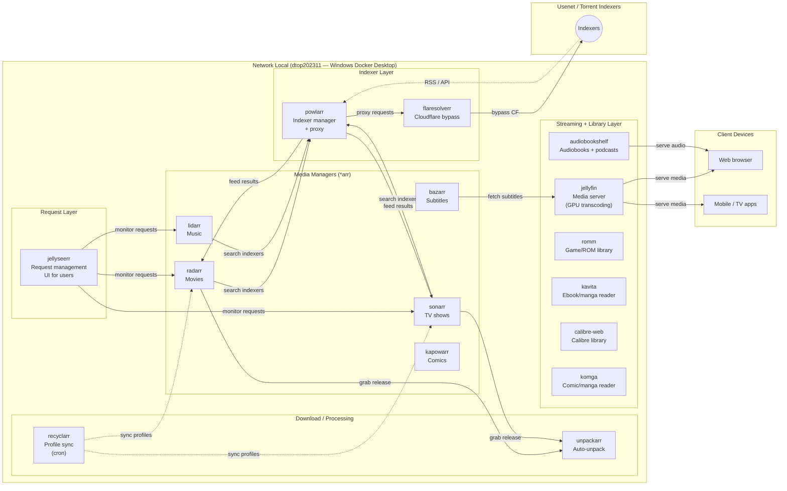

# Media Pipeline Configuration

## Architecture

The media pipeline spans a single tier: the **network-local host** (`dtop202311`,
Windows Docker Desktop, X86) where all media services run as Docker containers
behind Traefik. The pipeline covers the full lifecycle: request → search →
download → organize → subtitle → transcode → stream.



### Deployment Topology

All media services run on a single host (`dtop202311`, Windows Docker Desktop)
in the `nl` (network-local) region. Traefik (also on dtop202311) terminates TLS
and routes traffic to each service via the `traefik-windows-network` Docker
network. Authelia SSO (running on the OCI cloud server, reachable via Tailscale)
gates the outer layer for browser-facing services.

```
dtop202311 (Windows Docker Desktop, X86, nl region)
  └─ Traefik (TLS termination, Let's Encrypt DNS-01 via Cloudflare)
       ├─ jellyfin.nl.levonk.com / media.levonk.com        → jellyfin (8096)
       ├─ jellyseerr.nl.levonk.com / requests.levonk.com   → jellyseerr (5055)
       ├─ radarr.nl.levonk.com / movies.levonk.com         → radarr (7878)
       ├─ sonarr.nl.levonk.com / tv.levonk.com             → sonarr (8989)
       ├─ lidarr.nl.levonk.com / music.levonk.com          → lidarr (8686)
       ├─ bazarr.nl.levonk.com / subtitles.levonk.com      → bazarr (6767)
       ├─ prowlarr.nl.levonk.com / indexers.levonk.com     → prowlarr (9696)
       ├─ kapowarr.nl.levonk.com / comics-manager.levonk.com → kapowarr (5656)
       ├─ audiobooks.nl.levonk.com / audiobooks.levonk.com → audiobookshelf (13378→80)
       ├─ romm.nl.levonk.com / games.levonk.com            → romm (8091→8080)
       ├─ kavita.nl.levonk.com / books.levonk.com          → kavita (5060→5000)
       ├─ calibre-web.nl.levonk.com / library.levonk.com  → calibre-web (8087→8083)
       └─ komga.nl.levonk.com / comics.levonk.com          → komga (25600)
```

### Domain Model — Specific + Generic Alias

Each media service has two domains following the split-horizon DNS pattern:

| Software | Specific domain | Generic alias |
|----------|----------------|---------------|
| jellyfin | jellyfin.nl.levonk.com | media.levonk.com |
| jellyseerr | jellyseerr.nl.levonk.com | requests.levonk.com |
| radarr | radarr.nl.levonk.com | movies.levonk.com |
| sonarr | sonarr.nl.levonk.com | tv.levonk.com |
| lidarr | lidarr.nl.levonk.com | music.levonk.com |
| bazarr | bazarr.nl.levonk.com | subtitles.levonk.com |
| prowlarr | prowlarr.nl.levonk.com | indexers.levonk.com |
| kapowarr | kapowarr.nl.levonk.com | comics-manager.levonk.com |
| audiobookshelf | audiobooks.nl.levonk.com | audiobooks.levonk.com |
| romm | romm.nl.levonk.com | games.levonk.com |
| kavita | kavita.nl.levonk.com | books.levonk.com |
| calibre-web | calibre-web.nl.levonk.com | library.levonk.com |
| komga | komga.nl.levonk.com | comics.levonk.com |

DNS chain:
```
{service}.levonk.com  →  CNAME  →  {software}.nl.levonk.com  →  CNAME  →  dtop202311.tale-grouper.ts.net
```

- **Specific domain** (`{software}.nl.levonk.com`): Identifies the software instance on the nl network. Used for administration and debugging.
- **Generic alias** (`{service}.levonk.com`): Service-based name (not software name) for user-facing access. Enables split-horizon DNS — the generic domain can be repointed to a different instance on a different network without changing user bookmarks.
- **Traefik**: Routes match both domains via `Host(specific) || Host(alias)`. TLS cert includes the alias as a SAN.

### Windows Docker Deployment Pattern

`community.docker` Ansible modules cannot run on Windows (Ansible core
`basic.py` imports `grp`, Unix-only). All media containers are deployed via the
**SSH-tunneled Docker CLI pattern**:

- `DOCKER_HOST: ssh://ansible@dtop202311.tale-grouper.ts.net`
- `delegate_to: localhost` on every Docker task
- `ansible.builtin.shell`/`command` with `docker run` (not `docker compose`)
- Volumes initialized via the `localnet-volume-init` role (three-phase ownership)

This matches the pattern used by Stirling-PDF, Verdaccio, Hister, and all
other services deployed to dtop202311.

## Recent Changes

**2026-09-08**: Initial media pipeline documentation
- Created `PIPELINE-MEDIA.md` alongside `PIPELINE-AI.md` in the pipelines directory
- Documented the full media stack: jellyfin + *arr services + supporting tools
- All services deploy to `dtop202311` (nl region, Windows Docker Desktop)
- Traefik routes via `traefik-windows-network`; Authelia SSO gates browser access
- Reference compose: `shared/active/03-container/services/media/docker-compose.media.yml`

## Overview

This configuration deploys a self-hosted media pipeline covering the full
lifecycle from content request to streaming. The pipeline uses the *arr
automated media management, Jellyseerr for user requests, Jellyfin for
streaming, and supporting services (Flaresolverr, Recyclarr, Unpackarr) for
reliability.

## Pipeline Stages

### Stage 1: Request Layer — Jellyseerr

```
```

**Jellyseerr** (`fallenbagel/jellyseerr`) is the user-facing request portal.
Users browse and request movies/TV shows; Jellyseerr forwards approved
requests to the appropriate *arr service for monitoring and download.

- **Domain**: `jellyseerr.nl.levonk.com`
- **Port**: 5055
- **Auth**: Authelia SSO via Traefik

### Stage 2: Media Managers — *arr Stack

```
  → search Prowlarr indexers
  → grab releases
  → send to download client
  → organize into library
```

Each *arr service monitors its media type, searches indexers via Prowlarr,
grabs releases, sends them to the download client, and organizes the
completed files into the media library.

| Service | Image | Domain | Port | Media Type |
|---------|-------|--------|------|------------|
| radarr | `lscr.io/linuxserver/radarr` | radarr.nl.levonk.com | 7878 | Movies |
| sonarr | `lscr.io/linuxserver/sonarr` | sonarr.nl.levonk.com | 8989 | TV shows |
| lidarr | `lscr.io/linuxserver/lidarr` | lidarr.nl.levonk.com | 8686 | Music |
| bazarr | `lscr.io/linuxserver/bazarr` | bazarr.nl.levonk.com | 6767 | Subtitles |
| prowlarr | `lscr.io/linuxserver/prowlarr` | prowlarr.nl.levonk.com | 9696 | Indexers |
| kapowarr | `mrcas/kapowarr` | kapowarr.nl.levonk.com | 5656 | Comics |

All *arr services use the LinuxServer.io base images with `PUID=1000`/`PGID=1000`
for consistent file ownership across the media library.

### Stage 3: Indexer Layer — Prowlarr + Flaresolverr

```
*arr services → prowlarr (indexer manager + proxy) → flaresolverr (CF bypass) → indexers
```

**Prowlarr** (`lscr.io/linuxserver/prowlarr`) manages indexer connections and
proxies API/RSS requests to Usenet and torrent indexers. It syncs indexer
credentials to all *arr services automatically.

**Flaresolverr** (`ghcr.io/flaresolverr/flaresolverr`) bypasses Cloudflare
anti-bot protection on indexers that use it, allowing Prowlarr to retrieve
RSS feeds and API responses from protected sites.

- Flaresolverr is internal-only (no Traefik domain, no public exposure)
- Prowlarr references Flaresolverr via its container name on the shared network

### Stage 4: Download Processing — Unpackarr + Recyclarr

```
download client → unpackarr (auto-unpack) → *arr (import)
recyclarr (cron) → sync quality profiles → *arr services
```

**Unpackarr** (`ghcr.io/unpackarr/unpackarr`) monitors the download directory
and automatically unpacks completed RAR/ZIP archives so the *arr services can
import them without manual intervention.

**Recyclarr** (`ghcr.io/recyclarr/recyclarr`) runs on a cron schedule to sync
quality profiles, custom formats, and naming patterns from a central config
to all *arr services, ensuring consistent quality settings across the stack.

Both are internal-only (no Traefik domain, no public exposure).

### Stage 5: Streaming Layer — Jellyfin + Audiobookshelf

```
media library → jellyfin (transcode + stream) → client devices
audiobook library → audiobookshelf (stream) → client devices
```

**Jellyfin** (`jellyfin/jellyfin`) is the primary media server. It scans the
library organized by the *arr services, provides metadata, transcodes (with
GPU acceleration when available), and streams to web browsers, mobile apps,
and TV apps.

- **Domain**: `jellyfin.nl.levonk.com`
- **Port**: 8096 (web), 7359/udp (discovery)
- **Hardware**: `/dev/dri` mounted for GPU transcoding (when available)
- **Auth**: Authelia SSO via Traefik (Jellyfin also has its own user auth)

**Audiobookshelf** (`ghcr.io/advplyr/audiobookshelf`) is the audiobook and
podcast server. It manages audiobook libraries separately from Jellyfin,
with its own metadata, progress tracking, and mobile app support.

- **Domain**: `audiobooks.nl.levonk.com`
- **Port**: 13378→80
- **Auth**: Authelia SSO via Traefik

### Stage 6: Subtitle Management — Bazarr

```
jellyfin library → bazarr (fetch subtitles) → library
```

**Bazarr** (`lscr.io/linuxserver/bazarr`) monitors the media library and
automatically fetches subtitles for movies and TV shows from subtitle
providers. It integrates with Sonarr and Radarr to know which media needs
subtitles and in which languages.

## Service Inventory

| Service | Image | Host Port | Container Port | Specific Domain | Generic Alias | Traefik | Category |
|---------|-------|-----------|----------------|-----------------|----------------|---------|----------|
| jellyfin | `jellyfin/jellyfin` | 8096 | 8096 | jellyfin.nl.levonk.com | media.levonk.com | yes | ui |
| jellyseerr | `fallenbagel/jellyseerr` | 5055 | 5055 | jellyseerr.nl.levonk.com | requests.levonk.com | yes | ui |
| radarr | `lscr.io/linuxserver/radarr` | 7878 | 7878 | radarr.nl.levonk.com | movies.levonk.com | yes | ui |
| sonarr | `lscr.io/linuxserver/sonarr` | 8989 | 8989 | sonarr.nl.levonk.com | tv.levonk.com | yes | ui |
| lidarr | `lscr.io/linuxserver/lidarr` | 8686 | 8686 | lidarr.nl.levonk.com | music.levonk.com | yes | ui |
| bazarr | `lscr.io/linuxserver/bazarr` | 6767 | 6767 | bazarr.nl.levonk.com | subtitles.levonk.com | yes | ui |
| prowlarr | `lscr.io/linuxserver/prowlarr` | 9696 | 9696 | prowlarr.nl.levonk.com | indexers.levonk.com | yes | ui |
| kapowarr | `mrcas/kapowarr` | 5656 | 5656 | kapowarr.nl.levonk.com | comics-manager.levonk.com | yes | ui |
| audiobookshelf | `ghcr.io/advplyr/audiobookshelf` | 13378 | 80 | audiobooks.nl.levonk.com | audiobooks.levonk.com | yes | ui |
| romm | `rommapp/romm` | 8091 | 8080 | romm.nl.levonk.com | games.levonk.com | yes | ui |
| kavita | `lscr.io/linuxserver/kavita` | 5060 | 5000 | kavita.nl.levonk.com | books.levonk.com | yes | ui |
| calibre-web | `lscr.io/linuxserver/calibre-web` | 8087 | 8083 | calibre-web.nl.levonk.com | library.levonk.com | yes | ui |
| komga | `gotson/komga` | 25600 | 25600 | komga.nl.levonk.com | comics.levonk.com | yes | ui |
| flaresolverr | `ghcr.io/flaresolverr/flaresolverr` | 8191 | 8191 | (internal) | — | no | passive |
| recyclarr | `ghcr.io/recyclarr/recyclarr` | — | — | (cron) | — | no | passive |
| unpackarr | `ghcr.io/unpackarr/unpackarr` | — | — | (sidecar) | — | no | passive |

## Storage Layout

All media services share a common media data directory mounted into each
container. The *arr services organize downloaded content into subdirectories
(movies, tv, music, comics, downloads) that Jellyfin and Audiobookshelf scan.

```
{MEDIA_DATA_LOCATION}/
  ├── movies/       ← radarr organizes, jellyfin streams
  ├── tv/           ← sonarr organizes, jellyfin streams
  ├── music/        ← lidarr organizes, jellyfin streams
  ├── comics/       ← kapowarr downloads, komga serves
  ├── books/        ← calibre-web library
  ├── data/         ← kavita ebook/manga library
  ├── roms/         ← romm game library
  ├── downloads/    ← shared download directory (all *arr)
  ├── audiobooks/   ← audiobookshelf
  └── podcasts/     ← audiobookshelf
```

Each service also has its own config volume for persistent state (databases,
settings, API keys).

## Ansible Deployment

### Role: `media-stack`

Location: `shared/active/02-config/ansible/roles/media-stack/`

A single role deploys all media containers to dtop202311 using the SSH-tunneled
Docker CLI pattern. The role:

1. Initializes all config volumes via `localnet-volume-init` (UID 1000 ownership)
2. Pulls all upstream images
3. Deploys each container with `docker run` via `DOCKER_HOST: ssh://`
4. Connects each container to `traefik-windows-network`
5. Waits for health on each service

### Playbook: `deploy-media-stack.yml`

Location: `shared/active/02-config/ansible/playbooks/deploy-media-stack.yml`

Two-phase deployment:
- **Phase 1**: Deploy all media containers on dtop202311
- **Phase 2**: Re-run `proxy_traefik_windows` role with `media_stack_enabled`
  to deploy the `media-nl.yml` Traefik dynamic config (routes for all media
  domains)

### Just Recipes

```bash
# Deploy the full media stack
just ansible-deploy-media-stack

# Validate the media stack
just ansible-validate-media-stack
```

## Cross-Pipeline Relationships

- **Media Pipeline ↔ Web Proxy Chain**: Media services that need internet
  access (Prowlarr indexing, Flaresolverr, subtitle downloads) egress through
  the web proxy chain on dtop202311 if configured, or directly to the Internet.
- **Media Pipeline ↔ DNS Chain**: All media domains resolve via the DNS chain
  (CNAME → Tailscale FQDN → dtop202311).
- **Media Pipeline ↔ AI Pipeline**: No direct dependency. The media stack is
  independent of the AI pipeline.

## Reference

- **Reference compose**: `shared/active/03-container/services/media/docker-compose.media.yml`
- **Individual service dirs**: `shared/active/03-container/services/media/{service}/`
- **Ansible role**: `shared/active/02-config/ansible/roles/media-stack/`
- **Deploy playbook**: `shared/active/02-config/ansible/playbooks/deploy-media-stack.yml`
- **Traefik dynamic config**: `shared/active/02-config/ansible/roles/proxy_traefik_windows/templates/dynamic/media-nl.yml.j2`
- **Infrastructure ports**: `shared/active/02-config/ansible/infrastructure/ports.yml` (media section)
- **Infrastructure domains**: `shared/active/02-config/ansible/infrastructure/domains.yml` (media section)
- **Service catalog**: `shared/active/02-config/ansible/infrastructure/services.yml` (media entries)
